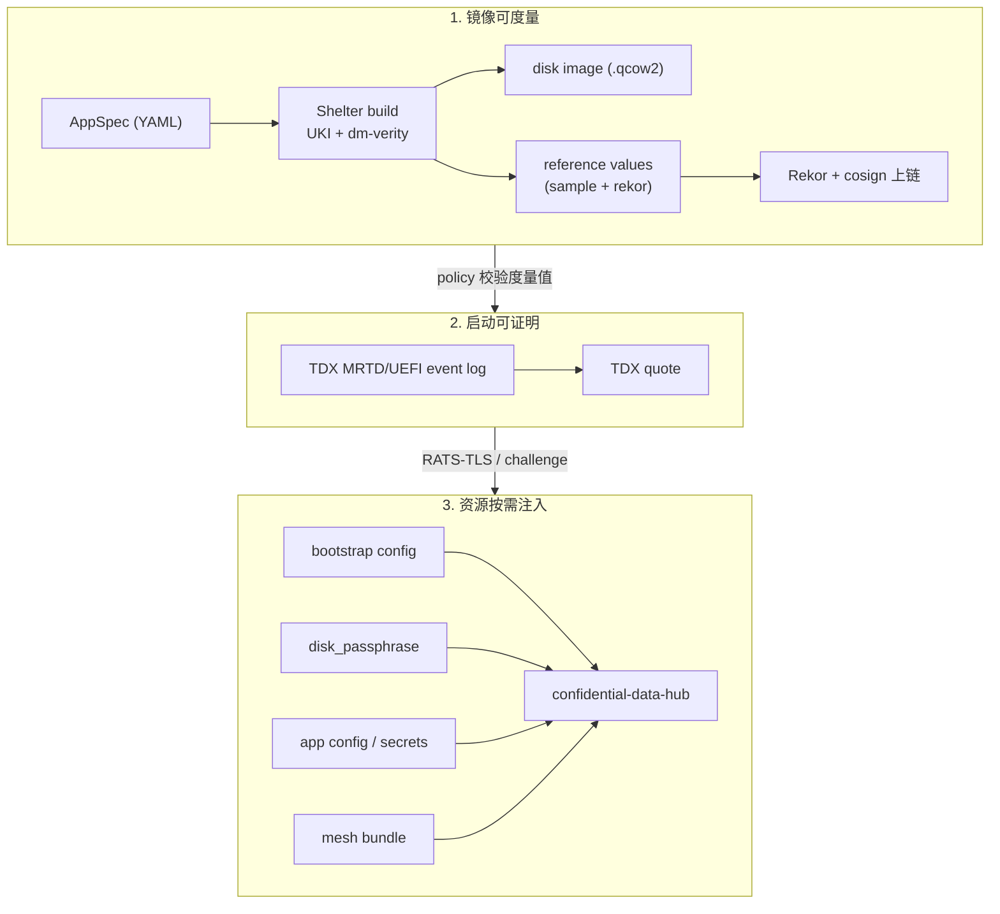

# Confidential Agent

Confidential Agent 是一套面向"AI Agent + 机密计算"的端到端工程化工具链。它把一份声明式的 `AppSpec`（YAML），编译成一台运行在机密虚拟机里的、**全盘加密 + 远程证明 + 受策略约束** 的 Agent 实例，并在主机侧通过 **TNG (Trusted Network Gateway) RATS-TLS** 接入它。

适合的人：
- 想把一个 Agent（OpenClaw、Hermes、自研 LangChain/MCP Server …）一键放进 TEE 跑起来的开发者。
- 需要把模型推理、对话上下文、密钥放进 **云厂商和运维都看不到** 的执行域里的安全敏感场景。
- 要求镜像可度量、启动可证明、密钥按需注入的合规交付方。

---

## 目录

- [核心特性](#核心特性)
- [整体架构](#整体架构)
- [快速开始 (Quick Start)](#快速开始-quick-start)
- [仓库结构](#仓库结构)
- [深入文档](#深入文档)

---

## 核心特性

| 能力 | 说明 |
|---|---|
| 🔐 **TDX 全盘加密** | Guest 可写层使用一次性磁盘密钥加密；密钥由 host 在远程证明通过后注入 initrd，**重启即丢失，且不落任何持久化存储**。 |
| 📜 **声明式 AppSpec** | 一份 `confidential-agent/v1` YAML 描述服务、镜像、部署、证明、密钥、资源 6 个维度，CLI 自动驱动构建/部署/销毁。 |
| 🛰 **远程证明模式** | `sample` 模式（开发自验）与 `rekor` 模式（基于 Sigstore Rekor + cosign 的供应链透明日志）。生产推荐 `rekor + required=true`。 |
| 🌐 **TNG RATS-TLS Mesh** | 多个 Confidential Agent 实例之间、以及主机 `connect` 子命令到 Guest 的连接，全部走带远程证明的 RATS-TLS（attest + TLS）。 |
| 🛡 **运行时策略 PEP** | 内置 `cai-pep`（Policy Enforcement Point），把 Agent 的 `exec` 工具调用强制隔离到只读、无网、限资源的 Docker sandbox，并按 path/command 模式拒绝。 |
| ☁️ **云资源全自动化** | 通过 [Shelter](https://github.com/inclavare-containers/shelter) + Terraform 自动完成 OSS 上传、自定义镜像、ECS 实例、安全组规则、镜像挂载等阿里云资源编排。 |

---

## 整体架构

### 三层信任链



每一层都对应仓库中的具体组件：

| 层 | 组件 | 代码入口 |
|---|---|---|
| 镜像构建 | `shelter` crate 渲染 Shelter YAML，由外部 `shelter` 二进制产出 UKI 镜像和 reference value | [`shelter/src/lib.rs`](shelter/src/lib.rs) |
| Host 控制面 | `confidential-agent` CLI，负责 build / deploy / inject / mesh / connect / status / destroy | [`cli/src/app/commands.rs`](cli/src/app/commands.rs) |
| Guest 控制面 | `confidential-agentd`，运行在 initrd 与 rootfs 两个阶段，负责拉密钥、写资源、配置 TNG | [`daemon/src/app.rs`](daemon/src/app.rs) |
| Guest 数据面 | TNG 做 RATS-TLS 网关；Trustiflux 做证明协议 | `examples/openclaw/install-openclaw.sh`, [`shelter/src/lib.rs`](shelter/src/lib.rs) |
| Agent 沙箱 | `cai-pep` 把 Agent 的 `exec` 工具下到 read-only/no-net Docker sandbox，并对外暴露 `attest` 子命令 | [`cai-pep/src/main.rs`](cai-pep/src/main.rs) |

---

## 快速开始 (Quick Start)

最短路径是 one-click installer。它会在本机安装依赖、在缺少 Shelter 时安装仓库内置的 Shelter RPM、构建当前源码、生成 OpenClaw 配置、交互式选择 operator CIDR，然后通过 Shelter 在阿里云上创建一台 TDX ECS。

```bash
curl -fsSL https://raw.githubusercontent.com/wdsun1008/confidential-agent/one-click/one-click/install.sh | sh
```

在 Alibaba Cloud Linux 3 上，脚本会优先通过系统源安装 `cargo`/`rust`，并为 Cargo 写入 Aliyun crates mirror。默认不会走 rustup；只有显式传入 `--allow-rustup` 时，系统源工具链不可用才会 fallback 到 rustup。

默认值面向 Alibaba Cloud Linux 3 测试环境；OpenClaw full deploy 当前建议从 alinux3 部署机执行。

| 参数 | 默认值 |
|---|---|
| Region | `cn-beijing` |
| Zone | `cn-beijing-i` |
| Instance Type | `ecs.g9i.xlarge` |
| Disk | `200G` |
| Attestation | `rekor` |
| State Dir | `$HOME/.confidential-agent` |

脚本会交互式询问缺失的阿里云凭证、百炼 API Key、是否启用钉钉，以及 operator access CIDR。启用钉钉时，镜像会安装并构建 `soimy/openclaw-channel-dingtalk`，再写入 `dingtalk` channel 配置。脚本也会在部署机安装同版本 Node.js/OpenClaw CLI，并把 `confidential-agent` 安装到 PATH。CIDR 默认使用当前部署机公网 IP `/32`，仅支持 IPv4；也可以选择 `0.0.0.0/0`，脚本会先提示这会把控制面、状态、debug SSH 和 connect 入口暴露给所有 IPv4 来源，且默认 OpenClaw 配置禁用 device auth、仅靠 gateway token 鉴权，0.0.0.0/0 模式下务必妥善保管 token。非交互传入的 `--allowed-cidr` 可用于你的浏览器或运维出口，脚本仍会额外探测部署机出口 IP 并加入 `deployer` peering，避免资源注入和 connect 被安全组挡住。非交互部署示例：

```bash
export ALICLOUD_ACCESS_KEY=<your-ak>
export ALICLOUD_SECRET_KEY=<your-sk>
export DASHSCOPE_API_KEY=<your-bailian-key>

curl -fsSL https://raw.githubusercontent.com/wdsun1008/confidential-agent/one-click/one-click/install.sh | sh -s -- deploy-openclaw \
  --non-interactive \
  --region cn-beijing \
  --zone-id cn-beijing-i \
  --instance-type ecs.g9i.xlarge
```

如果只想安装 host 侧组件，不创建云资源：

```bash
curl -fsSL https://raw.githubusercontent.com/wdsun1008/confidential-agent/one-click/one-click/install.sh | sh -s -- install-only
```

部署完成后，脚本会输出本地 connect 地址：

```text
web:    http://127.0.0.1:<port>/openclaw
ws/api: ws://127.0.0.1:<port>
token:  <generated-or-provided-token>
```

生成的 gateway token 会保存在 `$HOME/.confidential-agent/one-click/secrets/gateway.token`，后续重跑会复用同一个 token。部署完成后可以直接运行 `confidential-agent status --live`、`confidential-agent connect` 和 `openclaw tui --url ws://127.0.0.1:<port> --token <token>`。

清理云资源：

```bash
curl -fsSL https://raw.githubusercontent.com/wdsun1008/confidential-agent/one-click/one-click/install.sh | sh -s -- cleanup \
  --state-dir "$HOME/.confidential-agent"
```

---

## 常用扩展场景

| 场景 | 入口 |
|---|---|
| **GPU TEE（vLLM + H20）** | `examples/openclaw-vllm/` ，用 `ecs.gn8v-tee.4xlarge`，spec 里追加 NVIDIA CC 驱动安装脚本。 |
| **最小 MCP Server** | `examples/mcp/mcp-demo.yaml`，最薄的一个 spec，可作为模板。 |
| **多实例 Mesh** | 在不同的 spec 文件里使用相同的 `connect` 端口集合分别 `deploy`，CLI 会自动维护 `mesh-bundle.json` 并把对端公网 CIDR 注入安全组。 |
| **Debug SSH** | spec 里把 `deploy.image_variant: debug` + `build.variants.debug.enabled: true`，CLI 会自动生成 ed25519 密钥对；入向访问由 `peering add --role operator --cidr ...` 控制。 |

---

## 仓库结构

```
confidential-agent/
├── Cargo.toml             # workspace
├── core/                  # 共享数据结构 (AppSpec / BootstrapConfig / MeshBundle / DaemonStatus)
├── shelter/               # 把 AppSpec 渲染成 Shelter build YAML 的纯函数库
├── cli/                   # confidential-agent (host 控制面)
├── daemon/                # confidential-agentd (guest 控制面 + initrd-fetch)
├── cai-pep/               # Policy Enforcement Point，运行时 sandbox + attest helper
├── tools/
│   ├── Dockerfile         # confidential-agent-tools 镜像（hack/tng-2.6.0 + attestation-challenge-client）
│   ├── policies/          # Trustee/OPA rego（生产 + dev）
│   └── e2e/               # 端到端测试 runner、case 模板与探针
├── hack/                  # 严格 pin 的 TNG 二进制、Shelter RPM、libtdx-verify RPM
└── examples/
    ├── openclaw/          # OpenClaw + cai-pep（推荐起步）
    ├── openclaw-vllm/     # OpenClaw + vLLM + NVIDIA TEE
    └── mcp/               # 最小 MCP Server 示例
```

---

## 深入文档

- [docs/architecture.md](docs/architecture.md) — 控制流与数据流详解（含序列图）
- [docs/spec.md](docs/spec.md) — `confidential-agent/v1` AppSpec 完整字段参考
- [docs/a2a.md](docs/a2a.md) — 跨组织/跨用户 A2A：背景、架构、信任模型、step-by-step 上手与排错
