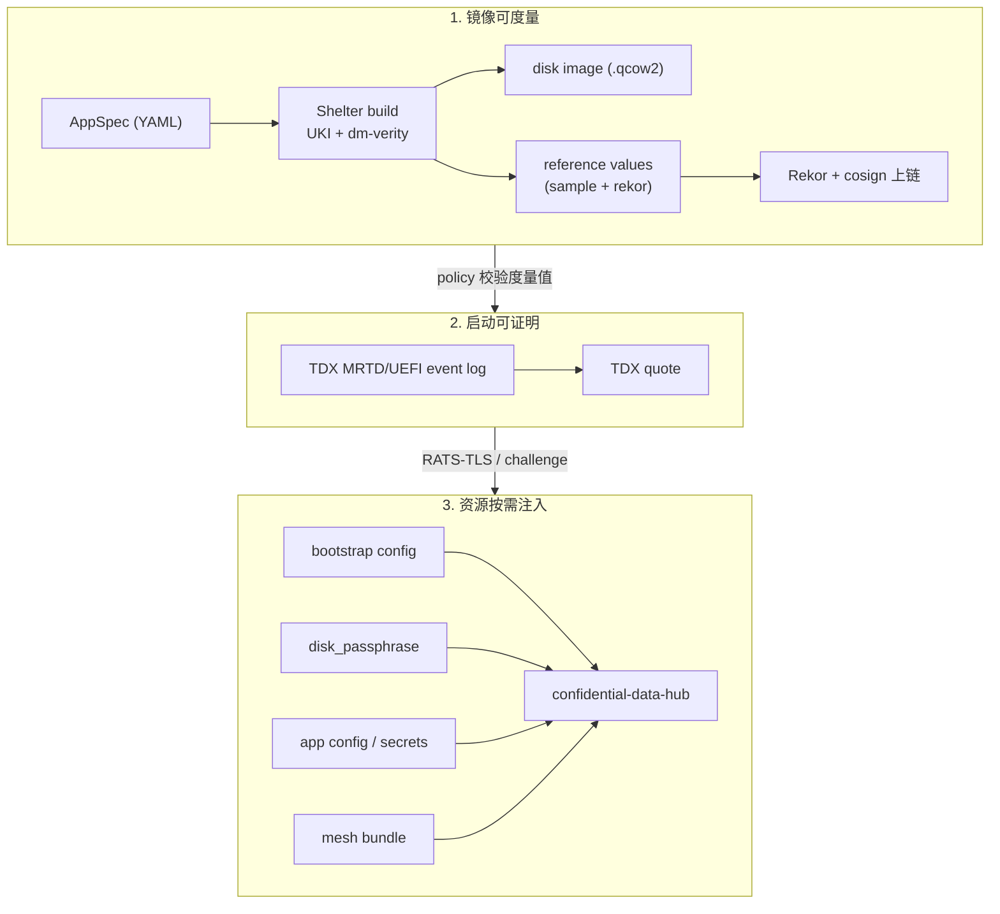

# Confidential Agent

Confidential Agent 是一套面向"AI Agent + 机密计算"的端到端工程化工具链。它把一份声明式的 `AppSpec`（YAML），编译成一台运行在机密虚拟机里的、**全盘加密 + 远程证明 + 受策略约束** 的 Agent 实例，并在主机侧通过 **TNG (Trusted Network Gateway) RATS-TLS** 接入它。

适合的人：
- 想把一个 Agent（OpenClaw、Hermes、自研 LangChain/MCP Server …）一键放进 TEE 跑起来的开发者。
- 需要把模型推理、对话上下文、密钥放进 **云厂商和运维都看不到** 的执行域里的安全敏感场景。
- 要求镜像可度量、启动可证明、密钥按需注入的合规交付方。

---

## 目录

- [核心特性](#核心特性)
- [整体架构](#整体架构)
- [快速开始 (Quick Start)](#快速开始-quick-start)
- [仓库结构](#仓库结构)
- [深入文档](#深入文档)

---

## 核心特性

| 能力 | 说明 |
|---|---|
| 🔐 **TDX 全盘加密** | Guest 可写层使用一次性磁盘密钥加密；密钥由 host 在远程证明通过后注入 initrd，**重启即丢失，且不落任何持久化存储**。 |
| 📜 **声明式 AppSpec** | 一份 `confidential-agent/v1` YAML 描述服务、镜像、部署、证明、密钥、资源 6 个维度，CLI 自动驱动构建/部署/销毁。 |
| 🛰 **远程证明模式** | `sample` 模式（开发自验）与 `rekor` 模式（基于 Sigstore Rekor + cosign 的供应链透明日志）。生产推荐 `rekor + required=true`。 |
| 🌐 **TNG RATS-TLS Mesh** | 多个 Confidential Agent 实例之间、以及主机 `connect` 子命令到 Guest 的连接，全部走带远程证明的 RATS-TLS（attest + TLS）。 |
| 🛡 **运行时策略 PEP** | 内置 `cai-pep`（Policy Enforcement Point），把 Agent 的 `exec` 工具调用强制隔离到只读、无网、限资源的 Docker sandbox，并按 path/command 模式拒绝。 |
| ☁️ **云资源全自动化** | 通过 [Shelter](https://github.com/inclavare-containers/shelter) + Terraform 自动完成 OSS 上传、自定义镜像、ECS 实例、安全组规则、镜像挂载等阿里云资源编排。 |

---

## 整体架构

### 三层信任链



每一层都对应仓库中的具体组件：

| 层 | 组件 | 代码入口 |
|---|---|---|
| 镜像构建 | `shelter` crate 渲染 Shelter YAML，由外部 `shelter` 二进制产出 UKI 镜像和 reference value | [`shelter/src/lib.rs`](shelter/src/lib.rs) |
| Host 控制面 | `confidential-agent` CLI，负责 build / deploy / inject / mesh / connect / status / destroy | [`cli/src/app/commands.rs`](cli/src/app/commands.rs) |
| Guest 控制面 | `confidential-agentd`，运行在 initrd 与 rootfs 两个阶段，负责拉密钥、写资源、配置 TNG | [`daemon/src/app.rs`](daemon/src/app.rs) |
| Guest 数据面 | TNG 做 RATS-TLS 网关；Trustiflux 做证明协议 | `examples/openclaw/install-openclaw.sh`, [`shelter/src/lib.rs`](shelter/src/lib.rs) |
| Agent 沙箱 | `cai-pep` 把 Agent 的 `exec` 工具下到 read-only/no-net Docker sandbox，并对外暴露 `attest` 子命令 | [`cai-pep/src/main.rs`](cai-pep/src/main.rs) |

---

## 快速开始 (Quick Start)

下面这条路径覆盖最常见的用法：**OpenClaw + Challenge 注入 + Rekor reference value**。完成后你会得到一台跑在阿里云 TDX ECS 上、可远程证明、可通过 TNG RATS-TLS 访问的 OpenClaw Agent。

### 0. 环境与依赖

| 要求 | 说明 |
|---|---|
| 操作系统 | Linux x86_64（推荐 Alibaba Cloud Linux 3） |
| Rust | 1.75+ |
| Docker | 必需，CLI 通过 docker 运行 `confidential-agent-tools` 镜像调用 `tng` 与 `attestation-challenge-client` |
| Shelter | 外部二进制 [shelter](https://github.com/inclavare-containers/shelter)，需在 `$PATH` 或通过 `--shelter-bin` 指定 |
| 阿里云权限 | 需要 ECS / VPC / OSS / 安全组创建权限（用于 Terraform） |
| Cosign Key | rekor 模式必需。可用 `cosign generate-key-pair` 生成 |

### 1. 编译

```bash
git clone https://github.com/inclavare-containers/confidential-agent.git
cd confidential-agent

# 构建 workspace（产出 confidential-agent / confidential-agentd / cai-pep / shelter lib）
cargo build --release

# 构建工具镜像（包含 tng 2.6.0 + attestation-challenge-client）
docker build -t confidential-agent-tools:latest -f tools/Dockerfile .
```

> 后续会发布预编译 release 包；当前阶段请先从源码构建。

### 2. 准备 Aliyun 凭据

CLI 会通过 Shelter / Terraform 调阿里云 API。最简方式：
```bash
export ALIBABA_CLOUD_ACCESS_KEY_ID=<your-ak>
export ALIBABA_CLOUD_ACCESS_KEY_SECRET=<your-sk>
```

Shelter 实际使用的凭据规则以其文档为准；这里只列最常用的环境变量。

### 3. 准备 cosign 公私钥（仅 rekor 模式）

```bash
cd examples/openclaw
cosign generate-key-pair                  # 生成 cosign.key / cosign.pub
```

### 4. 准备 OpenClaw / 钉钉等敏感配置

打开 `examples/openclaw/openclaw.json`，按注释替换以下字段（这些都是会被远程证明注入到 Guest `/root/.openclaw/openclaw.json` 的密文资源）：

```jsonc
{
  "models": { "providers": { "bailian": {
    "apiKey": "替换为你的百炼 API Key"
  } } },
  "channels": { "dingtalk": {
    "clientId": "替换为钉钉机器人 clientId",
    "clientSecret": "替换为钉钉机器人 clientSecret"
  } },
  "gateway": { "auth": {
    "token": "替换为一个强随机字符串，host 通过 connect 时的鉴权 token"
  } }
}
```

如果你不需要钉钉/百炼，直接删掉对应小节即可。

### 5. 修改 AppSpec 中需要因人而异的部分

编辑 `examples/openclaw/openclaw.yaml`，**重点修改**：

| 字段 | 必改 | 说明 |
|---|---|---|
| `deploy.region` | ✅ | 阿里云 region，例如 `cn-beijing`，需与 zone 匹配。 |
| `deploy.zone_id` | ✅ | TDX 可用区，例如 `cn-beijing-l`。 |
| `deploy.instance_type` | ✅ | TDX ECS 规格，例如 `ecs.g8i.xlarge`。 |
| `deploy.security.allowed_cidr` | ✅✅ | **务必改成你自己的运维 CIDR**（默认 `203.0.113.0/24` 是 TEST-NET 占位符）。 |
| `attestation.rekor.cosign_key` | ✅ | 指向你刚生成的 cosign 密钥路径。 |

### 6. 一条龙：build + deploy + inject + mesh

```bash
# 让 CLI 找到 confidential-agentd（必须和 confidential-agent 同目录）
export PATH="$PWD/target/release:$PATH"

# 1) 构建机密镜像（会构建所有 enabled variants；产出 .qcow2 + reference value + Rekor metadata）
confidential-agent build --spec examples/openclaw/openclaw.yaml

# 2) 上云 + 注入资源 + 同步 mesh bundle；实际部署 deploy.image_variant 指定的 variant
confidential-agent deploy --spec examples/openclaw/openclaw.yaml
```

成功后你会看到类似输出：
```
[ca] deploy completed: service=openclaw public_ip=1.2.3.4 private_ip=10.0.0.8 mesh_generation=1
```

### 7. 可信地访问 Agent（host → guest）

```bash
# 启动一条本地 TNG 隧道，把 127.0.0.1:18789 RATS-TLS 转发到 Guest 的 18789
confidential-agent connect

# 现在可以直接访问 OpenClaw 控制台
curl -H "Authorization: Bearer <你前面填的 GATEWAY_TOKEN>" http://127.0.0.1:18789/openclaw/health
```

> 注意：`connect` 内部跑的是带远程证明的 TLS 握手，握手失败（reference value 不匹配、证明过期等）会直接拒绝连接。

### 8. 查看状态

```bash
# 本地视角
confidential-agent status

# 包含 Guest 实时上报（HTTP GET :8088/status）
confidential-agent status --live --json
```

### 9. 销毁

```bash
confidential-agent destroy openclaw
```

> `destroy` 会回收 Terraform 创建的全部资源（ECS、自定义镜像、安全组等），并把 mesh-bundle 里这台实例的 entry 摘除。

---

## 常用扩展场景

| 场景 | 入口 |
|---|---|
| **GPU TEE（vLLM + H20）** | `examples/openclaw-vllm/` ，用 `ecs.gn8v-tee.4xlarge`，spec 里追加 NVIDIA CC 驱动安装脚本。 |
| **最小 MCP Server** | `examples/mcp/mcp-demo.yaml`，最薄的一个 spec，可作为模板。 |
| **多实例 Mesh** | 在不同的 spec 文件里使用相同的 `connect` 端口集合分别 `deploy`，CLI 会自动维护 `mesh-bundle.json` 并把对端公网 CIDR 注入安全组。 |
| **Debug SSH** | spec 里把 `deploy.image_variant: debug` + `build.variants.debug.enabled: true`，CLI 会自动生成 ed25519 密钥对并放通 22 端口（仍受 `allowed_cidr` 约束）。 |

---

## 仓库结构

```
confidential-agent/
├── Cargo.toml             # workspace
├── core/                  # 共享数据结构 (AppSpec / BootstrapConfig / MeshBundle / DaemonStatus)
├── shelter/               # 把 AppSpec 渲染成 Shelter build YAML 的纯函数库
├── cli/                   # confidential-agent (host 控制面)
├── daemon/                # confidential-agentd (guest 控制面 + initrd-fetch)
├── cai-pep/               # Policy Enforcement Point，运行时 sandbox + attest helper
├── tools/
│   ├── Dockerfile         # confidential-agent-tools 镜像（tng 2.6.0 + attestation-challenge-client）
│   ├── policies/          # Trustee/OPA rego（生产 + dev）
│   └── e2e/               # 端到端测试脚本
├── hack/                  # 严格 pin 的 TNG 二进制 + libtdx-verify rpm
└── examples/
    ├── openclaw/          # OpenClaw + cai-pep（推荐起步）
    ├── openclaw-vllm/     # OpenClaw + vLLM + NVIDIA TEE
    └── mcp/               # 最小 MCP Server 示例
```

---

## 深入文档

- [docs/architecture.md](docs/architecture.md) — 控制流与数据流详解（含序列图）
- [docs/spec.md](docs/spec.md) — `confidential-agent/v1` AppSpec 完整字段参考
- [docs/a2a.md](docs/a2a.md) — 跨组织/跨用户 A2A：背景、架构、信任模型、step-by-step 上手与排错
