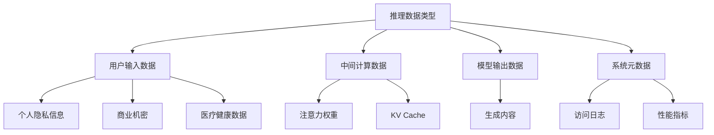
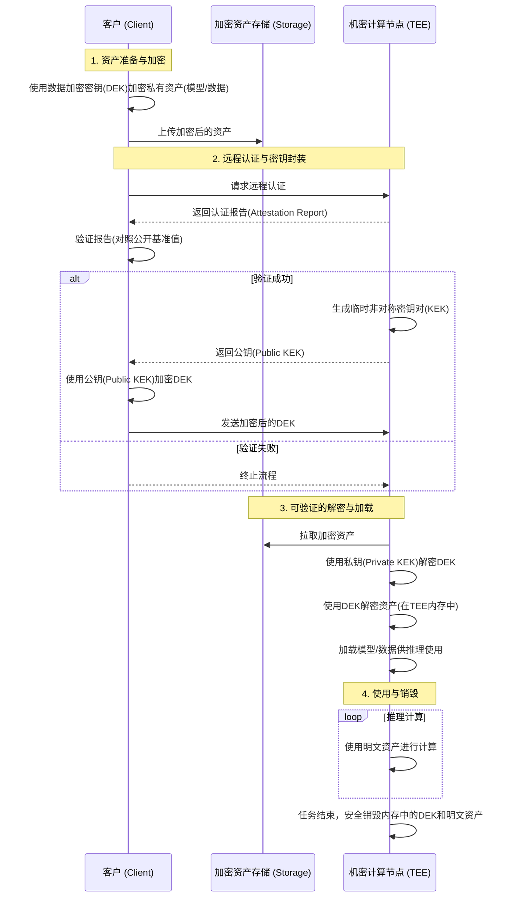

# Confidential MaaS：构建可验证的推理链路数据密态流转

# 背景介绍

## MaaS（Model as a Service）服务的发展现状

### MaaS服务模式的演进与市场格局

随着大型语言模型（LLM）和生成式AI技术的突破性进展，人工智能正从专门化的研究领域迅速转变为普惠性的基础能力。在这一浪潮中，模型即服务（Model as a Service, MaaS）已成为AI能力输出的主流模式，它将复杂的AI模型封装为简单易用的API接口，极大地降低了企业和开发者使用尖端技术的门槛。

当前市场由几类主要参与者构成：

模型巨头：如OpenAI、Anthropic，专注于前沿模型的研发和API服务。

云服务商：如阿里云、AWS、Azure、Google Cloud，它们凭借强大的基础设施优势，不仅提供自研模型，更构建了庞大的MaaS平台（如阿里云百炼、Amazon Bedrock），这些平台不仅是“模型超市”，集成了多家顶尖模型供用户选择，还提供了一站式的配套工具链、向量数据库、以及弹性的计算资源，成为MaaS生态的核心枢纽。

开源生态：以Hugging Face、ModelScope为代表的社区，通过开放共享模型、数据集和工具，为MaaS提供了极其丰富的选择和强大的创新活力。开源模型降低了用户进行私有化部署和微调的成本，推动了技术的快速普及和迭代。

这种“模型超市”式的商业模式虽然极大地繁荣了AI应用生态，但也带来了严峻的挑战：用户的数据流向变得前所未有的复杂，隐私保护的责任边界也随之变得模糊和分散。

### 大规模AI推理服务的技术架构特征

为了应对高并发、低延迟和高可用的需求，MaaS推理服务架构往往包含大量的分布式组件。一个简化的架构通常包含以下核心组件：

*   负载均衡器：作为流量入口，将海量用户请求分发至下游服务，确保系统的可扩展性和高可用性。
    
*   API网关：负责处理所有API请求的通用功能，如身份认证、访问鉴权、流量控制和请求路由。
    
*   推理引擎集群： 这是MaaS服务的“大脑”，由大量运行在GPU、NPU等专用加速硬件上的计算节点组成，负责执行实际的模型推理任务。
    
*   后端服务： 支撑推理服务的各种辅助系统，包括用于RAG（检索增强生成）的向量数据库、用于提升性能的KV Cache缓存系统、以及用于运维和审计的日志与监控系统等。
    

这些组件协同工作，在提升服务效率和扩展性的同时，也构成了一条漫长且复杂的数据处理链路。用户数据在多个计算和存储节点间流转，其中许多节点可能运行在未经验证的计算环境中，这显著增加了数据在处理过程中的隐私泄露风险敞口。

## 大模型推理服务中的数据隐私保护需求日益凸显

### 推理数据的多维度敏感性分析

随着MaaS服务渗透到金融、医疗、法律、研发等核心业务领域，用户输入的数据不再仅仅是日常闲聊，而是包含了大量高价值的敏感信息。因此，数据隐私保护已从“加分项”转变为MaaS服务提供商必须满足的“生命线”。

MaaS服务处理的数据具有前所未有的广度和深度，其敏感性体现在多个维度：

**个人隐私信息（PII/PHI）：**用户在与AI助手进行心理咨询、健康问诊或财务规划时，会输入大量个人身份信息（PII）和受保护的健康信息（PHI）。

**企业核心机密：**企业用户可能利用大模型分析财务报表、起草法律合同、优化商业战略，甚至提交未公开的产品设计和源代码进行审查或重构。这些数据是企业的核心知识产权和商业秘密。

**知识产权与创作内容：**作家、研究人员和开发者使用模型进行内容创作、论文撰写和代码生成，这些输入和输出本身就构成了受保护的知识产权。

**模型与数据资产：**对于使用模型微调和RAG等服务的用户而言，其私有的标注数据集、知识库文档和最终生成的微调模型，是极其宝贵的数字资产，同样需要最高级别的保护。

### 监管合规与技术标准演进

全球范围内的监管机构正在以前所未有的速度收紧数据隐私法规，并开始专门针对AI技术制定新的规范。

**现有法规的延伸适用：**欧盟的《通用数据保护条例》（GDPR）、美国的《加州消费者隐私法》（CCPA/CPRA）、中国的《个人信息保护法》（PIPL）等法规，都对数据的收集、处理和跨境传输提出了严格要求，MaaS服务作为新型数据处理中心，必须遵守这些规定。

**新兴的AI专项法规：**欧盟的《人工智能法案》（AI Act）等新兴法规，更是将AI系统的透明度、可解释性和安全性置于核心位置，要求高风险AI系统提供全方位的风险管理和数据治理措施。

合规压力迫使MaaS平台必须提供可审计、可验证的数据安全保障，向监管机构和客户证明其具备了保护数据全生命周期的能力。

### 现有安全方案的局限性

尽管MaaS服务商已经部署了成熟的传统安全方案，但它们在应对大模型推理场景下的新型威胁时，存在明显的“安全盲点”：

**传输中加密（Encryption in Transit）**：通过TLS/SSL协议保护数据在客户端与服务器之间的传输通道，但这无法防止数据在到达服务器后被解密处理时的泄露。

**静态加密（Encryption at Rest）：**对存储在硬盘或数据库中的数据进行加密，但这无法保护数据在被加载到内存和GPU显存中进行计算时的安全。

**访问控制与边界防御：**依赖身份认证（IAM）和网络防火墙构建安全边界，但在云原生环境下，攻击可能来自内部（如恶意运维人员、同主机上的其他租户），边界防御模型逐渐失效。

这些方案共同的局限性在于：

**无法保护使用中（In-Use）的数据：** 一旦数据为了计算而必须以明文形式存在于内存或GPU显存中，它就彻底暴露在操作系统、虚拟机管理器（Hypervisor）等特权软件以及物理攻击的威胁之下。

**安全无法被客户验证：** 用户无法独立验证服务商是否真正遵守了其安全承诺。服务商提供的安全白皮书或第三方审计报告，对于实时发生的计算过程来说，是一种“滞后”且“非技术”的信任背书。

这些正是当前MaaS服务面临的最棘手、最核心的安全挑战，也是本文旨在攻克的关键问题。

# 客户需求：在信任缺失的环境中寻求数据控制权

MaaS（Model as a Service）平台作为连接模型能力与业务场景的桥梁，其本质是处理和转化高价值数据的枢纽。然而，传统的安全模型建立在对服务提供商的“契约式信任”之上，这在AI时代已逐渐失效。客户将最敏感的数据，比如商业机密、用户隐私等，交由一个功能强大但内部逻辑不透明的“黑箱”处理，这种模式本身就蕴含着巨大的风险。因此，MaaS平台面临的已不再是简单的加密需求，而是来自多方、多层次的，对数据全生命周期可验证控制权的诉求。

这些诉求主要源自两类核心用户群体，他们的关注点虽有不同，但最终都指向同一个目标：确保数据在任何时候都只被用于预期的目的，且这一过程可以被独立、可靠的验证。

## 直接用户（模型调用方）的核心安全与控制诉求

直接用户，包括企业级客户和个人开发者，是MaaS服务的直接消费者。他们利用大模型API构建应用、分析数据、优化业务流程。对他们而言，输入的数据本身就是核心资产或需要严格保护的隐私信息。

*   **数据机密性与防滥用诉求：** 在传统的服务模式下，数据一旦离开客户端，用户便失去了对它的控制。他们最大的担忧是：服务提供商是否会利用客户数据进行模型微调，从而增强其自身模型能力，甚至反向形成竞争优势？拥有高权限的平台运维人员或内部攻击者，是否能接触到流经内存或存储系统的明文数据？企业的核心商业机密（如代码、配方、战略）是否会因平台方的安全疏忽或恶意行为而泄露给竞争对手？用户需要的不仅仅是一纸服务等级协议（SLA），而是技术上的“零信任”保障。他们要求数据在传输、存储、计算的全过程中，对包括MaaS平台在内的所有外部实体均保持密态，从根本上杜绝泄露和滥用的可能性。
    
*   **行为可验证与合规审计诉求：** 当前MaaS服务是一个不透明的“黑箱”。用户调用API后，无法得知其数据在服务端的真实处理逻辑。数据是否仅用于本次推理？是否被转发到了其他分析服务？是否在计算节点留下了明文日志或缓存？传统的第三方审计周期长、成本高，且无法覆盖实时的计算过程。用户需要一种可靠的机制来验证服务端的行为，获得密码学级别的证据，以证明数据被安全、合规地使用
    

## 间接用户（终端设备用户）的隐私保护要求

间接用户，主要指使用MaaS客构建的AI应用或服务的最终用户，例如使用集成了MaaS能力的智能手机、智能汽车或医疗设备的消费者。企业有强烈需求保障其C端用户的隐私合规性，提升其终端客户的安全感，避免因数据采集与处理引发隐私争议或法律风险。

*   **规避合规风险：** 当手机的AI助手、汽车的智能座舱或医疗设备集成了MaaS能力后，它们处理的就是海量的、高度敏感的个人数据，如语音指令、家庭对话、驾驶习惯、健康状况等。作为数据控制者，企业对终端用户的隐私负有最终法律责任，必须能向监管机构和公众证明，其合作的MaaS平台在技术上提供了最高级别的隐私保护，确保终端用户数据在任何司法管辖区都得到了妥善处理，从而规避合规风险。
    
*   **构筑品牌信任与市场差异化：** 在同质化竞争激烈的消费电子和汽车市场，隐私保护正从一项合规要求，演变为一个核心的产品卖点和品牌承诺。将“可验证的隐私保护”能力产品化、可视化，将能够直接转化为用户信任和购买意愿，形成强大的市场差异化优势。
    

# 技术需求分析

## AI推理链路数据流转安全全景分析

MaaS服务的复杂分布式特性，虽然带来了极致的性能和可扩展性，但也形成了一条漫长且充满潜在风险的数据处理链路。用户的每一次API调用，其数据都将穿过负载均衡器、API网关，进入由成百上千个计算节点组成的推理集群，并与向量数据库、KV缓存等后端服务交互。

下图是一个典型的推理服务架构。除客户端外，其他组件往往被认为均不可信且有能力接触到用户的隐私数据。对于实现可验证的推理链路数据密态流转的目标，本文将问题拆分为“可验证的安全”和“推理服务数据全生命周期端到端加密”两个关键问题，并分别予以解决：

## 可验证计算

所谓“可验证的安全”，是指客户必须拥有技术手段，能够在每一次服务请求时，以密码学的方式独立验证其数据所处的计算环境是真实、完整且未被篡改的。这彻底颠覆了依赖服务商“合同承诺”或“第三方审计报告”的传统信任模式。

### 运行时环境的可信验证难题：如何远程“看清”服务器内部？

当用户的请求到达MaaS平台的一个计算节点时，用户如何确信这个节点上运行的操作系统、容器镜像以及推理程序本身，与预期一致？是否存在未知的监控软件、后门或恶意代码？传统的安全手段无法回答这个问题。

我们需要一种机制，让远端的计算节点能生成一份不可伪造的“身份报告”（Attestation Report），这份报告能精确地“度量”和反映其从硬件启动到应用加载的全过程。客户端必须能基于这份报告，验证该节点是否处于一个已知的、可信的“黄金状态”（Golden State），从而决定是否将数据密钥交付给它。这就是对远程认证（Remote Attestation）的根本需求。

### 静态审计机制的局限性：信任的“快照”无法保障实时的安全

服务商提供的安全白皮书或第三方审计报告，本质上是对某个时间点系统状态的“快照式”认证。它无法保证在报告出具之后、在用户的实际计算发生之时，系统没有被更改。攻击者可能在审计通过后植入恶意代码。

必须建立一个动态、透明且可公开审计的基准值（Baseline）发布系统。这个系统负责维护所有可信软件组件（如OS内核、推理引擎二进制文件）的“数字指纹”（哈希值）。当客户端收到节点的“身份报告”后，可以查询这个公开系统，比对报告中的度量值与官方发布的基准值是否一致。这个基准值发布系统本身必须是防篡改且可信的，否则整个信任链将崩溃。

## 推理服务数据全生命周期端到端加密保护

仅拥有一个可验证的计算环境是不够的。我们还必须确保数据在其整个生命周期：从离开客户端到返回结果，都处于加密状态，尤其要解决分布式MaaS架构带来的独特加密挑战。

### 私有模型和数据资产泄漏保护需求：保护AI时代的核心资产

定制化模型，都是极其宝贵的数字资产。如果这些资产在存储、传输或加载过程中以明文形式暴露，即使存在可验证的安全计算环境，也可能被错误的逻辑或漏洞利用。

我们需要一套完善的资产加密方案。模型文件、向量数据库、微调数据等在上传和存储时必须是加密的。当需要使用这些资产时，应通过一个安全的工作流，将解密密钥安全地注入到环境内部，并仅在验证可信的环境中完成解密和加载，确保资产数据“不出安全域”。

### 推理中间态数据持久化安全

现代大语言模型的推理过程并非无状态的。为了在多轮对话中保持上下文连贯性并优化性能，系统严重依赖对中间计算结果的缓存，这构成了模型的“动态状态”，例如键值缓存（KV Cache）、注意力权重（Attention Weights）和隐藏层状态（Hidden States）。在分布式或资源受限的环境下，这些包含上下文敏感信息的动态状态数据，可能会被临时写入本地磁盘，以便在不同推理批次、甚至不同计算节点间复用。这些明文状态的持久化或跨节点传输，为攻击者打开了新的窗口，他们可以借此拼接出用户的完整对话历史或推理上下文，造成严重的信息泄露。

必须实现对推理中间态数据的即时加密。这要求在不显著影响推理延迟的前提下，对中间态数据进行高效的加解密操作。

### 推理运行时数据防护

**运行时数据加密**

在传统的威胁模型中，Hypervisor等特权软件拥有对虚拟机的最高访问权限，理论上可以任意读取虚拟机内存，从而窃取“使用中”的明文数据。这构成了最根本的信任障碍。

必须采用机密计算技术，利用硬件能力创建一个与主机操作系统、Hypervisor完全隔离的加密“安全区”（Confidential VM）。用户数据和代码只在这个“安全区”内以明文形式存在，一旦离开CPU核心进入内存，就会被硬件自动加密。这从根本上消除了来自特权层级的威胁，是实现密态数据流转的基石。

**运行环境加固**

机密计算技术为应用程序提供了一个强大的隔离边界，保护其免受外部（如宿主机操作系统、虚拟机管理器）的威胁。然而，系统内部的安全风险依然需要被重视，除了外部隔离之外，还需要对系统内部的运行时环境实施“纵深防御”。

这包括但不限于：

**最小化可信计算基（TCB）：**进入TEE内部的每一行代码、每一个依赖库，都会扩大潜在的攻击面。挑战在于如何构建一个“极简”的运行时环境，仅包含运行推理服务所必需的组件，剔除所有不必要的库、工具和系统调用，从源头上减少漏洞引入的可能。

**应用层安全加固：**需要对推理服务代码本身进行严格的安全审计和加固。例如，实施严格的输入验证，防止恶意Prompt注入；关闭所有不必要的调试接口（SSH/Serial Console/Container exec权限）；以及应用内存安全编程语言或技术，防止内存破坏类漏洞。

**防止非预期的信息输出：**攻击者可能利用应用逻辑，将本应保密的数据（如从RAG知识库中检索到的内容）巧妙地“包装”在正常的模型输出中返回给用户。必须设计精密的过滤和监控机制，确保模型的输出严格遵守预设的安全策略，防止数据通过“业务逻辑”泄露。

### 分布式推理架构下的端到端推理上下文加密

现代MaaS平台是庞大的分布式集群。用户的请求可能被负载均衡器分发到任何一个可用的计算节点。客户端如何安全地将其会话密钥分发给一个由负载均衡器随机选择的、但经过了可信验证的计算节点？在多轮对话中，如果后续请求被分发到另一个节点，如何安全地同步会话上下文和密钥？

需要设计一套面向分布式可验证计算节点的端到端加密协议和密钥管理架构。这可能涉及可信的密钥分发机制、支持会话保持的智能路由机制，以及可验证节点之间的相互远程认证协议，从而将单个节点提供的安全保障，扩展成整个可验证计算集群的安全保障。

# 可验证安全解决方案

针对前述的技术挑战，本章提出一套端到端、可验证的安全解决方案。该方案以机密计算技术为基石，构建了一个从硬件到应用的完整信任链；通过建立公开透明的基准值信任体系，实现了安全策略的可审计性；最后，基于此可信基础，设计了一套覆盖数据全生命周期的端到端加密保护机制。这套组合方案系统性地解决了大模型推理服务在复杂分布式环境下的数据隐私与安全挑战，将传统的“契约式信任”升级为“技术性可验证信任”。

## 机密计算技术体系

机密计算的核心能力由三项关键技术支撑：Measured Boot（MB，度量启动）、Remote Attestation（RA，远程认证） 和 Trusted Execution Environment（TEE，可信执行环境）。这三项机制共同构建了计算过程中的安全闭环：

*   Trusted Execution Environment（TEE）：在硬件级隔离的“安全区”内执行代码和处理数据，从根本上防御来自特权软件的窥探和攻击。
    
*   Measured Boot（度量启动）：对系统启动过程中的关键组件进行完整性度量，确保运行环境未被篡改。
    
*   Remote Attestation（远程认证）：通过密码学手段验证目标节点的运行状态和软件配置，实现远程信任建立。
    

### 可信执行环境（TEE）(@Intel)

可信执行环境（TEE）是在主处理器内部构建的一个隔离且安全的执行空间。其核心目标是为敏感代码和数据提供一个受硬件保护的运行环境，即使操作系统（OS）、虚拟机管理器（VMM）或其他系统组件遭受攻击或被恶意控制，TEE 内部的资源仍能保持机密性与完整性。

各类 TEE 技术通常具备多层次的安全防护机制，包括但不限于：

**内存加密**：确保 TEE 内存中的数据在物理层面不可见；

**寄存器与上下文保护**：防止运行时状态被非法读取或篡改；

**中断与异常隔离**：阻止外部中断干扰 TEE 的执行流程；

**页表保护**：限制对 TEE 地址空间的访问权限，增强运行时安全性。

这些机制共同保障了 TEE 在复杂系统环境下的可信性，使其成为实现机密计算、隐私保护和远程认证的关键技术基础。

### 度量启动（Measured Boot）

#### 技术原理与实现机制

Measured Boot 不仅是启动安全的基础，更是远程认证（Remote Attestation）和运行时可信评估的前提条件。它通过硬件辅助机制确保：

*   链式度量：从固件(UEFI)开始，每一个启动阶段的组件（如Bootloader、内核、Initrd）在加载下一个组件之前，都会计算其哈希值（即“度量”）。
    
*   安全存储：这些度量值被依次扩展（Extend）到一个专用的、只能追加、无法篡改的平台配置寄存器（PCR）或运行时度量寄存器（RTMR）中。
    
*   最终摘要：最终形成的寄存器值，是整个启动链的密码学摘要。任何对启动组件的微小篡改，都会导致最终的摘要值截然不同，从而在远程认证阶段被轻易识破。
    

在 Intel TDX 架构中，MRTD（Measurement Register of Trusted-Domain (TD)）与四个 RTMR (Run Time Measurement Register) 寄存器共同构成了虚拟机的度量值。一旦启动完成，这些值即可作为衡量当前系统是否处于预期可信状态的关键依据。

在实际应用中，从 BIOS 到 GRUB2，再到 Kernel、Initrd 和 Cmdline 的启动度量链路已经相对成熟，通过局部调整和增强即可满足大多数场景下的完整性验证需求。

#### 应用层度量的技术路线

要将可信度量延伸至应用层，则面临更高的复杂性和挑战。目前业界主要探索了以下几种不同的技术路线，以实现对用户态程序及其运行环境的完整性和可信性保障。

| **解决方案** | **描述** |
| --- | --- |
| #### Direct Boot 度量 | 在机密计算实践中，Direct Boot 是一种将信任链前移至应用层的有效方法。其核心思想是： *   将业务逻辑直接嵌入 Initrd；      *   在系统启动阶段即完成对 Kernel、Initrd 和 Cmdline 的完整度量；      *   启动完成后由内核直接执行业务程序，跳过完整的用户空间初始化过程（如 systemd）；      这种方式不仅大幅缩短了启动路径，还显著减少了潜在的安全风险点，使得整个运行环境更加可控、透明和易于认证。 [LinuxKit](https://github.com/linuxkit/linuxkit) 是 Docker 开源的一套轻量级操作系统构建工具，已被广泛用于构建基于容器镜像风格的 Initrd 镜像。借助 LinuxKit，开发者可以便捷地将业务逻辑打包进可度量的启动组件中，为远程认证和运行时安全提供更强支撑。 |
| #### 基于固件的短链度量 | 该机制通过截断传统启动链的方式，构建了一个最小化的可信路径。其核心特点是： *   应用逻辑集成于 Initrd；      *   启动过程中仅加载 Kernel + Initrd；      *   成功引导后不再挂载根文件系统（rootfs），避免引入额外不可控组件；      *   所有完整性度量集中在早期阶段完成，形成“短链”信任模型；      这种方式特别适合 ECS 等虚拟机场器等，能够在保证安全性的同时提升启动效率和资源利用率。不过，由于缺乏完整的用户空间支持，该方案在功能灵活性和复杂业务适配方面存在一定局限，通常需要配合镜像定制工具（如 LinuxKit）进行标准化构建。 |
| #### 基于 dm-verity 的长链度量 | 基于 dm-verity 的长链度量是一种兼顾安全性与功能性的实现方式。它在传统启动流程基础上引入了细粒度的磁盘级完整性保护机制： *   启动过程依然加载 Kernel、Initrd 并挂载 rootfs；      *   在挂载根文件系统时，通过 dm-verity 对整个分区进行哈希校验；      *   每个数据块在访问前都会进行完整性验证，确保未被篡改；      *   校验失败将导致 I/O 错误，阻止恶意修改被执行；      这种方式不仅实现了从 BIOS 到用户空间的完整信任链，还能有效防御运行时攻击（如二进制替换、配置文件篡改等），特别适合IaaS场景。 |

### 远程认证（Remote Attestation） $\color{#0089FF}{@马丁(漠客)}$ 

系统的启动度量技术能够把TEE环境中推理服务所依赖的所有底层软件栈完整性度量信息记录在TDX硬件寄存器中。

接下来，用户需要对这些度量信息作验证，远程认证（Remote Attestation, RA，也称为远程证明）技术可使用户对机密虚拟机的运行状态进行验证。IETF（Internet Engineering Task Force，网际网路工作组）定义了远程认证流程，将远程认证的直接参与者分为三方

*   证明方（Attester）：通过提供当前执行环境的远程认证报告（Attestation Report），来获取授权。当前场景下的推理服务所处的TEE运行环境为证明方，当完成认证后，可以访问用户隐私数据。
    
*   验证方（Verifier）：负责验证证明方的远程认证报告。通常由用户自己或者用户可信的机构代理。
    
*   依赖方（Relying Party）：依赖验证方对证明方的认证结果，为证明方提供授权。通常为用户本身，提供如数据密钥等机密数据。
    

完成远程认证后，用户可根据验证结果选择信任当前推理服务所处可信执行环境，并授予其访问隐私数据的能力。远程认证往往会和密钥协商技术结合，为依赖方和证明方提供安全可信的信息通道，注入诸如用户隐私数据解密密钥等信息。

#### 远程认证和信任建立

远程认证的目的，是验证方确认目标虚拟机运行于具备硬件级安全保障的可信执行环境（TEE）中，并且其运行时的代码与配置符合预期，未被篡改。

硬件签名机制在这一过程中发挥了至关重要的作用。每个硬件处理器会包含一对绑定的硬件非对称密钥对（简称硬件密钥），TEE可以利用该非对称密钥可以对度量信息进行签名，生成远程认证报告。由证明者生成的远程认证报告**至少**包含如下三部分：

*   来自验证方的挑战值：在每次远程认证过程中，验证方会向TEE提供一个随机的挑战值。该挑战值会被包含在认证报告内。通常把任意数据嵌入远程认证报告的过程称为绑定（Binding）。
    
*   度量值：度量值涵盖了所有启动度量阶段记录的完整性信息，包括硬件寄存器的值以及额外的信息。
    
*   硬件签名：由硬件密钥对包含挑战值和度量值在内整体的签名。
    

验证方在验证远程认证报告时，包含如下逻辑：

*   硬件签名的验证：硬件厂商如Intel会维护一个公开服务，记录自己生产的硬件和对应公钥的背书信息。通过硬件厂商的背书服务可以验证签名密钥的有效性，保证认证报告确实源自于可信执行环境内。同时，通过数字签名保证度量值和挑战值的完整性。
    
*   度量值的验证：远程认证报告中的度量值，反映了运行时环境的内核态和用户态代码逻辑的完整性。通过与期望值（又称参考值（Reference Values）、黄金值（Golden Values）或基准值）的比对，保证目标系统软件代码的可信性。
    
*   验证方挑战值匹配：验证方确认先前发送的挑战值与当前收到报告的绑定关系。利用挑战值生成的随机性，可以保证认证报告的新鲜性（Freshness），避免TEE内的恶意软件逻辑试图利用其他认证报告发动重放攻击（Reply Attack）。
    

当且仅当运行环境与预期一致时，用户才与运行环境建立信任关系。这一过程实现了“**环境即身份**”和“**代码即身份**”的安全模型。

#### 密钥交换机制和数据解密

在完成远程认证（Remote Attestation, RA）后，TEE需要进一步处理用户隐私数据。在这个过程中，涉及到用户加密数据在TEE内解密，或者TEE之间网络通信的加密，二者都依赖密钥协商机制。通常，只涉及到通信两方的密钥协商机制是与远程认证紧密结合的，常见的有两种设计思路。

*   基于传输层增强的远程认证-密钥协商协议：将远程认证流程与TLS/DTLS协议等传输层协议结合，保证TLS客户端（依赖方）完成对TLS服务端（认证方）的执行环境认证（或者双向认证），建立加密信道。典型的包括Attested-TLS系列技术。
    
*   基于应用层的消息级远程认证-密钥协商协议：将远程认证流程封装成HTTP/gRPC等消息级协议，通过多轮会话来完成远程认证和密钥协商。典型的，包括Confidential Containers社区的RCAR协议。
    

Attested-TLS技术根据远程认证报告产生的时间，可以分为三类

*   握手前认证（Pre-Handshake Attestation）：服务端在接受客户端TLS握手请求之前，先获取远程认证报告。通常这个过程涉及TEE生成一对非对称密钥作为TLS密钥，并把公钥部分与远程认证报告绑定。在实际有客户端发起TLS握手请求时，会把公钥证书连同远程认证报告一同交给客户端作验证。这种技术由于没有客户端新鲜数的保证，存在重放攻击风险。
    
*   握手中认证（Intra-Handshake Attestation）：服务端将远程认证报告生成逻辑放在实际的TLS握手过程中，利用TLS协议中来源于客户端的新鲜数，生成远程认证报告。客户端在验证服务端证书时同步验证远程认证报告。这种技术能够阻止服务端重放攻击风险。
    
*   握手后认证（Post-Handshake Attestation）：服务端在TLS握手之后的某个阶段，按需生成远程证明报告，并交由客户端作认证，并将认证结果和当前TLS会话绑定。
    

基于应用层的消息级远程认证-密钥协商协议目前有Confidential Containers社区的RCAR（Request-Challenge-Atttestation-Response）协议。该协议基本逻辑符合Challenge-Response（挑战-应答）范式，包含四个流程

*   位于TEE内的证明方（Attester）程序发起远程证明请求（Request），连接依赖方服务Trustee
    
*   依赖方服务回复证明方一个挑战值（Challenge）
    
*   证明方生成一对软件公私钥对，并使用挑战值与公钥绑定生成远程认证（Attestation）报告发送给依赖方
    
*   依赖方借助验证方，验证远程认证报告，验证完毕后返回一个响应（Response）给证明方。该响应包含一个有效的凭证信息，例如是对公钥的背书，用以让证明方客户端在接下来进一步向依赖方发起请求。
    

上述两类协议都能够建立依赖方和TEE之间的安全通信隧道，基于此隧道，依赖方可以将用户隐私数据的解密密钥传入到TEE内，实现隐私数据的TEE内解密、TEE内使用和TEE内销毁。

#### 远程认证技术路线

目前业界有一些落地的远程认证技术体系，大体逻辑较为相似，枚举如下

*   Confidential Containers（CoCo）的Trustee体系：由开源社区推出的开源远程认证服务，提供Intel TDX/Intel SGX/AMD SNP/Arm CCA/Azure vTPM/Hygon CSV/Nvidia GPU/Hygon DCU等各大厂商硬件的认证，支持CPU与设备组合认证能力，支持策略验证，紧跟IETF标准化，已经登陆Fedora、OpenAnolis等多个软件生态，典型的下游实现例如Open Anolis Attestation Service（OAAS）。
    
*   Intel ITA：由Intel硬件厂商推出的商用远程认证服务，提供针对Intel架构下的TDX/SGX，以及Nvidia GPU的远程证明，支持策略验证。
    
*   Microsoft Azure Attestation（MAA）：由微软云厂商推出的商用远程认证服务，提供针对Azure云上SNP-vTPM、TDX-vTPM等产品架构的远程证明支持，支持细粒度的证明策略。
    

## 基准值信任技术体系

远程认证中最重要的部分之一，就是对目标机密虚拟机的运行状态的度量值做比对验证。一个运行良好的、状态可信的机密虚拟机，意味着在整个启动和运行流程中的所有软件栈是完全可预期的，因此应当具有一组确定的基准值。

基准值可以反映的是内部软件的完整性信息，当目标机密虚拟机的度量值与基准值完全相同时，可以认为目标机密虚拟机的整个运行状态是良好无篡改的，例如运行着预期的推理服务和模型；进一步的，我们需要考察基准值的来源，保证基准值对应的软件组件代码是没有后门的、安全可审计的，这就需要有一套完备的基准值生成和发布体系。

### 基准值生成

基准值的生成反映了TEE内部软件供应链的整体安全性，主要包括以下关键节点：

● 软件代码安全：TEE内运行的软件，包括推理引擎、相关操作系统镜像、库和配置等，必须在源码层面无安全隐患或后门，以确保用户隐私数据处理过程中的安全。

● 代码到软件制品的映射：基准值表征的是软件二进制制品完整性，需要有相关技术明确安全源代码与软件制品之间的对应关系，协助用户相信当前的基准值是可靠安全的。

#### 软件代码安全——代码开源与透明度机制 $\color{#0089FF}{@马丁(漠客)}$  $\color{#0089FF}{@段勇帅(九钟)}$ 

在软件代码方面，机密计算与代码开源紧密相关，通过代码透明度机制来保证安全性。

##### 开源在可验证计算中的必要性

仅获取公开的可信基准值并不足以确保运行环境的完整安全性。信任的根源是透明。为了让用户确信推理应用中没有后门或恶意逻辑，所有接触敏感数据的核心组件代码都应开源，接受社区和客户的公开审计。。

##### 开源社区安全机制

开源社区在推进代码透明性方面扮演着重要的角色，它通过以下几个方面来保障可验证计算的安全性

*   源码公开：代码库所有逻辑对公众开放，任何人可以查看、审计和学习源码，并允许任何利益相关者检查代码的质量和安全性。
    
*   协作开发：开源代码意味着多个开发者的共同协作贡献、代码审查和公开讨论决策，避免了安全隐患以及后门的引入。
    
*   许可证合规性：开源许可证明确指出软件的使用条件和限制，在透明的基础下，所有用户和贡献者都知道项目和代码的法律边界。
    

#### 代码到软件制品的映射

基准值往往表征的是软件制品文件的完整性信息，当用户明确了代码逻辑的安全性，需要进一步确定特定软件制品基准值所对应的源码。由于从源码到软件制品的编译过程是复杂的，需要考虑不同安全等级下的关联方法。

##### 可重复构建机制（工程确定性路径）

在理想状态下，软件源代码到软件制品的构建过程是完全可重复的，意味着通过标准化构建工具链可以允许验证方在任何时间自行重复构建出完全相同的制品文件，实现源码到制品的可验证映射：

*   采用声明式依赖锁定（如Cargo.lock）、环境隔离（容器/SDKMAN!）及编译器确定性设置（如`SOURCE_DATE_EPOCH`）；
    
*   核心价值：任何人在任意环境执行构建流程，均能生成与官方发布制品比特级一致的输出；
    
*   溯源逻辑：第三方通过重现构建过程，比对生成产物的哈希值即可确认制品是否源于声明源码且构建过程未引入未授权变更。
    

##### 数字签名机制（密码学信任路径）

在更多场景下，软件源代码与软件制品的构建过程并不是完全可重复的，意味着验证方在自己的环境下几乎不可能复现出相同的二进制产物。同时，软件制品和参考值的一对一关系是在构建时才能确定的。这就需要引入额外的信任关系，即软件构建和发布方通过非对称加密技术建立与软件制品的绑定关系：

*   软件构建和发布方用私钥对源码标签（如Signed Git Tag）或构建产物（如.apk/.exe）及基准值生成数字签名（.asc/.sig文件）；
    
*   核心价值：验证者使用公钥校验签名可同时确认：1）制品由私钥持有者发布，2）制品内容传输/存储中未被篡改，3）制品和基准值的对应关系；
    
*   溯源逻辑：签名本身不依赖构建过程，仅通过密码学证明发布者身份与制品完整性，与源码的对应关系需额外通过版本声明（如GitHub Release关联commit）建立。
    

在这种情况下，用户验证方需要选择自己信任的软件构建和发布方。

#### 可重复构建 $\color{#0089FF}{@段勇帅(九钟)}$ 

##### 软件制品确定性的技术挑战

即便我们已获得可信的基准值和经过审计的源代码，仍需一种机制将二者进行有效关联，以确保最终运行的二进制确实由所声明的源码构建而来。这一需求引出了“可重复构建（Reproducible Build）”的概念。

可重复构建是一种软件构建过程的理想属性：在相同的源代码、构建环境和构建指令下，无论何时、何地进行构建，都应能够生成完全一致的二进制输出（如可执行文件、库、软件包等）。它是实现“从源码到运行时”完整信任链的关键一环。

然而，在实践中实现真正意义上的可重复构建仍面临诸多挑战，主要包括但不限于：

**时间戳嵌入问题**：许多编译器和打包工具会在生成的二进制中自动插入当前时间戳，导致不同时间点构建出的文件哈希不一致；

**随机性引入差异**：某些构建流程中可能使用了随机数（如调试信息 ID、符号名称等），造成输出结果的不确定性；

**外部依赖不确定性**：构建过程中若依赖网络资源、第三方库或动态获取的内容，而这些内容随时间发生变化，也会导致最终产物不一致；

解决这些问题需要从构建工具链、依赖管理、构建环境标准化等多个层面入手，逐步消除非确定性因素，为可信验证提供坚实基础。

##### 可重复构建相关技术方案

*   **构建环境隔离**
    

Yocto等项目通过配方特定的sysroot（recipe-sysroot与recipe-sysroot-native）实现严格隔离。这些目录仅包含声明的依赖项，彻底杜绝未声明的主机工具或库的污染。同时通过显式许可清单（如HOSTTOOLS变量）严格限制主机工具访问，消除主机系统工具带来的不确定性。

*   **编译器级确定性**
    

采用-fdebug-prefix-map与-fmacro-prefix-map等编译器选项（通过DEBUG\_PREFIX\_MAP控制），标准化调试符号和宏中的文件路径。确保不同目录或用户名环境下生成的构建产物路径完全一致。

*   **依赖锁定与配置控制**
    

可重现构建要求明确定义所有依赖库的版本及配置标志。禁止浮动依赖（如自动检测的主机库），转而通过PACKAGECONFIG严谨定义所有允许的构建选项。

*   **构建产物后处理**
    

生态系统专用插件（如Maven/Gradle/sbt插件）通过清除JAR、APK（移动应用包）或二进制文件中的易变元数据（时间戳、唯一ID）实现产物标准化。apksigcopier等工具将加密签名与构建流程解耦，使独立重建无需私钥即可完成。

*   **独立验证体系**
    

rebuilderd等协调器在隔离环境中自动化执行大规模源码重建，将生成二进制文件与官方分发版本进行逐比特匹配验证，有效检测未授权篡改。

### 基准值发布和审计平台

#### 基准值发布系统

##### 可验证计算对发布和审计的安全要求

机密计算技术向验证方提供的运行时度量值，本质上是一系列哈希值，用于反映当前执行环境的完整性状态。然而，对于验证方而言，如何获取与预期运行状态一致的可信基准值（Trusted Baseline），是实现远程认证和公开审计的关键问题。

在当前应用场景中，为确保远程验证过程的安全性和可信性，基准值的发布机制需满足以下核心安全要求：

**公开可访问性 (Public Accessibility)**  
客户端（以及任何第三方审计机构）必须能够无需特殊授权、不受限制地访问和查询所有已发布的基准值。这种彻底的透明度是建立公众信任的基础，它防止了服务提供商对不同用户展示不同的“可信”标准，确保了验证规则的一致性。

**防篡改与完整性 (Tamper-Proof Integrity)**  
平台必须提供密码学级别的保证，确保任何基准值一旦发布，便无法被任何人（包括平台管理员）悄无声息地修改或删除。每一条发布记录都应是不可变的。这是信任的基石，否则，攻击者或恶意内部人员可以通过篡改历史基准值来“合法化”一个已被攻破的系统。

**明确的吊销机制 (Explicit Revocation)**  
软件世界中没有绝对的安全。当某个版本的软件（如推理引擎、操作系统内核）被发现存在严重漏洞时，必须有一个可靠的机制来宣布其对应的基准值“作废”。这个吊销记录本身也必须是公开且防篡改的，以防止客户端继续信任一个已知的、不安全的软件版本。这类似于SSL证书体系中的证书吊销列表（CRL）或OCSP。

**可追溯的来源证明 (Traceable Provenance)**  
仅有一个哈希值是不够的。一个可信的基准值必须能够清晰地追溯其源头。平台应记录每个基准值所对应的确切源代码版本（如Git Commit Hash）、构建环境的详细信息以及证明其是由“可重复构建（Reproducible Build）”过程生成的证据。这构成了从源代码到二进制再到度量值的完整信任链，让审计者可以独立验证“代码即身份”的承诺。

##### 基准值发布和审计相关技术方案

为满足上述苛刻的安全要求，传统中心化的数据库或网站发布模式是远远不够的。业界正在探索基于密码学和分布式系统构建的新一代信任基础设施。以下是两种主流的技术方案：

**透明日志 (Transparency Log)**

透明日志是一种公开的、仅能追加（Append-only）的、可被高效审计的日志系统。它的设计理念源于Google的证书透明度（Certificate Transparency）项目，并由Sigstore等开源项目发扬光大。  
所有基准值的发布都被视为一条日志条目，被添加到一个不断增长的加密链（通常是默克尔树，Merkle Tree）的末尾。任何人都可以向日志中添加新条目，但无法修改或删除已有条目。平台会定期发布日志的“树头哈希”（Tree Head Hash），任何观察者都可以通过对比不同时间的树头哈希和日志内容，来验证日志的完整性和一致性，确保没有任何记录被篡改或“分叉”。

**区块链技术 (Blockchain Technology)**

区块链，特别是公有链或联盟链，以其去中心化和防篡改的特性，也为基准值发布提供了理想的平台。  
可以将每一次基准值的发布或吊销操作，作为一笔交易记录在区块链上。通过分布式共识机制（如PoW或PoS），交易被打包进区块并永久链接到链上，使其几乎不可能被篡改。智能合约（Smart Contract）还可以用来定义更复杂的发布和治理逻辑。

透明日志通常更轻量、更专注，是专为验证软件制品这类场景设计的，其生态（如Sigstore）也更为成熟，是当前实现软件供应链安全的优选方案。

区块链提供了更强的去中心化保证，但在性能、成本和部署复杂性上可能更高。它更适用于需要多方共同治理、互不信任的联盟场景。

# 推理服务数据全生命周期端到端加密保护 $\color{#0089FF}{@赖堃(闻枢)}$  $\color{#0089FF}{@张泽宇(责羽)}$ 

## 私有数据资产加密

对于使用MaaS平台的企业和开发者而言，其价值不仅仅在于调用通用模型的能力，更在于利用平台实现自身数据资产的增值。私有的定制模型、用于RAG的领域知识库、以及用于模型微调的标注数据集，这些不仅是数据，更是企业的核心知识产权和竞争壁垒。因此，我们必须建立一套全新的数据资产保护范式：将数据资产的访问控制权牢牢掌握在数据所有者手中，并确保只有经过客户验证的可验证计算环境才能在需要时解密和使用这些资产。

### 私有数据资产加密链路

在MaaS场景下，保护模型、知识库等私有资产面临着独特的挑战：

**密钥控制权与信任边界：**核心挑战在于密钥管理。如果密钥由服务商控制，那么所谓的加密对服务商而言形同虚设。必须实现一种机制，让数据所有者（客户）能管理其数据加密密钥（DEK），并安全地将其提供给一个可验证的计算环境。

**“静态”到“使用中”的安全转换：**数据最脆弱的时刻，是从加密存储状态被解密并加载到内存/显存进行计算的瞬间。必须确保这一转换过程完全发生在硬件加密的安全计算环境中，杜绝明文数据在主机操作系统或Hypervisor层面暴露的任何可能。

**资产类型的多样性与集成复杂性：**MaaS涉及的资产类型多样，从模型权重文件，到向量数据库索引，再到大量的非结构化文档，其存储和加载方式各异。加密方案必须具备足够的灵活性，以最小的性能开销和改造成本，与现有的AI工作流（如模型加载器、RAG检索器）无缝集成。

以下是一个面向上述场景的加密资产使用工作流示例。该流程确保了数据资产的机密性，并将解密权限与环境的可验证严格绑定。

## 持久化数据加密（address中间态数据） $\color{#0089FF}{@赖堃(闻枢)}$ 

在推理过程中，普遍存在中间态数据的落盘存储的需求。对这些数据的加密分析主要围绕加密方案以及密钥管理两方面展开。

### 存储层加密架构

#### 机密实例数据卷存储加密机制

**机密性**

dm-crypt 是 Linux 内核提供的实现磁盘加密的核心机制，负责将数据在写入磁盘前加密，并在读取时解密。加密/解密过程对上层应用透明，用户无需修改现有文件系统或应用程序。而LUKS（Linux Unified Key Setup）则是基于 dm-crypt 的加密密钥管理标准。解决密钥和加密参数（如算法、密钥槽、随机盐等）的管理问题。LUKS使用的是典型的KEK加密方式，数据采用主密钥（Master Key）进行加密，用户输入的密码经过密钥派生算法（如 PBKDF2 等算法）得到KEK，使用KEK对主密钥进行加密后存放到密钥槽中。数据加密支持多种加密算法和模式（如 AES-XTS、AES-CBC、Serpent 等），能够确保数据在流出机密计算实例的安全边界之前，进行不受云服务提供商控制的数据加密。

**完整性**

在某些应用场景中，业务可能对数据的数值正确性有很高的要求。例如，在机器学习模型训练过程中，攻击者可能会对一些关键生产数据（如模型权重、向量值）进行恶意篡改，从而降低模型的效果，甚至影响业务的正常运行。这类攻击具有较高的隐蔽性，仅依靠加密手段无法完全防御，因为攻击者可以直接对密文进行盲目修改。dm-integrity 是 Linux 内核中用于数据完整性保护的关键技术之一，它通过与 dm-crypt 机制结合，采用密码学 Hash 算法（如 HMAC-SHA256 等）计算数据块的消息认证码（MAC），确保存储设备中的数据未被未经授权的修改。即使攻击者尝试篡改密文，dm-integrity 也能检测到这些变化并阻止其进一步传播，从而确保数据的完整性和可信度。

#### 机密实例系统分区存储加密机制

在云计算环境中，机密实例的系统盘分区存储加密需满足两大核心安全需求：可度量性与数据加密能力。可度量性确保系统完整性，通过不可篡改的验证机制实现从启动到运行的全链路可信；数据加密能力则通过端到端的加密技术保护敏感信息，即使物理存储介质被非法访问，攻击者也无法获取明文数据。二者共同构建了机密实例的纵深防御体系，既保障了系统运行环境的可信基线，又实现了数据存储的自主可控。

**可度量性：基于哈希树的全链路可信验证**

操作系统可以通过dm-verity机制实现对rootfs卷的完整性度量，其大致流程如下：

*   哈希树构建：在系统启动阶段，内核会为rootfs卷的每个数据块计算哈希值，并逐层聚合生成Merkle树结构。最终的根哈希值（Root Hash）作为整个文件系统的完整性标识。
    

*   安全存储：根哈希值被加密后存储于可信执行环境（TEE）内的安全内存中，防止未经授权的访问或篡改。
    
*   动态校验：系统运行时，内核实时验证每个读取数据块的哈希值是否与哈希树路径一致。若检测到任何数据块被修改（如磁盘数据修改和恶意代码注入），系统将立即终止启动流程并触发告警，彻底阻断不可信环境的运行。
    

这一机制不仅可确保系统启动过程的可信性，还通过持续校验实现运行时的动态防护，为关键业务提供不可抵赖的完整性保障。

**数据加密：分层密钥体系与远程证明的协同防护**

数据加密与块设备加密的方式相同，通过采用dm-crypt机制的透明加密能力和LUKS标准加密方法，结合远程证明的密钥管理策略，让加密凭据通过远程证明机制在对实例进行验证之后下发。所有数据在写入磁盘前自动加密，读取时在机密实例的安全内存中解密，确保加密数据在云盘存储期间始终处于加密状态，同时满足密钥全生命周期的自主可控需求。

#### 机密实例向量加密机制（rag）

### 加密凭据管理

#### 凭据存储

*   机密KMS？
    

#### 远程证明的凭据分发

*   重复内容？
    

## 推理数据端到端加密

### 可验证计算场景下的端到端加密原理（验证、密钥、加密流程的原理性介绍）

#### 端到端加密中的实例身份验证

在端到端加密系统中，实例身份验证是确保通信双方身份真实性和数据完整性的核心环节。与传统的X.509证书体系相比，本文描述的可验证安全模型，在信任建立、验证机制及安全性保障方面存在显著差异。

*   中心化与去中心化：X.509证书体系采用中心化信任模型，其核心依赖于证书颁发机构（CA）构建的信任链。而可验证安全模型通过远程证明直接验证实例身份，无需依赖第三方机构。
    
*   静态证书与动态证明：X.509体系的技术实现依赖于静态证书的分发，只能代表实例在证书签发时的身份。而在可验证计算场景下，可以通过远程证明实现对通信对方的环境进行实时的验证，从而实现即时、细粒度的安全控制。通过配合使用一次性通信密钥，还可以减少长期密钥暴露风险。
    

#### 端到端加密中的密钥管理

在端到端加密体系中，密钥的生成、分发、存储和销毁机制直接影响系统的安全性与可用性。根据应用场景和安全需求的不同，密钥管理可分为临时密钥和长期密钥两种模式，以下将分别介绍这两种模式。

*   临时密钥：临时密钥是为特定机密实例（如一次会话、任务或数据传输）动态生成的密钥，仅在该实例的生命周期内有效，任务结束后立即销毁。临时密钥通常基于密钥派生函数（KDF）或加密安全的随机数生成器生成，确保每次实例的密钥唯一且不可预测。
    
*   长期密钥：长期密钥由中心化密钥管理系统统一生成并存储，实例启动时通过远程证明（Remote Attestation）验证其可信环境后，安全分发密钥。
    

长期密钥由于其依赖中心化的管理，存在单点泄露风险，在模型推理应用场景中，临时密钥通过短生命周期和动态生成机制，可以降低泄露风险。

#### 端到端加密协议介绍

##### 消息级加密（Message-Level Encryption）

消息级加密是指对每条单独的消息进行独立加密和解密，每条消息使用不同的密钥或加密上下文。这种机制确保即使某条消息被截获或密钥泄露，仅该消息的内容会被暴露，而其他消息仍保持安全。消息级加密通常依赖于非对称加密算法（如RSA、ECC）或对称加密算法（如AES）的组合，结合密钥协商协议来动态生成每条消息的加密密钥。其优点是适用于消息数量多、频率高的场景，但由于每条消息需独立密钥协商，可能影响传输效率，因此往往应用于无状态服务的场景。

##### 会话级加密（Session-Level Encryption）

会话级加密在通信双方建立连接或会话时生成一对共享密钥，该密钥在会话期间（如通话、聊天窗口开启时）用于加密所有消息。会话结束后，密钥通常被丢弃或更新，但同一会话内的所有消息共享同一密钥。

主流的会话级加密采用TLS协议，在建立TCP连接时通过握手协商会话密钥，后续数据传输使用该密钥加密。其优点是在会话内消息共享密钥，因此在需要保持长连接、传输大量数据时可以减少重复密钥协商的计算和延迟。但会话级加密由于其有状态的特点，在云原生场景下配合负载均衡组件使用时，还需要对负载均衡的配置进行调整。

##### 节点级加密（Node-Level Encryption）

节点级加密的核心是通过虚拟网络设备（如TUN/TAP）在数据传输的每个节点间构建安全通道，确保数据在经过中间节点时无法被窃取或篡改。这种加密方式通过将加密操作嵌入到网络协议栈的底层，通过构建虚拟网络，对上提供传输过程的透明安全性。但它的劣势也很显著，由于所有的通信均承载于虚拟网络中，这对于对CPU资源消耗较大。此外，对于已有业务的融合也不友好，若网络中同时存在加密和非加密流量，需额外设计隔离机制，否则可能因配置错误导致未加密数据泄露。

### 不同场景下的端到端加密需求

端到端加密通过确保数据从发送端到接收端的全程加密，有效抵御中间人攻击、数据泄露及未授权访问，其应用场景的复杂性要求技术方案需针对不同环境进行差异化设计。以下从集群内部通信和外部客户访问两大场景展开分析，结合技术细节与安全逻辑，系统阐述其加密需求与实现路径。

#### 集群内部的端到端加密需求

##### 双向身份验证

双向身份验证的核心目标是确保集群内部的每个计算节点或服务端点在建立通信前，能够验证对方的身份与安全性状态。例如，当两个AI模型训练节点需要交换数据时，双方需通过硬件级的可信根证明自身未被篡改，并且当前运行的软件环境符合预设的安全策略。这一过程不仅验证了对方的硬件完整性和软件环境的正确性，还通过密码学手段确认其持有的密钥未被泄露或替换。从而能有效抵御中间人攻击，同时为后续加密通信奠定信任基础，确保各方共享的数据仅在可验证的安全环境中流动。

##### 多种应用层协议的支持

在云原生场景下，集群中的服务端点之间需要加密通信，以保护数据隐私与完整性。但是不同服务端点之间所使用的协议因功能不同而不同。例如，负责处理网络请求的中间件通常使用HTTP来传输，而数据库集群则又通常使用基于TCP的定制通信协议。在设计端到端加密时，需要考虑这些协议的加密支持能力。此外，有些协议在设计时可能并未原生支持加密，为了实现加密通信，还需要引入额外的加密层，如TLS或DTLS。

##### 可选加密的支持

并非所有集群内部接口都需要端到端加密。例如，实例中运行服务的健康检查接口无需加密，节点间的日志传输或非敏感的元数据同步也可能无需加密，而模型参数交换或用户隐私数据则必须加密。因此，系统还需提供细粒度的加密策略控制，允许根据接口类型、数据敏感性或用户配置动态启用或禁用加密。

##### 会话级加密与消息级加密的选择

会话级加密和消息级加密是端到端加密的两种不同模式，它们各自适应于不同类型的通信场景。在集群环境中，可以根据会话负载的不同需求，选择合适的加密方式。

会话级加密适用于长时间、高吞吐的通信场景。例如，在分布式训练中，节点间需持续交换大规模的张量数据，此时通过TLS或DTLS建立持久化加密通道，使用单一密钥加密整体会话的数据流，可显著降低加密/解密的计算开销，同时保证数据在传输全程的安全性。

消息级加密则更适合短时、异步的交互。例如，当边缘设备向中心集群提交推理请求时，每个独立消息（如单次API调用）携带自身的加密上下文，即使通道中断或实例重启，由于消息的独立性和无状态性质，消息可以被重新转发给正常的服务，从而确保业务的正常运行。

#### 客户访问集群业务的端到端加密需求

##### 客户端身份验证

为了确保只有授权用户才能访问特定资源或执行某些操作，集群中的业务可能需要对客户端的身份进行验证。因此，在构建基于远程证明的端对端加密体系时，必须充分考量与客户身份验证机制的无缝对接。此过程可通过密码学手段或非对称密钥技术来实现，前者依赖于仅由用户所知的秘密信息，后者则利用数学上难以破解的一对密钥（公钥与私钥）进行安全通信。此外，在某些特定环境下，如移动设备，还可能借助硬件层面的安全解决方案来存储用户密钥，从而进一步提升整体防护水平。

##### 字段级加密

除了在网络层面采取措施保障整体通信安全外，一些场景可能希望仅对于那些特别敏感的信息字段，例如关键Prompt、个人身份信息等，在传输应用字段级加密保护，而保留其他非关键字段的处于未加密状态，用于日志记录或者路由等需求。具体实现上，可以利用诸如AES-256等高强度加密算法对指定字段进行单独加密，同时使用基于远程证明的密钥管理系统来管理和分发解密所需的密钥。在这种场景中，需要业务对此进行专门适配，主动调用密钥对密文消息进行加解密。

### 端到端加密技术方案

#### 网络协议

当前主流的大模型对话服务普遍基于 HTTP 协议实现，支持如 Server-Sent Events（SSE）和流式传输等交互方式，并在部署架构中广泛使用负载均衡技术以提升可用性和扩展性。然而，在涉及**上下文状态的多轮交互场景**中（例如密钥协商与业务请求），传统七层负载均衡的调度不确定性可能导致客户端请求被分发至不具备会话状态的节点，从而引发解密失败或交互中断等问题。

为应对上述挑战，本章提出了一种面向大模型推理场景的网络协议层优化方案，旨在兼容现有服务架构的前提下，保障多轮交互过程中的通信连贯性与安全性。

##### WebSocket

WebSocket 是一种基于单个 TCP 连接实现全双工通信的应用层协议，能够在客户端与服务器之间建立持久化的双向通信通道。相比传统的 HTTP 请求/响应模式，WebSocket 避免了频繁的连接建立和协议头开销，显著提升了实时数据传输的效率。

更重要的是，WebSocket 天然支持长连接和多轮交互特性，使得其在涉及上下文状态的场景（如密钥协商后持续进行加密通信）中，能够天然满足端到端加密的需求。通过在整个会话生命周期内维持加密上下文，可实现连续、安全、低延迟的数据交换，适用于对交互性和安全性均有较高要求的大模型推理等服务场景。

##### 会话保持

当前主流的负载均衡方案普遍支持会话保持功能，即将来自同一客户端的连续请求调度至同一台后端服务器进行处理，以维持会话状态和上下文一致性：

*   **7 层（应用层）负载均衡的 Cookie 会话保持机制：**在首次请求时，负载均衡器可主动植入一个识别 Cookie，并在后续请求中识别该 Cookie，将流量转发至最初处理请求的后端节点。同时，Cookie 的有效时间也可根据业务需求灵活配置，适用于基于 HTTP/HTTPS 协议的交互场景；
    
*   **4 层（传输层）负载均衡的源 IP 调度策略**：利用客户端的源 IP 地址作为调度依据，确保相同源地址的请求始终被转发到相同的后端服务器。该方式适用于客户端可通过源 IP 唯一标识的场景。
    

#### 隐私中间件

在复杂的集群环境中，为实现端到端的安全验证与可信路由，本文引入**隐私增强型中间件**作为关键组件以解决集群环境下 E2E 加密问题。

##### Privacy Gateway

在如下图所示的典型部署场景中，存在多台功能相同的后端服务器。为实现对 TEE 节点的安全管理与请求调度，本文引入一个运行于 TEE 环境外的**Privacy Gateway**组件。

Privacy Gateway 的核心职责包括：

**TEE 节点注册管理**：接收来自后端 TEE 节点的远程认证报告（Attestation Report）及其加密公钥，完成节点身份的初步验证与注册；

**集群健康状态维护**：定期对已注册的 TEE 节点进行探活与健康检查，确保其处于可信运行状态，并动态维护可用节点列表及其对应的公钥信息；

**TEE 属性信息透传**：向客户端提供已注册 TEE 节点的远程认证报告和公钥，使客户端能够基于这些信息完成信任评估与安全连接建立；

**安全感知路由调度**：根据客户端请求中的目标参数（如指定节点、密钥绑定要求等），将请求转发至符合条件的后端 TEE 节点，保障通信链路的完整性和安全性。

由于 Privacy Gateway 不涉及任何敏感数据的处理或长期机密信息的存储，因此可以安全地部署在 TEE 环境之外，作为可信服务链中的轻量级协调组件。

##### Confidential Cluster

本方案引入 Confidential Cluster 概念，通过集成分布式协议与节点间远程认证机制，实现跨 TEE 节点的安全数据共享（如 KV Cache 等状态信息），从而构建一个具备强安全性和高可用性的分布式可信执行环境。

在该架构中，每个 TEE 节点不仅维护自身的加密密钥，还可通过安全通道获取并存储其他节点生成的公钥和必要私钥片段。这种密钥协同机制确保了：

*   跨节点通信过程中的身份可验证性；
    
*   对等节点之间的数据访问可控性；
    
*   在不暴露完整密钥的前提下，支持联合解密或签名操作。
    

最终目标是构建一个具备去中心化信任管理能力、支持多节点协同推理与加密交互的机密计算集群体系。

##### Confidential Key Distribution Center (KDC)

在传统单体服务中，Privacy Gateway 可作为透明代理实现基础的信任管理和路由功能。然而，在涉及多跳通信、异构计算资源和跨服务依赖的微服务架构中，这种设计存在明显局限：

中间节点可能不具备解密能力，导致业务逻辑失败；

服务链路整体可信性难以验证，影响最终用户的信任判断。

因此，本文将 Privacy Gateway 提升为一个运行在 TEE 环境中的可信枢纽 — Confidential KDC，不仅承担路由和认证职责，还具备密钥管理和策略执行的能力。它成为连接客户端与多服务后端之间的“可信中介”，为构建端到端的加密微服务架构提供了关键支撑。

Confidential KDC 主要提供以下功能（甚至可以由用户的 KMS 作为 KDC）：

**密钥管理中心：**

与客户端进行密钥交换，获得数据密钥；

认证后端服务，下发数据密钥；

**安全认证中心：**

客户端验证 Confidential KDC ，确保 KDC 安全可信；

客户端密钥交换时上传 Key Policy，仅符合策略的服务节点可以获得用户密钥；

# 端侧隐私数据保护 @客户参与方

# Confidential MaaS (CMaaS)：构建可验证的AI推理安全架构 $\color{#0089FF}{@孙维东(东和)}$  $\color{#0089FF}{@张泽宇(责羽)}$ 

在前面的章节中，我们深入剖析了MaaS服务在数据隐私保护方面面临的严峻挑战，并详细探讨了机密计算、可验证安全、数据全生命周期加密等一系列关键技术。本章将对这些技术进行系统性的融合，正式提出 Confidential MaaS (CMaaS) 的概念。

Confidential MaaS (CMaaS) 并非单一技术的代称，而是一种全新的、以“可验证安全”为核心的AI服务范式。它将硬件级的可信执行环境（TEE）、密码学证明的远程认证（RA）、可公开审计的软件供应链，以及覆盖全链路的数据加密技术有机地结合在一起，旨在从根本上解决传统MaaS服务中用户与平台之间的信任鸿沟。CMaaS的目标是构建一条从用户端到云端推理引擎的、端到端、可验证的数据密态流转信任链，确保用户数据在任何时刻都处于技术性的保护之下，其安全状态可被用户独立验证，而非仅仅依赖于服务商的“契约式承诺”。

| **关键能力** | **价值主张** |
| --- | --- |
| 全生命周期数据密态保护 | 实现“数据可用不可见”，确保数据主权与绝对控制权。 在云端处理最敏感的商业机密和个人隐私，同时从技术上杜绝平台方和任何第三方未经授权的访问。用户真正掌握数据资产的控制权，而非仅仅是所有权。 |
| 可验证的计算环境 | 建立“零信任”的技术基石，用密码学证据取代合同承诺。 用户能在每次调用时独立验证计算环境的真实性与完整性，确保代码“所见即所是”，从根本上消除对后门、恶意篡改和数据滥用的担忧。 |
| 软件供应链的透明可追溯 | 打破AI“黑箱”，实现从代码到运行时的全面可审计。 通过代码开源、可重复构建和防篡改的基准值日志，为客户、监管方和社区提供一条清晰、不可否认的信任链，让每一行运行的代码都有源可溯，有据可查。 |
| 为严苛监管与合规提供技术证据 | 赋能高合规行业，安全拥抱AI创新。 为满足GDPR、PIPL及新兴AI法案等法规对数据安全和高风险系统的要求，提供强有力的技术支撑和可审计证据，显著降低合规风险，帮助企业在数据敏感型行业中抢占先机。 |

CMaaS并非单一技术的堆砌，而是一套贯穿硬件、软件、协议和流程的综合性安全架构。它系统性地解决了当前MaaS服务面临的核心信任难题，通过构建一个可验证的、端到端加密的计算链路，让用户在享受强大AI能力的同时，牢牢掌握自身数据的控制权。随着机密计算生态的成熟、硬件性能的提升以及相关标准的完善，CMaaS将从前沿探索逐步成为AI服务的安全标准配置。它不仅是保护商业机密和个人隐私的坚固盾牌，更是推动AI技术在更广泛、更核心的业务场景中安全、合规、可信地发挥价值的关键基石。

# 附录

## 技术术语表

## 参考文献

## 相关标准规范