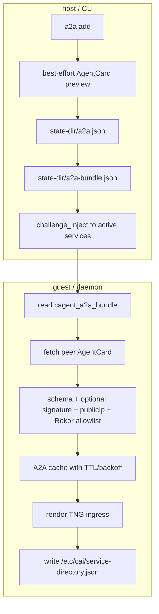
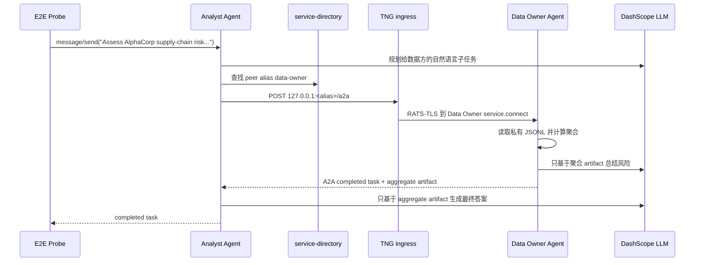

# Confidential A2A 接入指南

Confidential Agent 的 A2A 能力用于把不同管理域里的 agent 连接起来：每一方仍独立管理云账号、state-dir、镜像构建、密钥和安全组，但应用可以通过 A2A AgentCard 发现对端，并通过 RATS-TLS/TNG 建立经过远程证明的本地转发通道。

本文档描述当前实现，不描述计划中的兼容层。AppSpec 字段定义见 [`spec.md`](spec.md)。

## 目录

1. [当前能解决什么问题](#1-当前能解决什么问题)
2. [实现模型](#2-实现模型)
3. [AgentCard 格式与签名](#3-agentcard-格式与签名)
4. [信任链](#4-信任链)
5. [跨组织接入流程](#5-跨组织接入流程)
6. [真实 E2E：a2a-data-collab](#6-真实-e2ea2a-data-collab)
7. [CLI 与运行状态](#7-cli-与运行状态)
8. [排错](#8-排错)
9. [能力边界](#9-能力边界)

## 1. 当前能解决什么问题

A2A 适合这几类场景：

- **跨组织 agent 协作**：组织 A 的 agent 需要调用组织 B 的 agent，但双方不能共享 state-dir、云 AK/SK 或部署流水线。
- **只开放证明后的服务端口**：对端只能访问 `:8089` AgentCard 发现端口和 `service.connect` 端口，不能直接进入内部 mesh 端口。
- **自然语言 agent 编排**：应用层只需要知道 peer alias，例如 `data-owner`，实际 IP、端口、reference values 和 TNG ingress 由 daemon 动态生成。
- **可审计接入**：网络放行由 `peerings.yaml` 管理，协议 desired state 由 `a2a.json` 管理，两个变更面分离。

核心对象有三个：

| 对象 | 所在位置 | 作用 |
|---|---|---|
| `peerings.yaml` | host state-dir | 入向安全组授权，声明哪些 CIDR 能访问哪些 scope |
| `a2a.json` | host state-dir | 出向 A2A desired state，声明本域要调用哪些 AgentCard URL |
| `service-directory.json` | guest `/etc/cai/` | 应用运行时读取的本地 peer alias 到 TNG ingress 端口映射 |

## 2. 实现模型

### 2.1 网络层和协议层分离

`peering` 只处理入向网络授权，`a2a` 只处理出向 peer 声明。

```
alpha wants to call beta:

beta side:
  peering add --role peer --cidr <alpha-vm-ip>/32
  peering apply

alpha side:
  a2a add --alias beta http://<beta-ip>:8089/.well-known/agent-card.json
```

如果业务需要双向调用，双方各自执行一次 `a2a add`。A2A 本身不是双向 invite/accept 协议。

### 2.2 端口与 scope

| 端口 | 作用 | peering scope |
|---|---|---|
| `:8088` | daemon `/status` / `/health` | `status` |
| `:8089` | daemon `/.well-known/agent-card.json` | `agent_card` |
| `:8006` | challenge inject control | `control` |
| `:22` | debug SSH，仅 debug image | `ssh` |
| `service.connect[]` | RATS-TLS server 入口 | `connect` |
| `service.ports - service.connect` | 内部 mesh 端口 | `mesh` |

`role=operator` 默认包含 `control,status,ssh,agent_card,connect`；`role=peer` 默认包含 `agent_card,connect`。peer 默认不打开 `mesh`。

### 2.3 `a2a add` 后发生什么



CLI preview 是 best-effort：管理机可能访问不了对端 `:8089`，失败不阻塞写入。guest daemon 的 fetch 和校验才是权威结果，会反映在 `status --live` 的 `A2A Peers` 段里。

## 3. AgentCard 格式与签名

### 3.1 当前 AgentCard 形态

当前实现发布 A2A v1 风格 AgentCard。CA 专用扩展只接受 `capabilities.extensions[]` 中 URI 为 `https://confidential-agent.dev/extensions/tee-rekor/v1` 的条目。旧版顶层 `extensions["x-confidential-agent/v1"]` 不再被消费；遇到这种卡片会提示对端仍在使用 legacy AgentCard extension。

最小有效 AgentCard 示例：

```json
{
  "protocolVersion": "1.0",
  "name": "data-owner-agent",
  "description": "Data owner A2A agent",
  "supportedInterfaces": [
    {
      "url": "http://203.0.113.20:18789/a2a",
      "protocolBinding": "JSONRPC",
      "protocolVersion": "1.0"
    }
  ],
  "preferredTransport": "JSONRPC",
  "skills": [
    {
      "id": "aggregate-risk",
      "name": "Aggregate Risk Analysis",
      "description": "Return aggregate risk evidence"
    }
  ],
  "capabilities": {
    "extensions": [
      {
        "uri": "https://confidential-agent.dev/extensions/tee-rekor/v1",
        "required": true,
        "params": {
          "id": "data-owner",
          "cacheTtlSec": 300,
          "publicIp": "203.0.113.20",
          "ports": [
            { "name": "port-18789", "port": 18789 }
          ],
          "rekor": {
            "rekorUrl": "https://rekor.sigstore.dev",
            "artifactId": "data-owner-release",
            "artifactType": "uki",
            "artifactVersion": "20260528000000",
            "rvName": "measurement.uki.SHA-384"
          },
          "tee": "tdx"
        }
      }
    ]
  }
}
```

强必填字段分两类：

| 类别 | 字段 |
|---|---|
| A2A 描述字段 | `protocolVersion`、`name`、`description`、`supportedInterfaces[].url`、`supportedInterfaces[].protocolBinding`、`supportedInterfaces[].protocolVersion` |
| CA 安全字段 | CA extension `params.id`、`publicIp`、`ports[]`、`rekor.*`、`tee` |

### 3.2 在 AppSpec 中发布 AgentCard

```yaml
a2a:
  id: analyst-agent
  name: Analyst Agent
  version: "1.0.0"
  description: "LLM analyst agent"
  interfaces:
    - protocol_binding: JSONRPC
      port: 18789
      path: /a2a
  skills:
    - id: supply-chain-risk-analysis
      name: Supply Chain Risk Analysis
      tags: [analysis, a2a, confidential]
```

要求：

- `service.connect` 至少包含一个端口。
- `a2a.interfaces[].port` 必须在 `service.connect` 中。
- `attestation.reference_values` 必须为 `rekor`，否则 AgentCard 中没有可公开审计的 Rekor metadata。

未显式配置 `interfaces` 时，CLI 会从 `service.connect[]` 推导 `JSONRPC` + `/a2a`。

### 3.3 Sigstore Keyless AgentCard 签名

本服务要发布签名 AgentCard 时，在 spec 中开启：

```yaml
a2a:
  signing:
    mode: sigstore-keyless
    required: true
    expected_issuer: https://token.actions.githubusercontent.com
    expected_subject: repo:org/repo:ref:refs/heads/main
```

`deploy` / `inject` 阶段会调用 `cosign sign-blob`，对去掉 `signatures` 字段后的 canonical AgentCard JWS signing input 签名，并把 Sigstore bundle 写入 `signatures[].header["x-confidential-agent-sigstore-bundle"]`。

非交互式 CI 建议设置：

```bash
export CA_A2A_SIGSTORE_IDENTITY_TOKEN="$OIDC_JWT"
```

该变量会传给 `cosign sign-blob --identity-token`。没有 identity token 或 CI OIDC 环境时，keyless signing 可能进入交互式登录，不适合自动化 E2E。

对端消费签名 AgentCard 时，必须在 `a2a add` 中配置 signer pin 才会验签：

```bash
confidential-agent a2a add --alias data-owner \
  --signer-issuer https://token.actions.githubusercontent.com \
  --signer-subject repo:org/repo:ref:refs/heads/main \
  http://203.0.113.20:8089/.well-known/agent-card.json
```

`a2a.signing.expected_issuer` / `expected_subject` 描述“我发布的 AgentCard 应该由谁签”；`a2a add --signer-*` 描述“我消费的 peer AgentCard 必须由谁签”。当前 CLI 不会从本地 spec 自动推断对端 signer pin，因为本地 spec 描述的是本服务身份，不等价于 peer 身份。

未配置 signer pin 时，daemon 不验证 `signatures[]`，仍会执行 A2A schema、`publicIp` 和 Rekor allowlist 校验。

## 4. 信任链

daemon fetch peer AgentCard 后按顺序处理：

1. 校验 URL path 固定为 `/.well-known/agent-card.json`，content-type 为 JSON，body 不超过大小上限。
2. 校验 AgentCard A2A 描述字段和 CA extension 安全字段。
3. 如果 peer 配置 signer pin，校验 `signatures[]` 中至少一个 Sigstore keyless 签名满足 issuer/subject pin。
4. 校验 AgentCard `publicIp` 是 URL host 的 IPv4 解析结果之一。
5. 校验 `rekorUrl` 在本地 trusted Rekor allowlist 中，默认只信任 `https://rekor.sigstore.dev`。
6. 用 AgentCard 的 Rekor 指针生成 TNG reference values。
7. TNG/RATS-TLS 握手时验证对端 TEE quote 与 reference values 匹配。

握手成功意味着：

- 调用目标运行在符合 reference values 的 confidential VM 中。
- AgentCard 指向的 Rekor metadata 来自本地信任的 Rekor 实例。
- 如果配置了 signer pin，AgentCard 由指定 OIDC issuer/subject 对应的 keyless 身份签署。

握手成功不意味着：

- 对端组织身份在未配置 signer pin 时已被证明。
- 对端业务逻辑一定不会泄露数据；业务层仍要做最小化返回和探针验证。
- Rekor 或上游 build pipeline 自身没有被攻陷。

扩展 Rekor allowlist：

```bash
export CA_TRUSTED_REKOR_URLS="https://rekor.sigstore.dev,https://rekor.example.com"
```

## 5. 跨组织接入流程

下面以 alpha 调用 beta 为例。

### 5.1 部署前准备 operator peering

```bash
confidential-agent --state-dir ./alpha-state \
  peering add --role operator --cidr <alpha-ops-cidr> --label alpha-ops

confidential-agent --state-dir ./beta-state \
  peering add --role operator --cidr <beta-ops-cidr> --label beta-ops
```

`deploy` / `inject` 会检查 operator peering 是否包含 `control+status`，并尽量确认当前管理机出口 IP 被 `control` scope 覆盖。

### 5.2 build / deploy

```bash
confidential-agent --state-dir ./alpha-state build  --spec alpha.yaml
confidential-agent --state-dir ./alpha-state deploy --spec alpha.yaml

confidential-agent --state-dir ./beta-state build  --spec beta.yaml
confidential-agent --state-dir ./beta-state deploy --spec beta.yaml
```

部署完成后，服务公网 IP 在：

```bash
jq -r '.deploy.public_ip' ./alpha-state/services/<service>/state.json
jq -r '.deploy.public_ip' ./beta-state/services/<service>/state.json
```

### 5.3 入向 peer peering

beta 必须允许 alpha 服务 VM 访问 beta 的 `agent_card` 和 `connect` scope：

```bash
confidential-agent --state-dir ./beta-state \
  peering add --role peer --cidr <alpha-service-ip>/32 --label alpha
confidential-agent --state-dir ./beta-state peering apply
```

如果 beta 也要调用 alpha，alpha 侧同样添加 beta 服务 VM IP。

### 5.4 出向 a2a desired state

alpha 声明要调用 beta：

```bash
confidential-agent --state-dir ./alpha-state a2a add \
  --alias beta \
  --signer-issuer <beta-agent-card-signer-issuer> \
  --signer-subject <beta-agent-card-signer-subject> \
  http://<beta-service-ip>:8089/.well-known/agent-card.json
```

`--signer-issuer` / `--signer-subject` 只在 beta 发布签名 AgentCard 时使用。没有 OIDC token、未启用 `a2a.signing.required=true` 的 legacy/unsigned 流程中，去掉这两个参数即可；daemon 仍会执行 schema、`publicIp`、Rekor allowlist 和 RATS-TLS 校验。

执行后：

- host 写入 `<state-dir>/a2a.json`，当前版本为 `2`。
- host 渲染 `<state-dir>/a2a-bundle.json`，并 inject 给 active service。
- guest daemon fetch beta AgentCard，完成校验后生成 TNG ingress。
- 应用在 `/etc/cai/service-directory.json` 里看到 alias `beta`。

`a2a.json version: 1` 不再自动迁移。没有存量服务时，删除旧文件并重新执行 `a2a add`。

### 5.5 应用调用

应用不直接写 beta IP。它读取 `/etc/cai/service-directory.json`，找到 peer alias 对应的本地端口，然后对 `127.0.0.1:<port>` 发起 HTTP/A2A 请求。该本地端口由 TNG ingress 转发到 beta 的 `service.connect` 端口，并在连接时完成 RATS-TLS 验证。

管理机调试本服务时使用：

```bash
confidential-agent --state-dir ./alpha-state connect start \
  --service <alpha-service> \
  --ready-json alpha-ready.json \
  --wait-ready 180
```

停止：

```bash
confidential-agent --state-dir ./alpha-state connect stop \
  --ready-json alpha-ready.json
```

## 6. 真实 E2E：a2a-data-collab

`tools/e2e/run.sh a2a-data-collab` 是当前推荐的 A2A 端到端样例。它不依赖 OpenClaw 场景，而是构造一个更典型的跨组织 agent 协作流程。

### 6.1 背景

业务问题：分析方希望评估 `AlphaCorp` 的供应链风险，但原始数据属于数据方，包含客户姓名、订单号、区域、风险分和事件类别。数据方不希望把原始行暴露给分析方，只允许返回聚合统计和解释。

两个组织：

| 组织 | Agent | 私有能力 |
|---|---|---|
| Analyst Org | Analyst Agent | 接收用户自然语言任务，规划要向数据方请求什么聚合信息，再综合最终答案 |
| Data Owner Org | Data Owner Agent | 持有 `private-risk-data.jsonl`，只能把本地数据聚合后交给 LLM 总结 |

两个 agent 都是 `examples/a2a-data-collab/files/agent-server.mjs` 启动的真实 HTTP JSON-RPC A2A server，背后通过 DashScope compatible `/chat/completions` 调用真实 LLM。没有 mock LLM、没有固定字符串回复。

### 6.2 运行链路



E2E 覆盖的基础设施路径：

1. 两个 state-dir 分别 build/deploy 两台 confidential VM。
2. 两边添加 operator peering。
3. 两边交换服务公网 IP 并添加 peer peering。
4. 默认运行 unsigned AgentCard 流程，不需要 OIDC token；设置 `E2E_A2A_SIGNING=1` 后才开启 Sigstore Keyless signing。
5. signed 模式下，`a2a add` 使用 signer pin 校验 peer AgentCard；脚本还会先用错误 signer subject 添加临时 peer，确认 daemon 严格拒绝。
6. daemon 通过 AgentCard、Rekor metadata 和可选 signer pin 生成 TNG ingress。
7. Analyst 应用通过 `/etc/cai/service-directory.json` 找到 `data-owner`，发起真实 A2A 调用。
8. Probe 通过 `connect start` 暴露 Analyst 的 `/a2a`，发送自然语言任务并验证结果。

### 6.3 通过标准

Probe 代码在 `tools/e2e/probes/a2a-data-collab-probe.mjs`。通过条件：

- A2A response 是 `completed` task。
- 最终文本看起来是针对 `AlphaCorp` 的聚合风险分析。
- data artifact 中包含 Data Owner 返回的聚合结果。
- 聚合结果符合测试数据：`record_count=6`，`high_risk_count=3`。
- 响应全文和 artifact 不包含原始客户姓名 `Ada Lin`、`Ben Zhao`、`Cara Wu`、`Dev Patel`、`Eli Chen`、`Faye Kim`。
- 响应全文和 artifact 不包含订单号模式 `ORD-ALPHA-\d+`。

这个样例的价值在于它同时验证了三层能力：基础设施信任链、A2A 协议发现与路由、真实自然语言 agent 协作。最终结果不是单纯 health check，而是一个经过 LLM 推理和跨 agent 委托的业务输出。

### 6.4 运行方式

默认 unsigned 模式需要 Aliyun、DashScope 和 Rekor/cosign：

```bash
export ALICLOUD_ACCESS_KEY='...'
export ALICLOUD_SECRET_KEY='...'
export DASHSCOPE_API_KEY='...'
export DASHSCOPE_BASE_URL='https://dashscope.aliyuncs.com/compatible-mode/v1'
export DASHSCOPE_MODEL='qwen3.7-max'

env -u HTTP_PROXY -u HTTPS_PROXY -u http_proxy -u https_proxy -u ALL_PROXY -u all_proxy \
  tools/e2e/run.sh a2a-data-collab
```

开启 signed 模式时再提供 Sigstore keyless 身份：

```bash
export E2E_A2A_SIGNING=1
export CA_A2A_SIGSTORE_IDENTITY_TOKEN="$OIDC_JWT"
```

如果不设置 `A2A_SIGNER_ISSUER` / `A2A_SIGNER_SUBJECT`，runner 会从 `CA_A2A_SIGSTORE_IDENTITY_TOKEN` 的 JWT payload 中读取 `iss` / `sub`。也可以显式覆盖：

```bash
export A2A_SIGNER_ISSUER='https://token.actions.githubusercontent.com'
export A2A_SIGNER_SUBJECT='repo:org/repo:ref:refs/heads/main'
```

## 7. CLI 与运行状态

### 7.1 peering

```bash
confidential-agent peering add    --role operator|peer --cidr <CIDR> --label <name> [--scope ...]
confidential-agent peering list
confidential-agent peering show   <label>
confidential-agent peering remove <label>
confidential-agent peering apply  [--dry-run]
```

`peering add/remove` 只改本地 desired state；`peering apply` 才会更新云上安全组。

### 7.2 a2a

```bash
confidential-agent a2a add \
  [--alias <id>] \
  [--service <s1>,<s2>] \
  [--signer-issuer <issuer> --signer-subject <subject>] \
  <agent-card-url>

confidential-agent a2a list
confidential-agent a2a show <alias-or-url>
confidential-agent a2a sync [--alias <id>] [--all]
confidential-agent a2a remove <alias-or-url>
```

`--service` 限定 peer 只分发给指定本地 service；为空时 fan-out 到本 state-dir 下所有 active services。fan-out 场景下，对端 peering 必须覆盖所有会 fetch AgentCard 的本地 service VM 公网 IP。

### 7.3 status

```bash
confidential-agent status --live
confidential-agent status --live --json
```

`A2A Peers` 中的 state：

| state | 含义 |
|---|---|
| `ok` | 最近一次 fetch、校验和 TNG ingress 生成成功 |
| `stale` | 当前 fetch 失败，但 daemon 仍有上一份成功 cache 并继续服务 |
| `error` | 没有可用 cache，或 trust/schema/签名校验失败，或 peer id 冲突 |

CLI preview 状态：

| kind | 含义 |
|---|---|
| `verified` | CLI preview 成功 |
| `unverified` | 没有 preview 结果 |
| `unreachable` | 管理机无法访问 peer AgentCard 或 HTTP 非 200 |
| `unsigned` | 配置了 signer pin，但 AgentCard 没有 `signatures[]` |
| `signature_failed` | Sigstore 签名存在，但不满足 issuer/subject pin 或 cosign 验证失败 |
| `host_mismatch` | AgentCard `publicIp` 与 URL host 解析结果不一致 |
| `rekor_untrusted` | `rekorUrl` 不在 trusted Rekor allowlist |
| `invalid` | URL、JSON、schema 或 CA extension 格式无效；包括 legacy top-level CA extension |

## 8. 排错

| 现象 | 常见原因 | 处理 |
|---|---|---|
| `deploy` 报缺少 operator peering | 没有 `control+status` scope | 先 `peering add --role operator ...` |
| `a2a list` 是 `unreachable` | 管理机访问不了对端 `:8089` | 通常不阻塞；以 daemon `status --live` 为准 |
| daemon error 包含 `agent card transport error` | 对端 peering 未放行本服务 VM IP | 对端添加 caller service 公网 IP `/32` 并 `peering apply` |
| `unsigned` | 消费方配置了 signer pin，但发布方 AgentCard 未签名 | 发布方启用 `a2a.signing.required=true` 并重新 deploy/inject |
| `signature_failed` | signer issuer/subject 不匹配，或 cosign 验签失败 | 核对发布方 OIDC identity；消费方重做 `a2a add --signer-*` |
| `publicIp ... is not one of URL host addresses` | AgentCard 与访问 URL 不一致 | 对端重新 deploy 或确认使用正确公网 IP/DNS |
| `rekorUrl ... is not trusted` | 对端 Rekor 不在 allowlist | 确认可信后设置 `CA_TRUSTED_REKOR_URLS` |
| `legacy top-level confidential-agent extension` | 对端仍发布旧 AgentCard | 先升级 AgentCard 发布方，再让消费方执行 `a2a add` |
| 应用报 `peer 'X' is missing` | daemon 尚未生成 service-directory 条目 | 查 `status --live` 的 A2A peer state 和 error |

## 9. 能力边界

当前实现有这些边界：

- 未配置 signer pin 时，AgentCard 签名不会被验证。
- AgentCard transport 允许 HTTP；信任决策来自 signer pin、Rekor allowlist 和 RATS-TLS，不来自 TLS WebPKI。
- 只支持 IPv4 host 解析。
- `a2a.json` 只支持 version `2`，不自动迁移 version `1`。
- 旧顶层 CA extension 不兼容；新版只消费 `capabilities.extensions[]`。
- E2E 的数据不泄露断言覆盖样例数据中的客户姓名和订单号模式，不是通用 DLP 引擎。

后续可以继续增强：

- signer pin 策略模板和轮换流程。
- invite/accept 式双向接入工作流。
- 域级 catalog 发布与导入。
- HTTPS-only AgentCard discovery。
- IPv6 支持。
- 更完整的 Rekor inclusion proof 边界校验。

## 参考

- [`spec.md`](spec.md)
- [`architecture.md`](architecture.md)
- `examples/a2a-data-collab/`
- `tools/e2e/run.sh a2a-data-collab`
- [A2A Protocol Spec v1](https://a2a-protocol.org/latest/specification/)
- [Sigstore Rekor](https://docs.sigstore.dev/logging/overview/)
