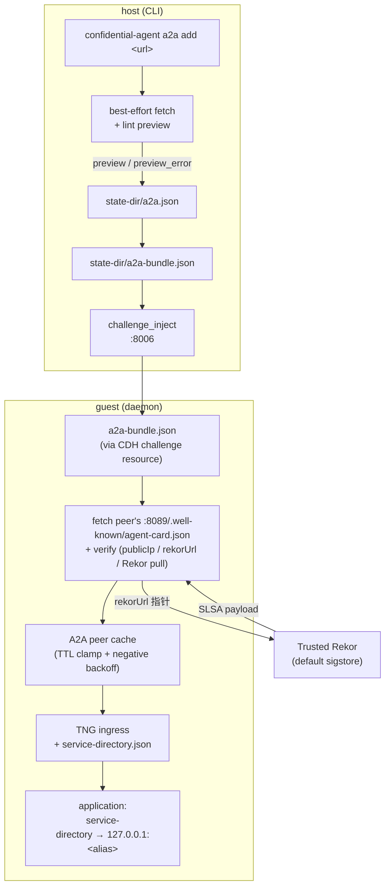

# Confidential A2A 接入指南

Confidential Agent 提供 **A2A（Agent-to-Agent）** 能力，允许位于不同管理域、不同云账号或不同组织的 confidential agent 之间通过远程证明建立可信调用通道。本文档介绍 A2A 的架构、信任模型、操作流程与运维方法。

> AppSpec 字段定义见 [`spec.md` §8 / §9](spec.md)；本文档面向跨组织接入的运维与开发人员。

---

## 目录

1. [适用场景](#1-适用场景)
2. [设计概要](#2-设计概要)
3. [架构总览](#3-架构总览)
4. [信任模型](#4-信任模型)
5. [跨组织接入流程](#5-跨组织接入流程)
6. [其他接入形态](#6-其他接入形态)
7. [CLI 命令参考](#7-cli-命令参考)
8. [运维操作](#8-运维操作)
9. [排错指南](#9-排错指南)
10. [当前能力边界](#10-当前能力边界)
11. [常见问题](#11-常见问题)

---

## 1. 适用场景

A2A 在以下场景中提供基于远程证明的跨域接入能力：

- **跨组织调用**：不同组织各自部署的 confidential agent 之间需要互相调用，每个组织独立管理云账号、密钥与运维。
- **跨用户接入**：终端用户或客户在没有部署方 state-dir 与 cosign 私钥的情况下，凭 AgentCard URL 即可建立带远程证明的连接。
- **合规网络环境**：云策略禁止 `0.0.0.0/0` ingress、要求安全组变更走审计流程的环境。

A2A 提供的核心能力：

- **标准协议发现**：基于 [A2A v0.3.0](https://a2a-protocol.org/v0.3.0/specification/) AgentCard，第三方 A2A SDK 可直接消费 AgentCard 的标准字段。
- **基于 Rekor 的远程证明**：peer 的 TEE measurement 由 daemon 从 trusted Rekor transparency log 拉取，不依赖 AgentCard 自描述内容。
- **网络授权与协议接入解耦**：网络层 CIDR 放通与协议层 peer 接入由独立的命令族管理，可以分别归属不同的运维角色与变更节奏。

---

## 2. 设计概要

### 2.1 三层分离

| 层 | 关注点 | 配置文件 / 命令族 |
|---|---|---|
| 网络层 | 哪些来源 CIDR 可以访问哪些端口 | `peerings.yaml` + `peering` 命令族 |
| 协议层 | 本组织希望调用哪些外部 agent | `a2a.json` + `a2a` 命令族 |
| 应用层 | 业务通过本地 alias 端口调用 peer | `service-directory.json` |

每一层独立增删，互不依赖。

### 2.2 单向语义

A2A 是 caller→callee 的单向 RPC 协议。`a2a add <peer-card-url>` 是出向意图声明，仅声明本组织希望调用对端，不影响对端配置。需要应用层双向通信时，由两端各自执行一次 `a2a add`。

### 2.3 远程证明信任根

AgentCard 仅承载指针（`rekorUrl` / `artifactId` / `artifactVersion` / `rvName`），不携带 reference value 内容、不携带 cosign 公钥。daemon 从本地配置的 trusted Rekor allowlist 拉取 SLSA payload，再交由 TNG/Trustee 完成 RATS-TLS 校验。详细模型见 §4。

### 2.4 安全组由动态状态派生

AppSpec 不再包含 `allowed_cidr` 与 `peers[]` 字段。所有 SG ingress 规则由 `peerings.yaml` 驱动，通过 `peering apply` 触发 Terraform 重渲染。

### 2.5 发现端口与控制端口分离

| 端口 | 用途 | SG scope |
|---|---|---|
| `:8088` | daemon `/status` `/health` | `status` |
| `:8089` | `/.well-known/agent-card.json` | `agent_card` |

两个端口由 daemon 内独立的 listener thread 处理，对应独立的 SG scope。`:8089` 不响应 `/status`、`:8088` 不响应 AgentCard 请求。

---

## 3. 架构总览

### 3.1 端口与 scope 矩阵

```
┌─────────────────────── confidential-agent guest VM ────────────────────────┐
│                                                                            │
│  :8088 daemon /status /health           — status      scope                │
│  :8089 daemon /.well-known/agent-card   — agent_card  scope                │
│  :8006 inject control                   — control     scope                │
│  :22   debug ssh (debug image only)     — ssh         scope                │
│                                                                            │
│  service.connect 端口 (RATS-TLS server) — connect     scope                │
│  service.ports 全集 (RATS-TLS server)   — mesh        scope                │
│                                                                            │
│  TNG ingress (RATS-TLS client) → 127.0.0.1:<auto-alias> → peer:<port>      │
│  /etc/cai/service-directory.json:                                          │
│     services["beta"] = { ports: [{address: "127.0.0.1", port: 18000}] }    │
└────────────────────────────────────────────────────────────────────────────┘
```

### 3.2 `a2a add` 触发后的数据流



CLI 与 daemon 的职责划分：

| 角色 | 出口 IP | 触发时机 | 失败语义 |
|---|---|---|---|
| CLI fetch | 管理机出口 IP | `a2a add` / `a2a sync` | best-effort，失败仅记录，不阻塞 |
| daemon fetch | 服务 VM 公网 IP | 每次 daemon poll，受 cache TTL 控制 | 权威结果，决定服务可用性 |

a2a-bundle 仅携带 `url + alias + scoped_services + fingerprint`，不携带 cached card 与 verification 状态，由 daemon 独立完成 fetch 与校验。

### 3.3 SG 渲染规则

`peerings.yaml` 中每条 entry 的 `scope` 决定它会被渲染为哪些端口的 ingress 规则：

| scope | 端口 | 默认包含的 role |
|---|---|---|
| `control` | `:8006` | operator |
| `status` | `:8088` | operator |
| `ssh` | `:22`（仅 debug 镜像） | operator |
| `agent_card` | `:8089` | operator + peer |
| `connect` | `service.connect` 端口 | operator |
| `mesh` | `service.ports` 全集 | peer |

`role=operator` 默认不包含 `mesh`：运维通过 `connect` 端口走 RATS-TLS 接入，不直接打开 mesh 全端口。

---

## 4. 信任模型

### 4.1 校验流程

```
拉到 AgentCard
  ↓
publicIp ∈ URL host 解析结果
rekorUrl ∈ trusted Rekor allowlist
  ↓
按 AgentCard.rekor 指针从 trusted Rekor 拉 SLSA payload
  ↓
SLSA measurement → TNG/Trustee reference values
  ↓
RATS-TLS 握手：peer TEE quote 必须匹配 measurement
  ↓
握手成功
```

### 4.2 当前模型保证的属性

握手成功意味着：

- 连接对象运行在 trusted Rekor 上具有合法 SLSA provenance 的 confidential-agent 镜像中。
- 该 confidential-agent 的 TEE measurement 与 SLSA payload 中声明的 measurement 一致。
- AgentCard 中声明的 `publicIp` 与本次访问的 URL host 解析结果一致，避免 HTTP body 将后续连接重定向至任意 IP。

### 4.3 当前模型不保证的属性

握手成功**不**意味着：

- 连接对象属于某个特定组织。任何能够同时控制以下三项的攻击者，都能让握手通过：
  1. 部署一个合法的 confidential-agent 实例；
  2. 将其 SLSA provenance 上传至同一个 trusted Rekor；
  3. 通过 DNS 或路由层影响目标 URL host 的解析结果。
- 对端 build pipeline 自身未被攻陷。
- Rekor inclusion proof 在所有边界条件下均有效。

后续增强方向见 §10。

### 4.4 trusted Rekor allowlist 配置

默认仅信任：

```
https://rekor.sigstore.dev
```

CLI 与 daemon 通过环境变量扩展（不可清空）：

```bash
export CA_TRUSTED_REKOR_URLS="https://rekor.sigstore.dev,https://rekor.example.com"
```

---

## 5. 跨组织接入流程

以下示例展示两个组织 alpha 与 beta 各自部署 OpenClaw confidential agent 并互相 A2A 调用的完整流程。

> 完整的端到端脚本：[`tools/e2e/run-openclaw-a2a-e2e.sh`](../tools/e2e/run-openclaw-a2a-e2e.sh)。

### 5.1 前置条件

- 两个云账号，或同账号下两段隔离的 VPC/subnet
- 两个管理机分别可访问公网与各自的云控制面
- `confidential-agent` CLI 与 `shelter` CLI 已安装
- 云账号凭证已配置（access key 或 aliyun CLI profile）
- `cosign` 已安装，用于生成 build 期签名密钥

### 5.2 步骤总览

```
alpha-mgmt                                          beta-mgmt
─────────────                                       ─────────────
1. peering add --role operator <alpha-mgmt-ip>      1. peering add --role operator <beta-mgmt-ip>
2. build && deploy alpha-spec.yaml                  2. build && deploy beta-spec.yaml
                       │                                                  │
                       └──── 通过带外通道交换公网 IP ────┘
3. peering add --role peer <beta-public-ip>         3. peering add --role peer <alpha-public-ip>
4. peering apply                                    4. peering apply
5. a2a add http://<beta-public-ip>:8089/...         5. a2a add http://<alpha-public-ip>:8089/...
                       │                                                  │
                       └──── 应用层调用产生双向 marker ────┘
```

### 5.3 Step 1：配置 operator peering

`deploy` 与 `inject` 启动时执行 fail-fast 检查：要求至少一条 `role=operator` peering 同时包含 `control` 与 `status` scope，且当前管理机的出口 IP 落在某条 `control` scope 的 CIDR 内。

```bash
# alpha-mgmt
confidential-agent --state-dir ./alpha-state \
  peering add --role operator --cidr <alpha-mgmt-ip>/32 --label alpha-ops

# beta-mgmt
confidential-agent --state-dir ./beta-state \
  peering add --role operator --cidr <beta-mgmt-ip>/32 --label beta-ops
```

如需覆盖整段 jumphost 网段，可直接使用 `--cidr 203.0.113.0/24`。

### 5.4 Step 2：build 与 deploy

```bash
confidential-agent --state-dir ./alpha-state build  --spec alpha-spec.yaml
confidential-agent --state-dir ./alpha-state deploy --spec alpha-spec.yaml
```

AppSpec 中必须包含 `a2a` 块（参考 [`examples/openclaw/openclaw.yaml`](../examples/openclaw/openclaw.yaml)）：

```yaml
a2a:
  id: alpha-openclaw
  name: alpha-openclaw
  version: "1.0.0"
  description: "Alpha confidential agent"
  skills:
    - id: chat
      name: Chat
      description: "OpenClaw gateway chat"
```

deploy 完成后，`<state-dir>/services/<service>/state.json` 中的 `deploy.public_ip` 即为对外服务地址；daemon 在 guest 内通过 `:8089` 暴露 AgentCard。

A2A 要求 `attestation.reference_values=rekor`，否则 spec 渲染阶段会拒绝。

OpenClaw 应用层如需通过 `/v1/responses` 调用，需要开启 `gateway.http.endpoints.responses.enabled=true`。`examples/openclaw/openclaw.json` 已默认配置该项。

### 5.5 Step 3：交换公网 IP

部署完成后通过带外通道交换两端的服务公网 IP：

```bash
ALPHA_IP=$(jq -r '.deploy.public_ip' ./alpha-state/services/openclaw/state.json)
BETA_IP=$(jq  -r '.deploy.public_ip' ./beta-state/services/openclaw/state.json)
```

### 5.6 Step 4：配置 peer peering

`peering` 表示入向授权。alpha 将 `BETA_IP` 加入自身 peerings，意味着允许 beta 入向访问 alpha 的 `:8089` 与 `service.ports`。

```bash
# alpha-mgmt
confidential-agent --state-dir ./alpha-state \
  peering add --role peer --cidr ${BETA_IP}/32 --label beta-org

# beta-mgmt
confidential-agent --state-dir ./beta-state \
  peering add --role peer --cidr ${ALPHA_IP}/32 --label alpha-org

# 触发 Terraform 渲染
confidential-agent --state-dir ./alpha-state peering apply
confidential-agent --state-dir ./beta-state  peering apply
```

`role=peer` 默认 scope 为 `[agent_card, mesh]`。

### 5.7 Step 5：声明 a2a peer

`a2a add` 表示出向调用意图。

```bash
# alpha 调 beta
confidential-agent --state-dir ./alpha-state \
  a2a add --alias beta http://${BETA_IP}:8089/.well-known/agent-card.json

# beta 调 alpha
confidential-agent --state-dir ./beta-state \
  a2a add --alias alpha http://${ALPHA_IP}:8089/.well-known/agent-card.json
```

执行结果：

- `<state-dir>/a2a.json` 写入 desired peer 记录
- `<state-dir>/a2a-bundle.json` 重新渲染并 inject 至所有 active service 的 daemon
- daemon 在 guest 内 fetch 对端 AgentCard，校验 `publicIp` 与 `rekorUrl`，按 AgentCard 中的 `ports` 配置 TNG ingress，写入 `/etc/cai/service-directory.json`

CLI fetch 失败不阻塞写入；daemon 端 fetch 是权威结果。

默认 fan-out 时，每个 active service VM 都会独立拉取并校验对端 AgentCard；因此对端 peerings 必须覆盖本组织所有 active service 的公网 IP。CLI 会在 `a2a add` 后提示 `remote side must allow these caller service public IPs ...`，需要将提示中的每个 `/32` 都加入对端 peerings 并执行 `peering apply`。若只希望特定 service 调用 peer，使用 `--service` 限定 fan-out 范围。

### 5.8 Step 6：应用层调用

应用通过 `/etc/cai/service-directory.json` 获取 peer 的本地 alias，访问 `127.0.0.1:<alias>` 即可。`connect` 命令将 `service.connect` 端口暴露至本地：

```bash
confidential-agent --state-dir ./alpha-state connect &
# stdout 示例：connect 127.0.0.1:18789 -> <alpha-public-ip>:18789 (openclaw)

node tools/e2e/openclaw-a2a-responses-probe.mjs \
  --url http://127.0.0.1:18789 \
  --token "$ALPHA_TOKEN" \
  --peer beta \
  --message "请只回复 CA_A2A_BETA_OK，不要输出其他内容。" \
  --expect CA_A2A_BETA_OK
```

成功返回 `{"ok": true, "finalText": "CA_A2A_BETA_OK"}`。

### 5.9 Step 7：查看运行状态

```bash
confidential-agent --state-dir ./alpha-state status --live
```

输出包含本地 service 概览、Daemon Live Status 与 A2A Peers 三段：

```
A2A Peers
SERVICE    PEER    STATE    FETCH    SUCCESS    PORTS    ERROR
openclaw   beta    ok       12s      12s        18000    -
```

`STATE` 字段含义见 §9.4。

---

## 6. 其他接入形态

### 6.1 单向调用

仅 alpha 调用 beta、beta 不反向调用时，仅在 alpha 侧执行 §5 中的 step 1–6；beta 侧仅需在 step 4 加入对应的 peer peering，不需要执行任何 `a2a` 命令。

### 6.2 凭 AgentCard URL 接入

第三方调用方未持有部署方的 state-dir 与 cosign 密钥时，可使用 `connect --from-card`：

```bash
confidential-agent connect --from-card http://${ALPHA_IP}:8089/.well-known/agent-card.json
```

CLI 拉取 AgentCard、完成 trust 校验、渲染 TNG client 配置并在本地端口建立 RATS-TLS 接入。alpha 侧需将调用方 IP 加入 peerings：

```bash
confidential-agent --state-dir ./alpha-state \
  peering add --role peer --cidr <client-ip>/32 --label charlie
confidential-agent --state-dir ./alpha-state peering apply
```

### 6.3 限定 fan-out 范围

默认情况下 `a2a add` 将外部 peer 关系 fan-out 至本管理域所有 active services。如需限定 peer 仅对特定 service 可见：

```bash
confidential-agent a2a add --alias beta-prod \
  --service prod,staging \
  http://${BETA_PROD_IP}:8089/.well-known/agent-card.json
```

`--service` 留空表示全 fan-out。

运维上需要注意：全 fan-out 不是只让 OpenClaw 一个 VM 拉取对端 AgentCard，而是本管理域内所有 active service 都会收到 desired peer，并各自从自己的公网 IP 发起 daemon fetch。如果对端只放行了某一个 caller service 的 IP，其他 service 会在 `status --live` 的 A2A Peers 中显示 `agent card transport error`。此时要么补齐对端 peerings，要么重新用 `--service` 只把 peer 分发给需要它的 service。

---

## 7. CLI 命令参考

### peering（网络层）

```
confidential-agent peering add    --role operator|peer --cidr <CIDR> --label <name> [--scope ...]
confidential-agent peering list
confidential-agent peering show   <label>
confidential-agent peering remove <label>
confidential-agent peering apply  [--dry-run]
```

`--scope` 可选值：`control` / `status` / `ssh` / `agent_card` / `connect` / `mesh`，未指定时按 §3.3 表中的 role 默认值。

### a2a（协议层）

```
confidential-agent a2a add    [--alias <id>] [--service <s1>,<s2>] <agent-card-url>
confidential-agent a2a list
confidential-agent a2a show   <alias-or-url>
confidential-agent a2a remove <alias-or-url>
confidential-agent a2a sync   [--alias <id>] [--all]
```

### connect

```
confidential-agent connect                                       # 默认从本地 state-dir 渲染配置
confidential-agent connect --from-card <agent-card-url>          # 仅依赖 AgentCard URL
```

### status

```
confidential-agent status                # 本地 service 概览
confidential-agent status --live         # 含 daemon /status 与 A2A peers
confidential-agent status --live --json  # 结构化输出，供监控脚本消费
```

### deploy / inject

```
confidential-agent deploy --spec ... [--skip-peering-check]
confidential-agent inject --spec ... [--skip-peering-check]
```

`--skip-peering-check` 仅在出口 IP 探测不准确的特殊网络环境下使用。

---

## 8. 运维操作

### 8.1 增加 peer

```bash
confidential-agent peering add --role peer --cidr <peer-ip>/32 --label <name>
confidential-agent peering apply
confidential-agent a2a add --alias <name> http://<peer-ip>:8089/.well-known/agent-card.json
```

`peering add/remove` 不会自动触发 `peering apply`，以便 SG 变更可纳入审计流程。

### 8.2 移除 peer

```bash
confidential-agent a2a remove <alias-or-url>
confidential-agent peering remove <label>
confidential-agent peering apply
```

### 8.3 peer 重建或 IP 变更

对端重新部署后服务 IP 变更，需要：

```bash
confidential-agent a2a remove <old-alias>
confidential-agent peering remove <old-label>
confidential-agent peering add --role peer --cidr <new-ip>/32 --label <new-label>
confidential-agent peering apply
confidential-agent a2a add --alias <name> http://<new-ip>:8089/.well-known/agent-card.json
```

### 8.4 重新同步 AgentCard desired state

daemon 按 AgentCard 中的 `cacheTtlSec` 自动刷新（默认 300 秒，clamp 至 [60s, 3600s]）。需要重新执行 CLI 侧预览校验并把当前 desired state 重新注入 guest 时：

```bash
confidential-agent a2a sync --alias <name>      # 单个
confidential-agent a2a sync --all               # 全部
```

`a2a sync` 重新渲染 a2a-bundle 并 inject。若 URL / alias / service scope 发生变化，daemon 会因 bundle fingerprint 变化失效缓存并重新拉取；若 desired state 没变，daemon 会继续遵守现有 AgentCard cache TTL。

### 8.5 status 输出解读

```
$ confidential-agent status --live
SERVICE   PHASE   ...
openclaw  active  ...

Daemon Live Status
SERVICE   DAEMON_PHASE   APP    MESH   SSH   ERROR
openclaw  running        ready  ready  -     -

A2A Peers
SERVICE   PEER    STATE   FETCH   SUCCESS   PORTS   ERROR
openclaw  beta    ok      12s     12s       18000   -
openclaw  charlie unreachable -   -         -       transport error: ...
```

`A2A Peers` 段在没有 a2a peer 时不渲染。

### 8.6 监控集成

`status --live --json` 输出 JSON 结构供监控脚本消费。建议对 `a2a_peers[*].state` 持续处于 `error` 或 `stale` 的情况配置告警。

---

## 9. 排错指南

### 9.1 deploy fail-fast 错误

| 错误信息片段 | 原因 | 处理方式 |
|---|---|---|
| `no operator peering with control+status scope` | 缺少 operator peering | 执行 `peering add --role operator --cidr ... --label ...` |
| `outbound IP X is not covered` | 当前管理机出口 IP 未被任何 operator control CIDR 覆盖 | 加入对应 CIDR；或在特殊网络下使用 `--skip-peering-check` |
| `unknown field 'security'` 或 `unknown field 'peers'` | spec 中残留旧版字段 | 执行 `confidential-agent migrate <spec>` |

### 9.2 `a2a list` 状态分类

CLI fetch 失败不阻塞 desired state 写入。`a2a list` 输出的状态列含义：

| 显示值 | 含义 | 处理建议 |
|---|---|---|
| `verified` | CLI fetch 成功且所有 trust 校验通过 | 正常 |
| `unverified` | 未尝试 CLI fetch 或无结果 | 执行 `a2a sync` |
| `unreachable` | transport 失败（DNS / connect / read / 非 200） | 通常为对端 peering 未放行管理机 IP；以 `status --live` 中 daemon 端 STATE 为准 |
| `untrusted` | `publicIp` 与 URL host 解析不一致，或 `rekorUrl` 不在 allowlist | 对端 AgentCard 不可信，确认对端配置 |
| `invalid` | schema 缺字段、缺 `extensions["x-confidential-agent/v1"]`、JSON 解析失败 | 对端 daemon 配置异常 |

### 9.3 daemon 侧 A2A peer 错误

`status --live` 中 `STATE=error` 时，根据 `ERROR` 列定位：

| ERROR 子串 | 根因 | 处理方式 |
|---|---|---|
| `agent card transport error` | 对端 `:8089` 不可达 | 确认对端 peering 是否覆盖本服务 VM 公网 IP；默认 fan-out 时要覆盖本组织所有 active service 的公网 IP；确认对端是否执行了 `peering apply`；核对云端 SG 实际状态 |
| `publicIp ... is not one of URL host addresses` | AgentCard 中的 `publicIp` 与 URL host 解析结果不一致 | 通常为对端 IP 变更但 AgentCard 未刷新；对端重新 deploy 后即可 |
| `rekorUrl ... is not trusted` | rekorUrl 不在本地 allowlist | 核对对端 rekorUrl；如确属可信 Rekor 实例，扩展 `CA_TRUSTED_REKOR_URLS` |
| `directory id conflicts with an existing service` | peer id 与本域 service id 重名 | 使用 `--alias` 指定不同别名 |
| `failed to fetch ... and no cached AgentCard is available` | 首次拉取失败且无缓存 | 60 秒内 daemon 不重试，按 `status --live` 观察下一次 fetch 结果，同时排查网络 |

### 9.4 STATE 字段含义

| state | 含义 |
|---|---|
| `ok` | 最近一次 fetch 与校验成功，TNG ingress 使用最新 AgentCard |
| `stale` | 当前 fetch 失败，daemon 仍持有上一份成功 cache 并继续提供服务 |
| `error` | 无可用 cache，或 trust 校验失败，或 peer id 与本域 service 冲突，TNG ingress 不可用 |

`stale` 是 daemon 在网络抖动期间的优雅降级状态，不属于异常；持续处于 `stale` 或 `error` 时需要介入。

### 9.5 应用层无法定位 peer

应用通过 `/etc/cai/service-directory.json` 获取 peer alias 与本地端口的映射。当应用报告 `peer 'X' not found`：

1. SSH 进入 guest，确认 `cat /etc/cai/service-directory.json` 中是否包含该 peer。
2. 如不存在，访问 `curl http://127.0.0.1:8088/status`，检查对应 peer 的 `state` 字段，按 §9.3 处理。
3. 如 service-directory 有但应用读取不到，确认应用配置中的 peer id 与 `a2a add --alias` 一致。

### 9.6 `peering apply` 后 SG 未生效

```bash
confidential-agent peering apply --dry-run
```

输出 Terraform diff。如 dry-run 显示有变更但实际 apply 后云端 SG 未变化，从 Shelter 与 Terraform 日志中定位云 API 错误。

---

## 10. 当前能力边界

### 10.1 当前未覆盖的属性

- AgentCard 接入不依赖组织身份 pin，无法证明对端属于特定组织（详见 §4.3）。
- AgentCard transport 同时允许 HTTP 与 HTTPS；信任根在 Rekor，传输层不参与信任决策。
- 仅支持 IPv4。
- AgentCard 不签名。
- `deploy` 阶段的出口 IP 探测使用 ipinfo.io 与 ipify；多 ISP 或多 NAT 出口的环境下可能误判，可通过 `CA_OPERATOR_EGRESS_IP` 显式指定。
- `peering apply` 仅作用于本组织 Terraform 资源范围，跨账号资源需另行打通。

### 10.2 后续增强方向

- AgentCard 签名与 signer pin（Fulcio identity / 长期 cosign key），用于组织身份绑定。
- A2A invite/accept 双向接入工作流。
- 域级 catalog 发布与导入，简化多 service 场景下的双方接入步骤。
- 组级 trust policy（基于 SLSA-valid 的通配信任策略）。
- IPv6 支持。
- AgentCard discovery 强制 HTTPS。
- Rekor inclusion proof 边界条件验证。

---

## 11. 常见问题

**Q1：`a2a add` 后多久能调通？**
取决于 daemon poll 周期（5 秒）与 inject 完成时间，通常在 10–15 秒内 `status --live` 显示 `ok`。

**Q2：一台管理机能管理多个组织或环境吗？**
能。每个组织或环境使用独立的 `--state-dir`，`peerings.yaml` 与 `a2a.json` 在 state-dir 范围内隔离。

**Q3：peer 的 `service.ports` 修改后如何同步？**
对端重新 deploy 后会发布新的 AgentCard。本地执行 `a2a sync --alias <name>` 可重新注入当前 desired state；如果本地 URL / alias / service scope 没变，daemon 仍会遵守现有 cache TTL。需要立即绕过成功缓存时，变更 desired state（例如 remove 后重新 add）或等待 `cacheTtlSec` 到期。

**Q4：未持有部署方 state-dir 时如何接入？**
使用 `connect --from-card`，前提是接入方 IP 已被部署方加入 peerings（`scope=agent_card,mesh`）。详见 §6.2。

**Q5：AgentCard 中可见的字段有哪些？**
公开字段：`name`、`version`、`skills`、`url`、`cacheTtlSec`、`publicIp`、`ports`、`rekor.{rekorUrl,artifactId,artifactType,artifactVersion,rvName}`、`tee`。不包含 secret、镜像哈希、cosign 公钥。

**Q6：peer 使用非默认 Rekor 实例如何处理？**
默认仅信任 sigstore 公共 Rekor。确认 peer 所用 Rekor 实例的可信性后，通过 `CA_TRUSTED_REKOR_URLS` 扩展 allowlist。

**Q7：如何撤回 `a2a add`？**
执行 `a2a remove <alias-or-url>`。a2a-bundle 重新渲染后，daemon 在下一次 poll 时撤销对应 TNG ingress 与 service-directory 条目。

**Q8：`peering apply` 是否会中断已建立的连接？**
不会。Terraform 增量变更不影响已建立的 TCP / RATS-TLS 连接；但已被删除的 ingress 规则会阻止后续新建握手。

**Q9：同一 URL 可以注册多个 alias 吗？**
不可以。CLI 校验 URL 唯一性，建议一个 URL 对应一个 alias。

**Q10：`a2a` 与 `peering` 命令是否幂等？**
`peering add` 与 `a2a add` 在重复执行同一 label 或 URL 时会报错。在 IaC 场景下可使用：

```bash
peering add ... || true
peering apply
a2a add ...     || true
```

并通过 `peering list --json` 与 `a2a list --json` 进行 reconcile。

---

## 参考

- [`spec.md`](spec.md) — `a2a` / `peerings` schema 定义
- [`architecture.md`](architecture.md) — 单组织 mesh 与远程证明通道
- [A2A Protocol Spec v0.3.0](https://a2a-protocol.org/v0.3.0/specification/) — AgentCard 标准字段
- [Sigstore Rekor](https://docs.sigstore.dev/logging/overview/) — transparency log 信任根
- [`tools/e2e/run-openclaw-a2a-e2e.sh`](../tools/e2e/run-openclaw-a2a-e2e.sh) — 跨组织接入端到端脚本
