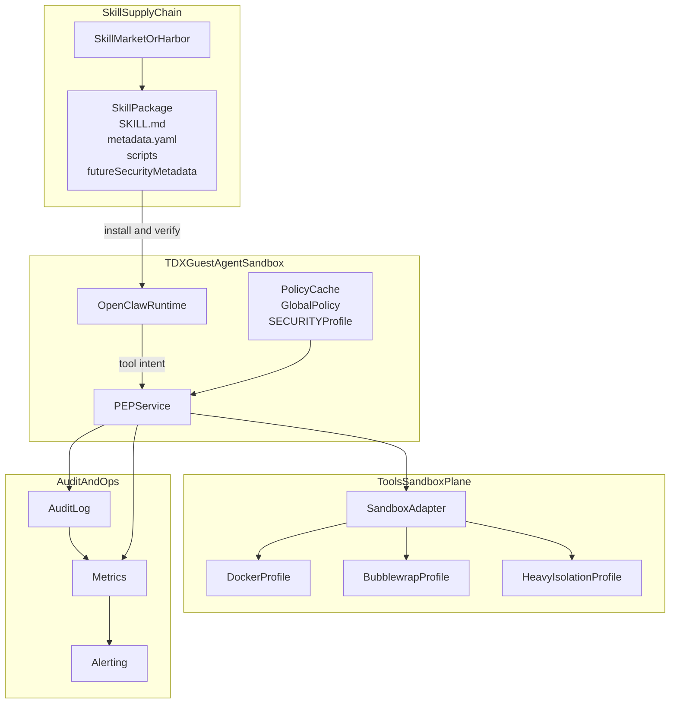
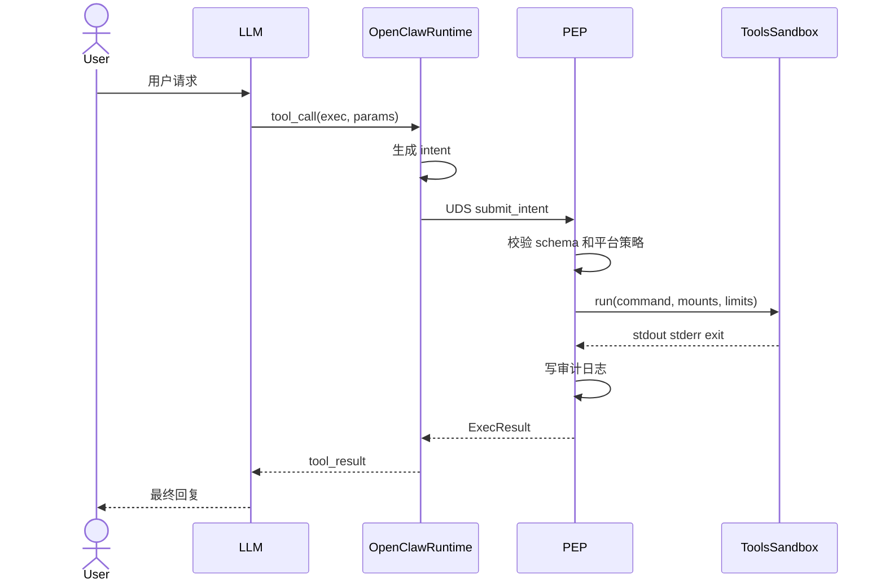
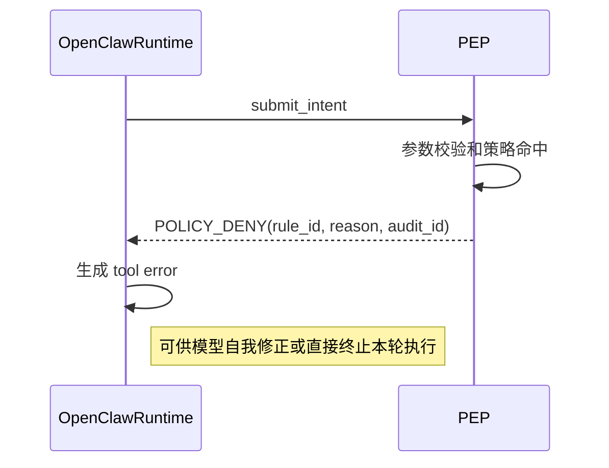
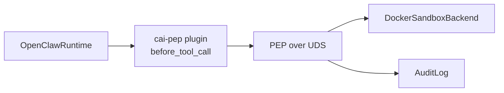
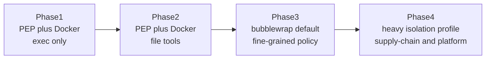

# Confidential Agent Agent Tool Sandbox 技术设计方案

## 1. 背景与目标

### 1.1 背景

`confidential-agent` 当前已经基于 Intel TDX、Trustee、TNG 和加密镜像建立了面向云基础设施的机密计算保护能力。该能力可以解决以下问题：

- 云厂商和宿主机管理员无法直接读取 Agent 内存与敏感配置。
- 通过远程证明可以向用户证明运行环境的完整性。
- 通过 KBS 可以在证明通过后再下发 API Key、磁盘密钥等敏感配置。

但这并不能解决 Agent 自身在运行时失控的问题。只要 Agent Runtime 仍然能够直接在宿主机或同一权限域中执行高危工具，就仍然存在以下风险：

- 提示词注入诱导 Agent 读取不应读取的主机文件。
- 大模型幻觉触发破坏性命令，导致系统损坏。
- 第三方 Skill 或 Tool 间接扩大访问面，导致敏感信息泄露。
- 工具调用难以审计，难以满足 ToB 场景的责任追溯要求。

本方案的总体目标: 以 `Tools Sandbox` 为主设计对象，在现有 `Agent Sandbox` 之外，再补一层独立的高危工具隔离执行面，并通过独立的 `PEP` 统一拦截和执行高危工具调用。同时，充分利用 TDX/CVM 这一天然 `Agent Sandbox`，补充最小权限和纵深防御所需的运行时安全加固。

### 1.2 本方案目标

本方案旨在为 `confidential-agent` 设计一套可落地的 Agent Tool Sandbox 体系，满足以下目标：

1. 在不大幅侵入 `OpenClaw` 源码的前提下，为高危工具建立强制经过 `PEP` 的执行路径。
2. 将 `OpenClaw` 保持为 `Agent Runtime`，把高危工具执行移到独立的 `Tools Sandbox` 中。
3. 短期可基于 Docker 快速落地，满足近期上线窗口。
4. 长期可平滑演进到 bubblewrap、自定义 namespace 方案或更强隔离后端。
5. 未来能平滑兼容社区和业界演进出来的 Skill 安全元数据规范、审计日志、策略治理与平台化扩展。
6. 与 `confidential-agent` 现有 TDX/Trustee 体系形成统一叙事：`confidential` 负责防外窥探，`security` 负责防内部失控。

### 1.3 非目标

本期方案不以以下内容为首要交付目标：

- 不在第一期引入 microVM 级后端作为默认执行面。
- 不在第一期把 `OpenClaw` 全部工具都迁移到 `PEP`；优先覆盖高危工具。
- 不追求第一期即实现复杂多租户计费、全量 IAM 或 OPA/Cedar 策略中心。
- 不重写 `OpenClaw` 的 Agent 主循环或大规模改造其工具框架。

## 2. 现状分析

### 2.1 设计思路

- `Agent Runtime` 位于 `Confidential Agent (TEE + Agent Sandbox)` 内部。
- `Agent Runtime` 与 `Tools` 执行环境必须隔离。
- 高危 Skill 不再由 Runtime 直接 fork 执行，而是先发给 `PEP`。
- `PEP` 负责将 Skill 调用意图转换为 Sandbox 可执行请求，并统一做最小权限控制和审计。
- `Tools Sandbox` 内部需要具备有限文件挂载、策略执行、黑白名单拦截、审计日志、授权管理等能力。
- 在 Tool 已被隔离到 `Tools Sandbox` 后，`Agent Runtime` 不再需要为了执行高危工具而维持过高权限，因此应结合 TDX 威胁模型同步做 `Agent Sandbox` 侧的最小权限加固。
- `Skills` 供应链侧未来可能演进出额外的安全元数据与签名机制；本方案仅做兼容预留，不在当前阶段自行定义。
- 短期使用 Docker 快速构建原型，长期再演进到 bubblewrap 或更细粒度的 namespace 机制。
- 方案需要尽快形成可上线的框架，占住技术位置。

### 2.2 当前项目现状

#### `confidential-agent`

`confidential-agent` 当前主要是镜像构建与部署工程，已经具备：

- TDX 机密虚拟机镜像构建链路。
- Trustee、Attestation Agent、TNG 等可信链路。
- `OpenClaw` 安装与 systemd 启动脚本。

但它当前没有自己的 Tool Sandbox 控制平面，也没有独立 `PEP` 服务。

#### `OpenClaw`

`OpenClaw` 当前已经具备可复用能力：

- 已有 `sandbox` 抽象，支持 Docker 和 SSH backend。
- `exec` 已支持 `host=sandbox` 路径。
- 文件读写、编辑、patch 在 sandbox 场景下可通过 `SandboxFsBridge` 执行。
- 存在 `before_tool_call` hook，可以在工具执行前做参数改写、拦截和审批。
- 已有 Docker sandbox 的安全校验，可阻止危险 bind mount、危险网络模式和弱化 seccomp/AppArmor 的配置。

但是，当前 `OpenClaw` 的 sandbox 仍然是 Runtime 进程自己管理的能力，并不满足会议纪要要求的“独立 PEP 统一决策和转发”的架构边界。

## 3. Tools Sandbox 和 Agent Sandbox 的关系

`Tools Sandbox` 与 `Agent Sandbox` 并非相互替代关系，而是面向不同保护对象的两层安全机制。二者共同构成 `confidential-agent` 在运行时侧的纵深防御体系。

- `Agent Sandbox` 面向 `Agent Runtime` 自身的运行环境安全，其主要作用是基于 TDX/CVM 增强加固保护 prompt、memory、密钥和会话状态，并在高危工具能力被下沉到独立执行面之后，落实最小权限原则，例如以非特权身份运行 Runtime、在初始化阶段完成必要特权操作后主动降权，以及关闭不必要的控制面或调试入口。

- `Tools Sandbox` 面向高危工具执行面的系统级隔离，其主要作用是将 shell、脚本、文件操作等高风险能力从 `Agent Runtime` 权限域中剥离，并通过 `PEP` 实现统一的策略控制、审计记录和受限执行。

## 4. 设计原则

本方案的核心定位是：

- `OpenClaw` 作为 TDX 内部的可信 `Agent Runtime`。
- 高危工具调用通过 `PEP` 下沉到独立 `Tools Sandbox`。
- `PEP` 是策略边界，`Tools Sandbox` 是系统隔离边界。

设计原则包括：

1. 默认拒绝。
   高危工具默认不允许直接在 Runtime 权限域执行。

2. 最小权限。
   每个 Skill 和每次工具调用只获得执行该任务所需的最小文件、网络、资源访问能力。

3. 单一路径。
   高危工具只能走 `PEP -> Tools Sandbox` 路径，避免存在 Runtime 直跑和 PEP 转发两条并行路径。

4. 低侵入。
   第一阶段优先采用 `OpenClaw` 插件、hook、配置和外挂进程方式集成。

5. 审计优先。
   所有高危工具请求都必须能记录 submitter、skill、参数摘要、策略命中、执行结果和拒绝原因。

6. 分阶段落地。
   第一阶段先立住架构和执行框架，第二阶段再逐步加细粒度策略和后端增强。

## 5. 威胁模型与安全边界

### 5.1 保护对象

需要重点保护的对象包括：

- TDX Guest 内的 Agent Prompt、Memory、Session State。
- 由 Trustee/KBS 下发的模型 API Key、业务凭据和磁盘密钥。
- 宿主机及 Guest OS 中不应暴露给工具的系统路径。
- Skill 包及其脚本的供应链可信性。
- Agent 工具调用行为的可审计性。

### 5.2 主要威胁

| 威胁 | 示例 | 结果 | 对应控制 |
| --- | --- | --- | --- |
| 提示词注入 | 诱导执行 `cat /etc/passwd` | 敏感信息泄露 | `PEP` 参数校验、路径白名单、受限挂载 |
| 模型幻觉 | 执行 `rm -rf` | 文件破坏 | 独立沙箱、只读挂载、资源限制、拒绝规则 |
| Skill 投毒 | 恶意脚本下载外部载荷 | 供应链攻击 | 安装来源约束、运行时隔离、审计，未来兼容社区安全元数据 |
| Runtime 绕过 | Runtime 直接调用 Docker/socket | 绕过策略层 | Docker socket 仅授予 `PEP` |
| 配置误用 | 将 `/etc` 或 Docker socket bind 进沙箱 | 安全边界失效 | Sandbox 配置校验、保留路径拦截 |
| 隐蔽外传 | 执行网络探测、curl 上传 | 数据泄露 | 网络默认禁用、egress allowlist、审计 |

### 5.3 可信边界划分

#### 可信边界内

- `OpenClaw` Runtime 进程
- `PEP` 进程
- TDX 机密虚拟机中的受控 OS
- Trustee/KBS/TNG 提供的现有信任链

#### 半可信边界

- 来源可追踪、经过内部筛选或白名单管理的 Skill 包
- 命中平台静态策略并通过 `PEP` 校验的工具调用请求

#### 不可信边界

- 用户输入
- 外部网页、IM 消息、邮件、文档内容
- 未审计的第三方 Skill
- 模型生成的命令与脚本本身

## 6. 总体架构

### 6.1 逻辑分层

本方案把系统拆成五层：

1. `Skill Supply Chain`（未来兼容层）
   负责 Skill 包、元数据和安装治理，并为后续兼容社区安全元数据规范预留接入点。

2. `Agent Runtime Layer`
   即运行在 TDX 内部的 `OpenClaw`，负责推理、编排、会话状态、Tool Call 生成。

3. `PEP Layer`
   独立守护进程，负责工具请求统一接入、参数和策略校验、后端选择和审计。

4. `Tools Sandbox Layer`
   负责在独立隔离域中执行 shell、脚本、文件操作和未来的浏览器自动化。

5. `Audit and Ops Layer`
   负责日志、监控、拒绝分析、后续计费限流和策略迭代。

### 6.2 总体架构图



### 6.3 运行时职责边界

#### `OpenClaw Runtime` 负责

- 生成 Tool Call Intent
- 维护会话和上下文
- 作为 `PEP` 客户端
- 接收工具结果并反馈给模型
- 在 TEE 构建的 `Agent Sandbox` 内尽量以低权限身份运行；若初始化阶段需要特权操作，应在完成后主动降权

#### `PEP` 负责

- 验证调用来源
- 校验参数和 schema
- 合并全局策略、Agent 配置和请求上下文约束
- 选择 sandbox profile 和 backend
- 执行授权、拒绝或审计

#### `Tools Sandbox` 负责

- 在隔离环境中实际执行工具
- 限制挂载、网络、资源和用户权限
- 返回标准化执行结果

## 7. 核心组件设计

### 7.1 `PEP` 服务

#### 部署形态

以独立守护进程方式部署 `PEP`：

- 服务名：`cai-pep.service`
- 通信方式：Unix Domain Socket，例如 `/run/cai/pep.sock`
- 运行用户：独立用户，例如 `cai-pep`
- 权限要求：可以访问 Docker socket 或后续 sandbox backend，但 `OpenClaw` 用户不能直接访问这些底层能力

#### 选择 UDS 的原因

- 不暴露公网接口，缩小攻击面。
- 同机通信低延迟，适合工具热路径。
- 可结合 socket 文件权限做进程级访问控制。
- 易于接入 systemd 管理和故障恢复。

#### `PEP` 内部模块

1. `IntentIngress`
   负责 UDS 接入、身份校验、限长、序列化检查。

2. `SchemaValidator`
   负责按 Tool 类型校验请求结构和字段。

3. `PolicyEngine`
   负责合并全局配置、Agent 级配置和动态规则。

4. `BackendResolver`
   负责按 profile 选择 `docker`、`bubblewrap` 或其他 backend。

5. `ExecutionController`
   负责具体执行请求、收集 stdout/stderr/exit code、执行超时和资源回收。

6. `AuditSink`
   负责把所有请求和结果记录到 journald 及后续可接的日志系统。

### 7.2 `Tools Sandbox`

#### 第一阶段后端：Docker

第一阶段采用 Docker 作为最低风险、最快可落地的 backend：

- 使用最小化基础镜像。
- 根文件系统默认只读。
- `tmpfs` 提供必要可写临时目录。
- 默认 `network=none`。
- 默认移除 Linux capabilities。
- 使用 seccomp/AppArmor profile。
- 宿主机敏感路径不允许 bind mount。
- workspace 只挂载必要子目录，不直通 `~/.openclaw`、`/etc`、Docker socket 等。

#### 第二阶段后端：bubblewrap

第二阶段引入 bubblewrap：

- 更适合短命令、高并发、低开销场景。
- 可直接利用 Linux namespace、mount namespace、seccomp 等原语。
- 可成为默认 profile，Docker 则保留给依赖重、环境复杂的任务。

#### 第三阶段：重隔离 profile

对以下场景可增加更强隔离后端：

- 第三方高风险 Skill
- 浏览器自动化或下载执行类 Skill
- 多租户或对逃逸风险极其敏感的场景

重隔离 profile 可采用：

- Kata Containers
- Firecracker/microVM
- 内部统一 Agent Sandbox 平台

但不作为第一阶段默认路径。

### 7.3 Sandbox Backend 抽象

`PEP` 内部定义统一 backend 接口：

```text
interface SandboxBackend {
  id: string
  prepare(request, policy): PreparedExecution
  run(prepared): ExecResult
  cleanup(handle): void
}
```

保证：

- `PEP` 协议层稳定。
- 后端可以平滑切换。
- 未来可以按 Skill 或风险等级选不同 backend。

### 7.4 Skill 安全元数据兼容预留

关于 Skill 供应链上的安全元数据和签名机制，本方案不在当前阶段自行定义，也不把它作为短期落地能力。

当前判断如下：

- 这部分更适合跟随社区和业界演进，而不是在本项目中先定义一套私有规范。
- 短期上线目标是先完成 `PEP + Tools Sandbox` 的运行时隔离闭环，不应把交付范围扩展到 Skill 供应链标准制定。
- 当前方案只需要在架构上预留兼容位，保证未来可以接入外部成熟规范。

因此，本方案当前仅保留以下兼容要求：

- `PEP` 的协议和策略模型允许未来附带 Skill 安全元数据引用字段。
- `PolicyEngine` 设计成可插拔输入源，未来可以增加来自 Skill 包元数据的策略补充。
- 审计日志中保留 `skill_id`、`tool_name`、`policy_source` 等字段，便于未来和外部元数据体系关联。

## 8. 协议设计

### 8.1 为什么需要独立协议

如果没有明确协议，`OpenClaw` 只是在本地“调用一个命令”，无法形成稳定的架构边界。定义独立协议的目的是：

- 把 Tool Intent 与具体执行机制解耦。
- 为后续策略、审计、回放、计费保留标准字段。
- 保证 `OpenClaw` 和 `PEP` 可以独立演进。

### 8.2 Intent 协议

建议第一版采用 UDS 上的 JSON RPC 风格：

#### `submit_intent`

```json
{
  "method": "submit_intent",
  "id": "req-123",
  "params": {
    "version": 1,
    "run_id": "run-uuid",
    "session_key": "agent:main:main",
    "agent_id": "main",
    "tool_name": "exec",
    "skill_id": "shell_readme_helper",
    "params": {
      "command": "ls -la /workspace",
      "workdir": "/workspace"
    },
    "request_context": {
      "provider": "dingtalk",
      "sender_id": "masked-user",
      "channel_type": "group"
    },
    "security_profile_ref": "sha256:profile",
    "issued_at_ms": 1775529600000
  }
}
```

#### `submit_intent` 响应

```json
{
  "id": "req-123",
  "result": {
    "status": "ok",
    "decision": "allow",
    "backend": "docker",
    "sandbox_profile": "default-docker",
    "stdout": "total 8\n...",
    "stderr": "",
    "exit_code": 0,
    "duration_ms": 318,
    "audit_id": "audit-uuid"
  }
}
```

#### 拒绝响应

```json
{
  "id": "req-123",
  "error": {
    "code": "POLICY_DENY",
    "message": "requested path is not allowed",
    "rule_id": "fs.deny_prefix",
    "detail": {
      "path": "/etc/passwd",
      "skill_id": "shell_readme_helper"
    },
    "audit_id": "audit-uuid"
  }
}
```

### 8.3 协议成功路径时序图



### 8.4 协议拒绝路径时序图



## 9. 与 OpenClaw 的集成方案

### 9.1 目标

集成方案必须满足：

- 尽量不侵入 `OpenClaw` 主循环。
- 第一阶段就能接住最危险的 `exec`。
- 保留未来把 `read/write/edit/apply_patch` 接入 `PEP` 的路径。

### 9.2 集成方式设计：插件加独立客户端

在 `confidential-agent` 镜像内预装一个 `OpenClaw` 扩展插件，例如 `cai-pep`，其职责包括：

- 在 `before_tool_call` hook 中识别高危工具。
- 对高危工具参数做标准化和补充上下文。
- 把原始工具调用改写为发往 `PEP` 的请求。
- 对 `PEP` 返回的 allow/deny/result 做统一封装。

### 9.3 第一阶段集成重点

#### 阶段 1 只强制接管以下工具

- `exec`
- 未来可选：`bash`
- 未来可选：某些高风险自定义 Skill 命令

#### 为什么先接 `exec`

- 风险最高。
- `OpenClaw` 现有 `exec` 已具备 sandbox 语义，容易对齐。
- `before_tool_call` hook 能低侵入拦截。
- 可快速形成“所有 shell/command 必须经 PEP”的架构闭环。

### 9.4 第二阶段接入文件类工具

第二阶段把以下工具逐步纳入 `PEP`：

- `read`
- `write`
- `edit`
- `apply_patch`

接入方式为两条路线二选一：

1. 继续用 hook 截获，再转发给 `PEP`。
2. 在 `OpenClaw` 侧新增 `PEP-backed SandboxBackend`，让文件桥和 exec 都通过同一 backend 访问远端执行面。

其中第二条路线更统一，但对 `OpenClaw` 的侵入略高。建议第一阶段先走 hook，第二阶段视稳定性决定是否抽象为 backend。

### 9.5 必须避免的双路径问题

必须明确禁止以下情况长期并存：

- 同一个 `exec`，部分请求直跑 `OpenClaw` 自带 Docker sandbox，部分请求走 `PEP`。
- `OpenClaw` 进程本身仍持有 Docker socket，同时 `PEP` 也持有。

否则会产生不可控的策略绕过面。

### 9.6 控制措施

1. `OpenClaw` 运行用户不授予 Docker socket 权限。
2. `PEP` 用户独占 Docker socket 或 sandbox backend 凭证。
3. 在 `OpenClaw` 配置中新增类似如下字段：

```json
{
  "confidentialAgent": {
    "pepSocket": "/run/cai/pep.sock",
    "enforcePepForTools": ["exec"],
    "denyDirectHostExec": true
  }
}
```

4. 当 `enforcePepForTools` 命中时，任何 Runtime 侧直跑都直接失败。

## 10. 策略设计

### 10.1 策略合并顺序

建议按以下顺序合并策略：

1. 全局基础策略
2. 产品级 profile
3. Agent 级策略
4. （未来）外部 Skill 安全元数据
5. 请求级动态上下文约束

最终规则遵循：

- `deny` 高于 `allow`
- 请求参数不能突破静态 profile 上界
- Skill 只能申请自己声明范围内的能力

### 10.2 关键策略项

#### 文件系统策略

- 仅允许挂载经过 allowlist 的 workspace 子路径。
- 默认拒绝 `/etc`、`/proc`、`/sys`、`/dev`、`/root`、`/var/run`、Docker socket。
- 对路径做标准化和真实路径解析，防止 symlink escape。

#### 网络策略

- 默认 `network=none`
- 对必须联网的 Skill 明确配置 egress allowlist
- 长期可引入 sidecar proxy 或 egress gateway

#### 资源策略

- 最大执行时长
- 最大 stdout/stderr 输出
- 最大内存和 CPU
- 最大进程数

#### 审计策略

每次请求至少记录：

- `run_id`
- `session_key`
- `agent_id`
- `skill_id`
- `tool_name`
- 参数摘要
- 允许或拒绝
- 命中的 `rule_id`
- 使用的 backend 和 profile
- 耗时、退出码、输出摘要

## 11. 镜像与部署落地方式

### 11.1 `confidential-agent` 镜像侧改造

在现有镜像定制链路基础上新增：

1. 安装 `PEP` 二进制或服务程序。
2. 安装 Tools Sandbox 运行依赖：
   - 第一阶段：Docker 或 rootless Docker 所需最小依赖
   - 第二阶段：bubblewrap、seccomp 配置
3. 下发默认策略模板。
4. 安装并启用 `cai-pep.service`。
5. 安装 `OpenClaw` 扩展插件 `cai-pep`。

### 11.2 systemd 编排设计

服务关系如下：

- `cai-secret-apply.service`
- `cai-pep.service`
- `cai-openclaw-gateway-launcher.service`

依赖关系：

- `cai-pep.service After=cai-secret-apply.service`
- `cai-openclaw-gateway-launcher.service After=cai-pep.service`

原因：

- 若 `PEP` 需要依赖策略、证书或其它运行时配置，应在 `OpenClaw` 启动前准备好。
- 这样可以确保高危工具一开始就没有绕开 `PEP` 的时间窗口。

### 11.3 Terraform 和部署侧考虑

本方案第一阶段无需大改 Terraform 基础架构，但要注意：

- OpenClaw 实例镜像需要切换为包含 `PEP` 和插件的新镜像。
- 如需额外日志上报、指标采集，可预留安全组与内网连通策略。
- 若未来把 `Tools Sandbox` 下沉为独立节点或服务，再扩 Terraform 模块。

## 12. 短期快速落地方案

### 12.1 目标

短期目标不是构建最终形态，而是在近期上线窗口前交付一个真实可运行、架构正确、可继续演进的基础框架。

### 12.2 短期版本定义

#### 范围

- 强制 `exec` 经 `PEP`
- `PEP` 通过 UDS 接入
- Docker 作为唯一 backend
- 默认网络关闭
- 输出结构化审计日志

#### 不做

- 不做 microVM
- 不做复杂图形浏览器沙箱
- 不做全工具统一迁移
- 不做组织级动态授权系统

### 12.3 短期架构图



### 12.4 短期交付标准

1. `exec` 无法再直接访问 Runtime 权限域。
2. 对 `cat /etc/passwd` 之类命令，`PEP` 可以稳定拒绝并输出规则命中。
3. 对允许的 workspace 命令，能在 sandbox 内正常执行。
4. 审计日志能追踪到每个工具调用。
5. 出问题时可以通过配置开关回退到只关闭 `PEP` 集成，而不影响 TDX 基础链路。

## 13. 长期演进路线

### 13.1 演进原则

- 先统一控制面，再增强隔离后端。
- 先接高危工具，再扩大覆盖面。
- 先做静态 profile，再做动态上下文策略。

### 13.2 演进路线图



### 13.3 分阶段目标

#### Phase 1

- `exec` 接入 `PEP`
- Docker backend
- 审计日志

#### Phase 2

- `read/write/edit/apply_patch` 接入 `PEP`
- 统一 Tool Intent 模型
- 更完整的文件和输出限制

#### Phase 3

- bubblewrap 成为默认轻量后端
- Docker 仅保留重依赖场景
- 增加更细粒度 namespace、mount 和 seccomp 策略

#### Phase 4

- 引入平台级配额、计费、限流、告警
- 为高风险 Skill 提供 microVM 或重隔离 profile

## 14. 工程实现方式与开发任务划分

### 14.1 模块拆分

#### 模块 A：`PEP` 服务

职责：

- UDS 接口
- 协议处理
- 策略引擎
- backend 调用
- 审计记录

#### 模块 B：`OpenClaw` 集成插件

职责：

- `before_tool_call` 拦截
- intent 组装
- `PEP` 客户端
- 结果映射
- 配置开关

#### 模块 C：Docker sandbox profile

职责：

- 基础镜像
- seccomp/AppArmor
- 资源限制
- workspace 挂载模板

#### 模块 D：未来规范兼容预留

职责：

- 预留 Skill 安全元数据接入点
- 预留策略输入扩展点
- 预留审计字段映射

#### 模块 E：镜像与发布集成

职责：

- `confidential-agent` 镜像脚本改造
- systemd 集成
- 配置模板
- 发布和回滚

### 14.2 开发任务表

| 任务 | 输出物 | 优先级 |
| --- | --- | --- |
| 定义 `PEP` 协议与数据结构 | 协议文档、JSON schema | P0 |
| 开发 `PEP` 守护进程 | 可运行服务、UDS 接口、审计日志 | P0 |
| 开发 Docker backend | Sandbox profile、执行器 | P0 |
| 开发 `OpenClaw` 插件 `cai-pep` | hook 集成、客户端调用 | P0 |
| 增加配置模板 | `openclaw.json` 新增项、默认策略 | P0 |
| 改造镜像构建链路 | 安装脚本、systemd 服务 | P0 |
| 支持文件工具接入 `PEP` | 第二阶段集成实现 | P1 |
| 引入 bubblewrap backend | 第二阶段后端 | P2 |

### 14.3 验收测试建议

#### 功能验证

- `exec` 正常命令可在 sandbox 内执行。
- 非法路径和非法网络请求被拒绝。
- `PEP` 异常时，`OpenClaw` 能明确报错，不静默降级到直跑。

#### 安全验证

- 验证 Runtime 用户无法直接使用 Docker socket。
- 验证 `/etc`、`/proc`、`/sys` 等路径无法被读取。
- 验证网络默认禁用，未声明联网能力的 Skill 无法外连。

#### 稳定性验证

- 重启 `PEP` 后 `OpenClaw` 可恢复。
- 多次执行请求后，sandbox 可复用或正确清理。
- 输出过大、超时、非零退出码可稳定处理。

## 15. 与 Agentic OS 及业界方案的差异化

### 15.1 对比维度

| 维度 | Agentic OS | OpenShell | OpenSandbox | E2B / K8s Agent Sandbox / Anthropic sandbox-runtime | 本方案 |
| --- | --- | --- | --- | --- | --- |
| 核心定位 | 面向 Agent 的 OS 级运行时 | 安全运行时/沙箱环境 | 标准化沙箱执行层 | 通用 sandbox 平台或后端 | `Confidential Agent` 内部的 Tool Sandbox 安全控制平面 |
| 架构主线 | OS 原生 Skills + AgentSecCore | 把 Agent 放进安全运行时 | 将执行环境服务化 | 提供多种隔离后端 | `OpenClaw Runtime` 留在 TDX 内部，Tool 通过 `PEP` 下沉执行 |
| 安全边界 | OS 层 | 运行时层 | 执行服务层 | 隔离后端层 | `confidential + security` 双层边界 |
| 秘密保护 | 侧重 OS 和技能侧安全 | 依赖沙箱和环境配置 | 依赖服务部署方式 | 依赖具体 provider | 密钥留在 TDX，工具沙箱不直接持有 Runtime 核心秘密 |
| 是否强调独立策略面 | 部分强调 | 相对较弱 | 侧重执行，不一定有独立治理面 | 因方案不同而异 | 强调 `PEP` 作为独立策略和审计平面 |
| 对 OpenClaw 侵入性 | 不适用 | 较高 | 中等 | 不确定 | 低侵入，优先插件和独立服务 |

### 15.2 相比 Agentic OS 的差异化

参考链接：
- [Agentic OS 发布文章](https://mp.weixin.qq.com/s/X1w7HMRDTefhi8onex4hKA)
- [ANOLISA GitHub](https://github.com/alibaba/anolisa)

`Agentic OS` 更像是把 Agent 能力内化到操作系统中，其特点是：

- 提供 OS 原生 Skill 和 AI Shell 入口。
- 把运行时优化、安全和可观测性做成系统级能力。
- 更强调“Agent 作为操作系统一等负载”的范式。

本方案的差异化不在于重造操作系统，而在于：

1. 明确面向 `confidential-agent` 产品落地。
   我们不重做 OS，而是在现有 TDX 产品形态中补齐 Tool 安全控制平面。

2. 明确区分 `Agent Sandbox` 与 `Tools Sandbox`。
   TDX/TEE 保护的是 Runtime 和秘密，并可承载 Runtime 最小权限加固；Tool Sandbox 保护的是执行行为和爆炸半径。

3. 强调独立 `PEP`。
   `PEP` 是本方案的核心差异点，避免策略和执行都留在 Runtime 进程内。

4. 更强调 ToB 可审计与可追责。
   所有高危工具调用统一进入 `PEP`，便于满足企业场景对审计和责任边界的要求。

### 15.3 相比 OpenShell 的差异化

参考链接：
- [OpenShell 介绍文章](https://mp.weixin.qq.com/s/fBprq0Twsna1DJf9mejbMw)
- [NVIDIA OpenShell GitHub](https://github.com/NVIDIA/OpenShell)

`OpenShell` 更偏向“给 Agent 一个安全的运行环境”，通常意味着：

- Agent 本身较深地依赖沙箱环境。
- 重点在于安全执行和运行时隔离。

本方案则强调：

- `OpenClaw` Runtime 仍留在 TDX 内，不把整个 Runtime 迁出去。
- 只把高危工具调用下沉到 `Tools Sandbox`。
- 对 `confidential-agent` 而言，更符合“密钥和上下文不出 TEE”的要求。

### 15.4 相比 OpenSandbox 的差异化

参考链接：
- [OpenSandbox 介绍文章](https://mp.weixin.qq.com/s/6iPjkN-EKivLIt8_1DLd9w)
- [Alibaba OpenSandbox GitHub](https://github.com/alibaba/OpenSandbox)

`OpenSandbox` 更偏向“标准化执行底座”，即：

- 提供统一的沙箱执行服务。
- 关注多语言代码执行、浏览器和桌面等执行能力。

本方案可借鉴其执行层思想，但差异在于：

- 本方案不只是执行底座，而是把 `PEP` 作为独立策略平面放在执行层前面。
- 本方案更强调 `PEP`、运行时隔离与审计闭环，并为未来 Skill 元数据标准预留兼容位。
- 本方案与 TDX 机密计算链路整合，形成更完整的 ToB 安全叙事。

### 15.5 相比 E2B、K8s Agent Sandbox、Anthropic sandbox-runtime 的差异化

参考链接：
- [E2B GitHub](https://github.com/e2b-dev/E2B)
- [Kubernetes SIG Agent Sandbox GitHub](https://github.com/kubernetes-sigs/agent-sandbox)
- [Anthropic sandbox-runtime GitHub](https://github.com/anthropic-experimental/sandbox-runtime)
- [Agent Sandbox 综合对比文章](https://mp.weixin.qq.com/s/kAG0N6T48jIsse69ZgGctA)

这类方案主要解决“隔离后端怎么做”：

- `E2B` 强在 Firecracker/microVM 和云服务化体验。
- `K8s agent-sandbox` 强在企业级编排和 warm pool。
- `sandbox-runtime` 强在本地低延迟和 bubblewrap 风格轻量隔离。

本方案的不同点是：

- 不把“后端选择”当作唯一问题，而把 `PEP` 放在更前面。
- 后端可以演进，但策略边界必须先立住。
- 更强调机密计算和工具治理的组合，而不是仅仅提供一个代码执行环境。

## 16. 落地策略

### 16.1 第一阶段推荐方案

按以下策略推进：

1. 保持 `OpenClaw` 作为 `Agent Runtime` 不变。
2. 新增独立 `PEP` 服务，使用 UDS 通信。
3. 第一阶段只强制接管 `exec`。
4. Docker 作为唯一 backend。
5. Runtime 用户不再直接接触 Docker socket。
6. 通过 `OpenClaw` 插件和 `before_tool_call` hook 完成低侵入集成。

### 16.2 第二阶段方案

1. 把文件工具逐步纳入 `PEP`。
2. 抽象统一的 `PEP-backed` backend。
3. 预留对外部 Skill 安全元数据规范的接入能力。
4. 引入 bubblewrap profile。

### 16.3 长期方向

1. 在社区和业界规范成熟后，再评估与外部 Skill 安全元数据体系的对接方式。
2. 形成可配置的风险分级 profile。
3. 为高危任务引入更强隔离后端。
4. 接入告警、指标、计费、限流等平台能力。

## 17. 风险、回滚与注意事项

### 17.1 风险

1. 第一阶段只接 `exec`，文件类工具仍存在策略不一致风险。
2. 若 `PEP` 不稳定，会直接影响工具执行可用性。
3. Docker 作为第一阶段后端，其隔离强度仍有限，需要正确加固。
4. `before_tool_call` hook 方式虽然低侵入，但长期可能不如统一 backend 干净。

### 17.2 回滚策略

保留显式开关：

- `confidentialAgent.enforcePepForTools`
- `confidentialAgent.pepRequired`

回滚原则：

- 可以关闭 `PEP` 集成，但不得自动回退到隐式直跑。
- 若关闭 `PEP`，应同时明确关闭对应高危工具或启用维护模式。

### 17.3 注意事项

- 绝不能让 `OpenClaw` 和 `PEP` 同时都能直接驱动底层 sandbox backend。
- 绝不能把 `PEP` 做成公网服务。
- 绝不能在第一阶段为了“方便”把 host 敏感路径透传进 sandbox。

## 18. 结论

本方案计划在 `confidential-agent` 中构建一条清晰的高危工具执行链路：

`OpenClaw Runtime -> PEP -> Tools Sandbox`

它的核心价值在于：

- 保持 `OpenClaw` Runtime 和密钥继续位于 TDX 可信执行环境内。
- 通过独立 `PEP` 建立统一策略、审计和治理边界。
- 通过独立 `Tools Sandbox` 降低高危工具失控时的爆炸半径。
- 通过插件和 hook 低侵入接入 `OpenClaw`，快速形成短期可上线版本。
- 通过 backend 抽象、可扩展策略输入和稳定审计字段，为后续兼容外部 Skill 安全规范预留稳定架构。

对 `confidential-agent` 而言，这不是单纯增加一个沙箱，而是在现有机密计算架构上补齐 ToB 场景真正需要的“运行时工具安全闭环”。
