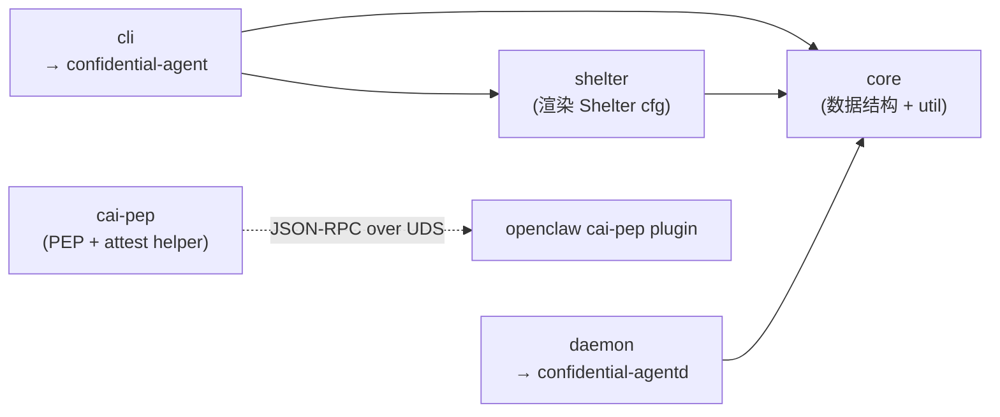
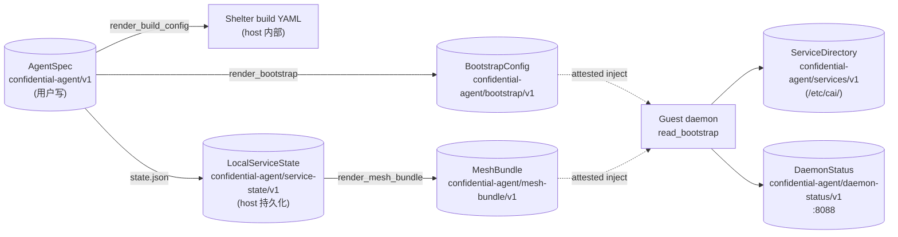
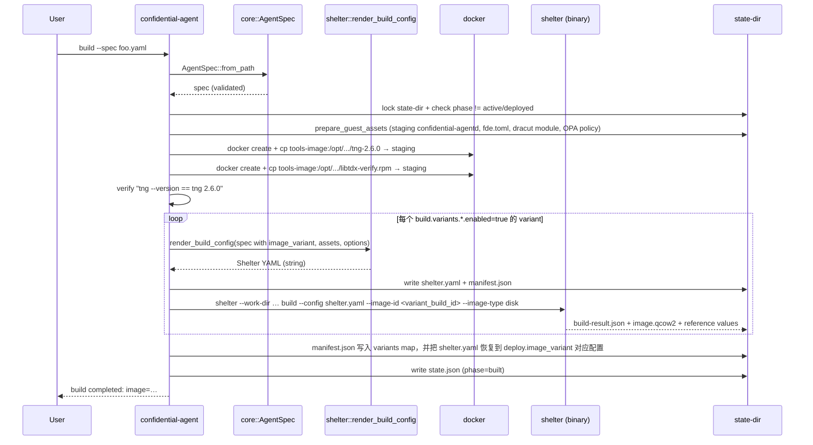
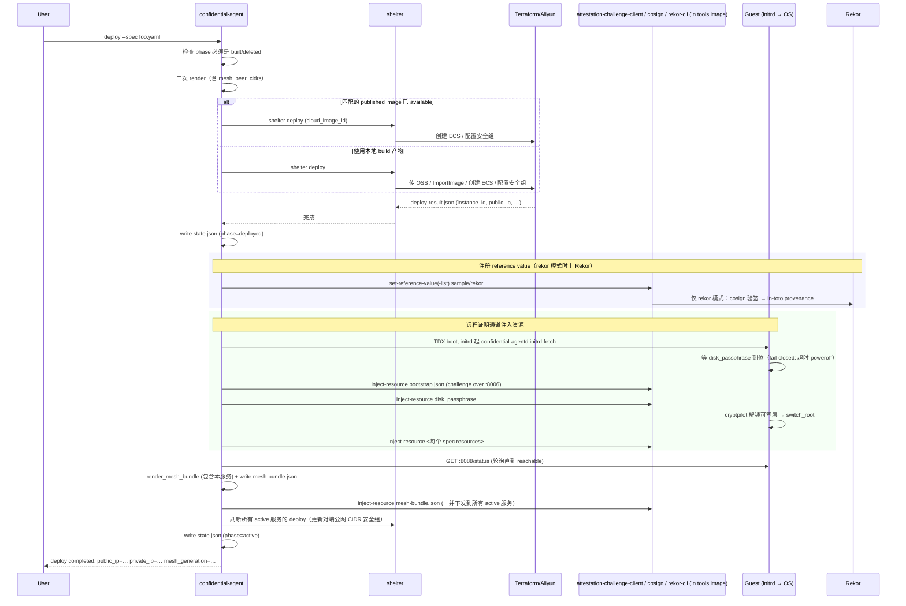
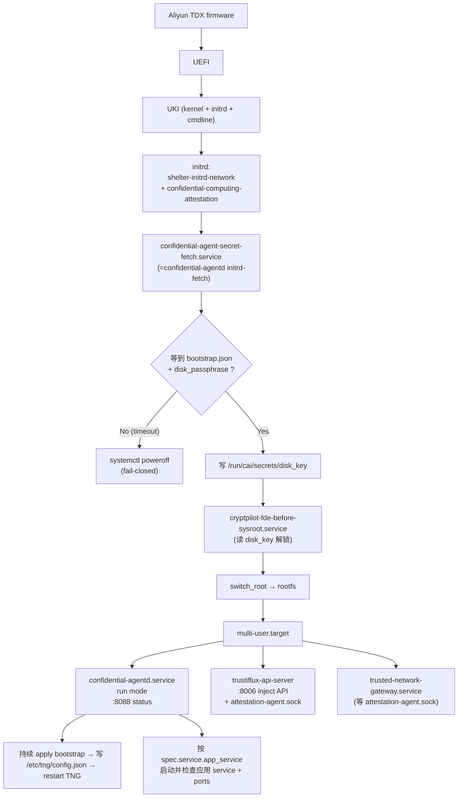
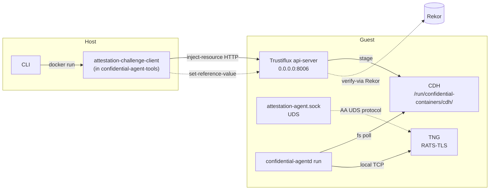
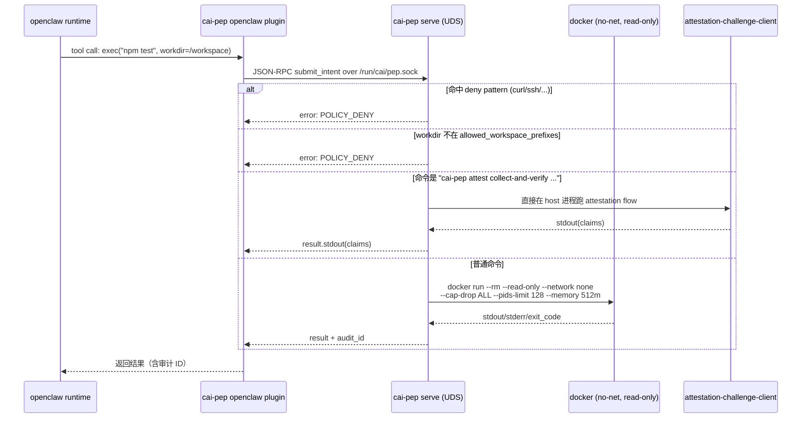

# 架构与数据流

---

## 1. 工作空间布局

5 个 crate，单一 workspace（[`Cargo.toml`](../Cargo.toml)）。



| Crate | 输出 | 跑在哪 | 主要职责 |
|---|---|---|---|
| `core` | lib | 共享 | `AgentSpec`、所有 schema、sha256/Rekor 工具 |
| `shelter` | lib | host | 把 `AgentSpec` + `GuestAssets` 渲染成 Shelter YAML |
| `cli` | `confidential-agent` 二进制 | host | 控制面：build / deploy / connect / status / destroy |
| `daemon` | `confidential-agentd` 二进制 | guest | initrd-fetch + 持久 daemon + 状态 HTTP |
| `cai-pep` | `cai-pep` 二进制 | guest | Unix socket 上的 PEP，沙箱内执行 Agent 工具调用 |

---

## 2. 三个核心 schema 与流转方向



每个 schema 都有显式的版本字符串校验（参考 [`core/src/schema.rs`](../core/src/schema.rs) 的常量集合），跨版本不一致会**直接拒绝**。

---

## 3. `build` 子命令的端到端流程



关键点：
- **mkosi vs convert 模式**：取决于 `build.base_image` 是否提供。前者由 Shelter 从零构建，后者基于已有镜像增强。两条路径下都强制 UKI 启动 + cryptpilot FDE（[`ShelterDiskCrypt::writable_layer_defaults`](../shelter/src/lib.rs)）。
- **TNG 严格 pin**：guest 用的 TNG 二进制版本必须等于 `REQUIRED_GUEST_TNG_VERSION = "tng 2.6.0"`（[`cli/src/app.rs`](../cli/src/app.rs)），否则 build 直接失败。
- **多 variant 构建**：一次 `build` 会构建所有 enabled variants；当前 state 的 `build_id` 指向 `deploy.image_variant`，完整结果保存在 manifest 的 `variants` map。
- **build_id 时间戳化**：`<image_name>-<variant>-<run_id>`，run_id 精确到毫秒，防止重复 build 互相覆盖。

---

## 4. `deploy` 端到端流程



注入采用 `inject-resource` over `http://<ip>:8006`，对应代码 [`cli/src/app/tools.rs::challenge_inject`](../cli/src/app/tools.rs)。每个资源会先尝试 direct 网络，失败后 fallback 走 host 的代理环境变量。

`image publish` 会把 build 产物预先导入为阿里云自定义镜像，并把 provider、region、variant、build id、镜像 hash 与 image id 记录在本地 state。`deploy` 只在这些字段匹配且发布状态为 `available` 时复用该 image；`destroy` 负责运行资源，published image 的删除由 `image unpublish` 或 `image prune` 管理。

---

## 5. Guest 启动顺序（initrd → multi-user）



关键 systemd unit 与依赖关系来自三处：
- daemon 嵌入的 unit 文本：[`agentd_service_unit`](../cli/src/app.rs)、[`secret_fetch_service_unit`](../cli/src/app.rs)。
- mkosi 模式下额外的 setup script：[`guest_setup_script`](../cli/src/app.rs) 装好 libtdx-verify、把 `tng-2.6.0` 软链到 `/usr/bin/tng`，并给 `trusted-network-gateway.service` 注入 `ExecStartPre` 等待 attestation-agent socket。
- 每个示例自己的 `install-*.sh`，例如 [`examples/openclaw/install-openclaw.sh`](../examples/openclaw/install-openclaw.sh) 注册 `cai-openclaw-gateway.service`；spec 的 `service.app_service` 决定 daemon 是否把该 unit 纳入 `app_ready` 判定。

---

## 6. Mesh Bundle：跨实例可信寻址

`MeshBundle` 是「所有 active 服务彼此都能信任地连到对方」的单一事实源。

结构（来自 [`core/src/schema.rs`](../core/src/schema.rs)）：

```jsonc
{
  "schema": "confidential-agent/mesh-bundle/v1",
  "generation": 7,
  "updated_at": 1714000000,
  "services": {
    "openclaw":      { "phase": "active", "public_ip": "1.2.3.4",  "private_ip": "10.0.0.8", "ports": [18789, 18800], "connect": [18789] },
    "openclaw-vllm": { "phase": "active", "public_ip": "5.6.7.8",  "private_ip": "10.0.0.9", "ports": [3001], "connect": [] }
  },
  "reference_values":      { "openclaw": ..., "openclaw-vllm": ... },   // sample 模式
  "rekor_reference_values":{ "openclaw": ..., "openclaw-vllm": ... }    // rekor 模式
}
```

下发链路：
1. CLI [`render_mesh_bundle`](../cli/src/app/workflows.rs) 生成 → host 持久化为 `<state-dir>/mesh-bundle.json`。
2. 通过 `attestation-challenge-client inject-resource default/local-resources/cagent_mesh_bundle` 推到每台 Guest。
3. Guest daemon [`sync_mesh`](../daemon/src/app.rs) 读到后：
   - 写 `/var/cache/confidential-agent/mesh-bundle.json`（持久化）；
   - 写 `/etc/cai/service-directory.json`（包含对端所有 `service.ports`，每个端口标记 `mode=connect|mesh`，应用读这个文件做服务发现）；
   - 渲染并写 `/etc/tng/config.json`，让本地 TNG 对本服务的 `connect` 端口只做服务端 attestation，对本服务的 `ports - connect` 端口同时验证调用方 attestation；访问对端 `connect` 端口时只验证对端服务端 attestation，访问对端 `ports - connect` 端口时同时携带本服务 attestation；
   - 如果配置 hash 变了，`systemctl restart trusted-network-gateway.service`。

mesh-bundle 是按 active service 集合滚动生成的。新 service deploy 时 generation 会推进，已有 service 可能先收到包含新 RV 的 bundle，再等新 service 自身 ingress 完成重启；e2e 成功路径应等待 daemon `:8088/status` 的 `mesh_generation` 更新且 `mesh_ready=true` 后再断言双向 RA 生效。

> 重点：`connect` 和 A2A 是单向 RA；同 state-dir confidential mesh 端口是双向 RA。应用需要通过端口拆分公开接入面和 confidential-only 能力。

---

## 7. 远程证明通道一览



- 同一个 `attestation-challenge-client` 既负责 reference value 注册，也负责 resource inject。Trustiflux 收到 inject 请求会先做远程证明（quote → policy → claims），通过后才把资源写到 CDH。
- 默认 OPA policy：[`tools/policies/trustee-opa-default.rego`](../tools/policies/trustee-opa-default.rego)。它做的是 EAR (AR4SI) 评估，硬件、配置、文件系统、可执行 4 个维度都要绿灯。
- 本地开发可换成 [`tools/policies/trustee-opa-local-dev.rego`](../tools/policies/trustee-opa-local-dev.rego)，会把 hardware/configuration/file_system/executables 全部置 2，方便 QEMU 自验。

---

## 8. PEP（Policy Enforcement Point）数据流



完整 PepConfig 字段见 [`cai-pep/src/main.rs`](../cai-pep/src/main.rs)。生产配置示例：[`examples/openclaw/files/cai-pep-default-policy.json`](../examples/openclaw/files/cai-pep-default-policy.json)。

为什么要给 `cai-pep attest` 开后门？因为 `attestation-challenge-client` 必须能访问 host 的 `/dev/tdx_guest` 和 `localhost:8006` 才能拿到 quote，普通 sandbox 显然不能给它这些权限——所以让 PEP 自己识别这条命令，受控地、绕过 sandbox 直接执行。Skill 模板 [`tdx-remote-attestation.SKILL.md`](../examples/openclaw/files/tdx-remote-attestation.SKILL.md) 讲了这个机制。

---

## 9. 端口约定速查

| 端口 | 监听者 | 用途 | 安全组规则名 |
|---|---|---|---|
| 22  | sshd（仅 debug） | Debug SSH | `ssh_22_peer_<cidr>` |
| 8006 | trustiflux-api-server | 远程证明 + 资源注入 API | `control_8006_peer_<cidr>` |
| 8088 | confidential-agentd | 只读 daemon status HTTP | `status_8088_peer_<cidr>` |
| 8089 | confidential-agentd | A2A AgentCard discovery HTTP | `agent_card_8089_peer_<cidr>` |
| 50000 | TNG control | 本地控制面 | (loopback only) |
| 39000+i | TNG egress | 应用本地 capture/listen | (loopback only) |
| `service.connect[]` | 用户应用 | host CLI / A2A / mesh service 经 RATS-TLS 接入，单向 RA | `connect_<port>_peer_<cidr>` + `mesh_<port>_peer_<cidr>` |
| `service.ports[] - service.connect[]` | 用户应用 | confidential mesh 数据面，双向 RA | `mesh_<port>_peer_<cidr>` |

---

## 10. 失败模式与可观测性

| 现象 | 多半的原因 | 建议做法 |
|---|---|---|
| `confidential-agent build` 卡在 `tng --version` | tools 镜像里的 TNG 不是 2.6.0 | 用 `tools/Dockerfile` 重新构建工具镜像 |
| Shelter deploy 完了，但 `inject-resource` 一直 timeout | 安全组 8006 没放通；或 `peerings.yaml` 的 `control` scope 不包含 host | 检查 `confidential-agent peering list` 并运行 `peering apply` |
| daemon phase 长期停在 `waiting-resources` | 某个 `required=true` 资源缺失或 sha256 不对 | `confidential-agent status --live --json` 看 `applied_resources` |
| daemon phase 停在 `starting-mesh` | TNG 未启动；通常因为 attestation-agent.sock 还没 ready | `journalctl -u trusted-network-gateway` |
| `connect` 报 `mesh bundle has no reference values` | 还没 deploy 过 / sample_rv 文件被手删 | 重新 `deploy` 或 `mesh sync` |
| Rekor 注册失败 | 网络到不了 `rekor_url`、cosign 签名失败 | 重新构建 tools 镜像并检查 cosign 公私钥、SLSA generator 与 Rekor 可达性 |
| initrd 阶段 Guest 直接关机 | initrd-fetch 在 `CA_SECRET_WAIT_TIMEOUT_SEC` 超时 | 这是设计的 fail-closed；扩大超时或先看 inject-resource 是不是一直没成功 |

---

## 11. 与其它工具的边界

Confidential Agent 并不复刻这些上游能力，而是把它们粘合在一起：

| 上游 | 角色 |
|---|---|
| [Shelter](https://github.com/inclavare-containers/shelter) | 实际生产 UKI 镜像、编排 Aliyun（Terraform alicloud provider）、产生 sample reference value 与 SLSA provenance |
| [TNG (Trusted Network Gateway)](https://github.com/inclavare-containers/tng) | RATS-TLS 数据面，attest+TLS 一体的双向认证 |
| [Trustiflux / CDH / Attestation Agent](https://github.com/confidential-containers) | Guest 内的远程证明协议端点 |
| [cryptpilot](https://github.com/openanolis/cryptpilot) | initrd 阶段做 dm-crypt 解锁，受 fde.toml 配置 |
| [Sigstore Cosign + Rekor](https://docs.sigstore.dev) | reference value 的供应链透明日志 |

Confidential Agent 自己写的部分集中在：**用户视角的 spec、可复现且可销毁的 host 状态机、跨实例 mesh、PEP**。所有不属于这几块的事都交给上游负责。
