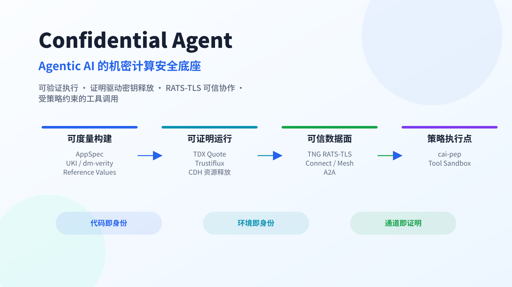
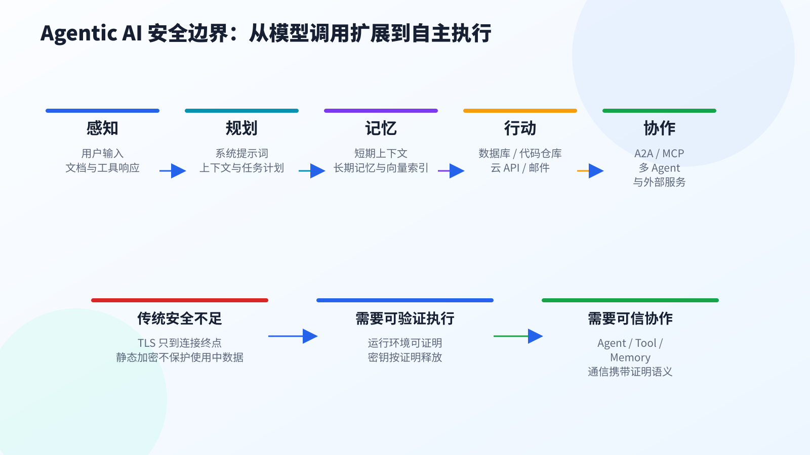
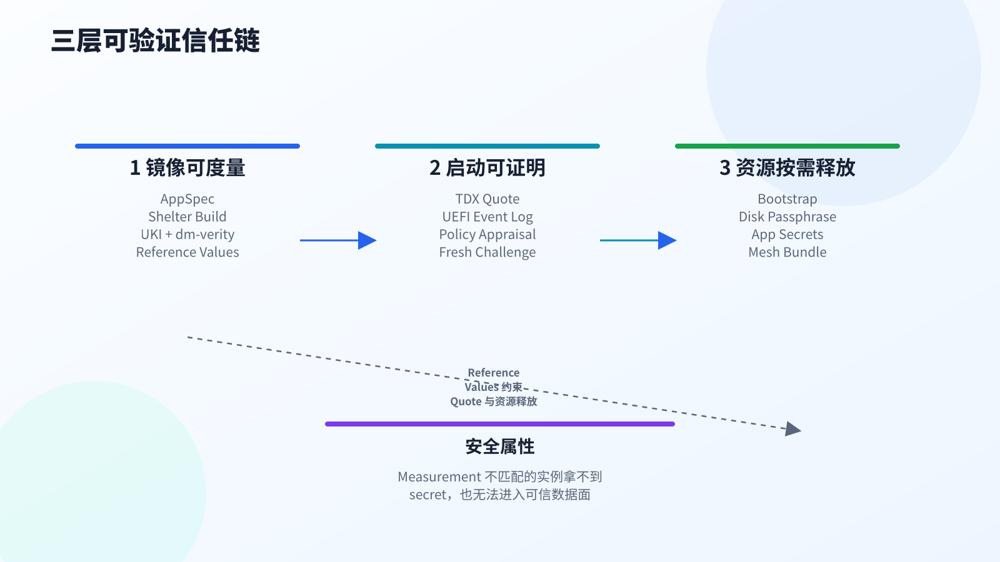
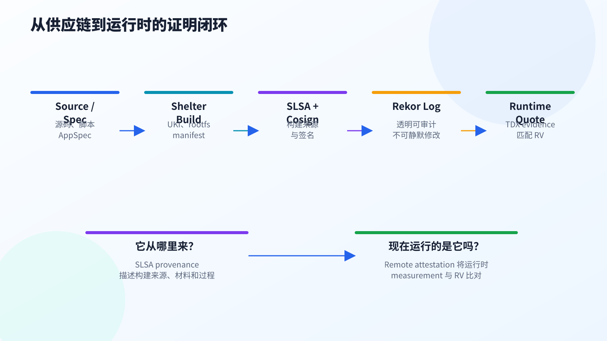
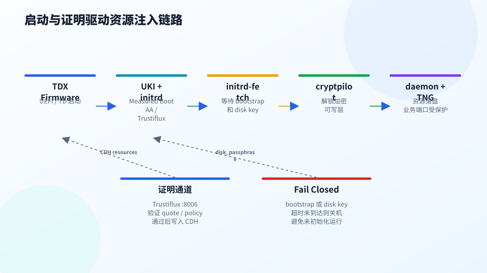
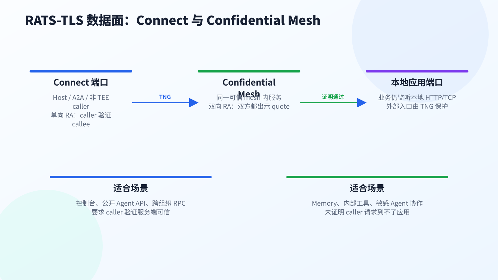
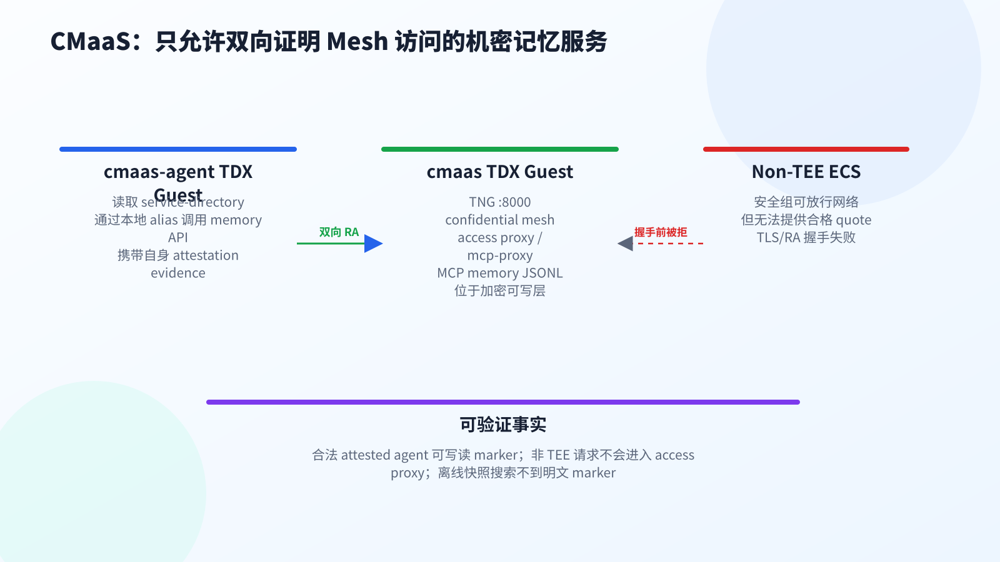
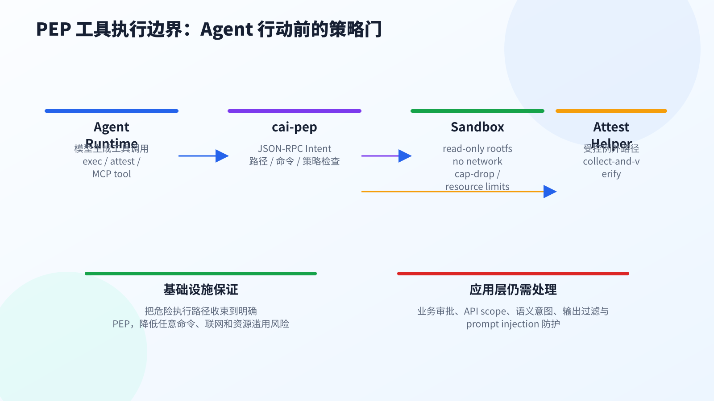
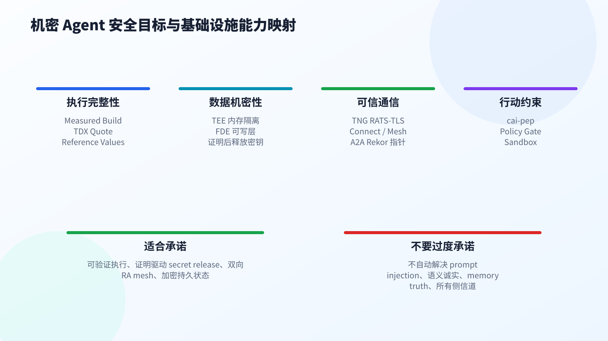

# Confidential Agent：Agentic AI 的机密计算安全底座

## 摘要

Agentic AI 正在从“调用模型生成内容”演进为“持有上下文、调用工具、维护记忆并代表用户行动”的运行时系统。它处理的不再只是一次性 prompt，而是用户输入、系统提示词、工具凭据、长期记忆、检索上下文、外部 API 响应、跨 Agent 消息和任务执行轨迹。传统 MaaS 架构中的 TLS、静态加密、IAM 与容器隔离，能够解决传输、存储和入口授权的一部分问题，但无法回答 Agent 场景中更核心的问题：**当前执行环境是否可信，密钥是否只释放给被证明的代码，业务流量是否只进入可验证的 Agent，对端 Agent 或工具服务是否运行在预期状态中。**

Confidential Agent 代表的是一类面向 Agentic AI 的机密计算架构范式：把 Agent workload 封装进可度量、可远程证明、可按证明释放密钥、可加密持久状态、可通过 RATS-TLS 建立可信通信的执行域中。它不是试图替代应用层 Agent safety，也不声称自动解决 prompt injection、模型幻觉、业务授权或记忆真假判断；它的目标是在基础设施层建立一条清晰的安全底座，让“数据在哪里被处理、什么代码在处理、密钥何时释放、对端是否可信”这些问题可以被技术性验证。

本文参考 Confidential Agent 项目的工程路径，系统阐述机密 Agent 架构中的需求、问题、技术体系和方案范式。重点不是逐项描述某个版本的实现状态，而是给出一套可复用的架构思考：从可度量镜像、远程证明、Reference Values、Rekor/SLSA，到证明驱动资源注入、加密可写层、RATS-TLS 数据面、可信 Mesh、A2A 跨域接入、Confidential Memory 和工具执行策略边界。

---

## 背景：Agentic AI 正在改变 AI 系统的安全边界

### 从内容生成到自主执行

大模型应用最初主要以问答、摘要、翻译、代码补全和内容生成为核心。这类系统的安全边界相对清晰：用户请求进入模型服务，模型生成结果并返回。平台需要保护 prompt、模型权重、输出结果和调用日志，但多数风险仍围绕一次性推理请求展开。

Agentic AI 改变了这个假设。Agent 不只是生成文本，而是在更长的任务周期内持续感知环境、规划步骤、调用工具、读写记忆、处理外部反馈，并根据中间结果调整执行路径。一个企业级 Agent 可能同时访问内部知识库、代码仓库、数据库、审批系统、邮件、日历、云控制台和第三方 SaaS；一个个人 Agent 可能持有用户邮箱、Token、钱包、浏览器会话和长期偏好；一个多 Agent 系统可能把任务从 orchestrator 分发给 specialist，再由 specialist 调用 MCP tool 或 A2A peer。

这种能力扩展带来的结果是：Agent 的安全边界不再止于模型 API。它覆盖了从用户请求进入 Agent Runtime，到模型推理、上下文组装、工具调用、记忆读写、跨服务通信、状态持久化和审计留痕的完整链路。任何一个环节出现明文暴露、运行环境不可验证、工具凭据泄露或跨 Agent 消息被伪造，都可能导致敏感数据泄露、越权操作、业务流程污染或合规失控。

### Agent 运行时承载的敏感资产

Agentic AI 的商业落地往往发生在企业流程最敏感的位置。金融机构希望 Agent 协助分析客户资产、交易行为和风险敞口；医疗机构希望 Agent 支持病历总结、辅助问诊和科研数据分析；制造企业希望 Agent 读取设计文档、质量报告和供应链数据；软件企业希望 Agent 进入代码仓库、CI/CD 系统、缺陷管理平台和云运维环境。Agent 要真正产生价值，就不可避免地触达高价值数据和高权限工具。

在这种场景中，Agent 运行时聚合的敏感材料远超传统模型服务：

| 资产类型 | 典型内容 | 主要风险 | 需要的基础设施能力 |
|---|---|---|---|
| 用户输入与检索上下文 | 业务文档、合同、代码、病历、财务数据 | 在服务端处理阶段被云运维、日志系统或中间组件读取 | 使用中数据保护、可信执行环境、最小化日志 |
| 系统提示词与规划状态 | system prompt、任务目标、chain of actions、工具选择策略 | 暴露业务规则、绕过约束或被篡改后改变 Agent 行为 | 镜像与配置度量、证明后资源注入 |
| 长期记忆与向量索引 | 用户偏好、组织知识、历史任务轨迹、RAG memory | 被读取导致长期隐私泄露，被污染导致后续决策偏移 | 加密持久状态、可信 memory 服务、写入来源约束 |
| 工具凭据 | API Key、OAuth Token、数据库连接串、云账号临时凭据 | 被宿主机、调试接口或恶意进程窃取后直接产生现实动作 | 证明驱动密钥释放、运行时隔离、策略执行点 |
| 跨 Agent 消息 | A2A 请求、MCP tool response、delegation claims | 对端伪造、消息重放、上下文污染或 provenance 丢失 | RATS-TLS、Reference Values、消息来源验证 |
| 执行轨迹与日志 | 工具参数、任务结果、错误栈、性能指标 | 无意记录明文 secret 或泄露任务结构与商业意图 | 日志最小化、审计分层、敏感路径隔离 |

因此，Agent 安全的核心问题不是“再给 API 加一层 TLS”，而是在多组件、多租户、多方协作的环境中，确保数据只在被验证的执行域内处理，确保密钥只释放给可信运行环境，确保 Agent 间通信建立在可证明身份之上，并确保客户可以独立验证这些承诺。

### Agent 威胁模型的五个层面

《When Agents Handle Secrets: A Survey of Confidential Computing for Agentic AI》将 Agentic AI 的安全问题拆为五层：perception、planning、memory、action、coordination。这一拆分非常适合描述机密 Agent 的安全边界。

| 层面 | 关注对象 | 典型攻击面 | 机密计算可以帮助的部分 |
|---|---|---|---|
| Perception | 用户输入、检索文档、工具响应、外部事件 | 间接 prompt injection、输入窃听、RAG 数据泄露 | 保护进入可信执行域后的明文数据，降低云运维读取风险 |
| Planning | 模型推理、system prompt、任务计划、上下文组装 | 系统提示词泄露、运行时篡改、模型/配置替换 | 证明运行镜像与配置，限制密钥只释放给可信环境 |
| Memory | 短期上下文、长期记忆、向量库、KV cache | memory exfiltration、shared memory contamination、rollback | 加密持久状态、可信 memory 服务、证明后访问 |
| Action | 工具调用、外部 API、代码执行、凭据使用 | 凭据窃取、工具滥用、命令注入、越权动作 | 策略执行点、sandbox、凭据不出可信域 |
| Coordination | A2A、MCP、跨组织委托、协作链路 | 对端伪造、消息污染、provenance 丢失、多跳信任断裂 | RATS-TLS、Reference Values、可信发现与证明通信 |

需要强调的是，机密计算不是 Agent safety 的全部。TEE 可以让运行环境对云平台特权层不可见，可以通过远程证明让客户验证“什么代码在运行”，也可以把密钥释放绑定到 measurement；但它不能自动判断一段自然语言是不是恶意指令，不能保证一个已经通过证明的 Agent 在业务语义上诚实，也不能替代应用层授权、输出过滤、人工审批和记忆治理。它解决的是底座层的“可验证执行与可验证通信”问题。

---

## 客户需求：从“信任服务商”到“验证执行环境”

### 企业客户的数据控制权诉求

企业采用 Agentic AI 的最大阻力通常不是模型能力，而是数据控制权。Agent 要进入核心业务流程，就必须访问客户数据、内部系统和高权限工具。客户关心的不只是请求是否通过 TLS 发送，也不只是数据库是否启用了静态加密，而是数据离开自身环境之后，是否仍然处于可验证、可约束、可审计的安全边界内。

客户需要确认：

- 服务提供方无法将请求内容、系统提示词、私有知识库和工具结果用于未授权训练或分析；
- 云平台运维人员无法通过宿主机、虚拟机管理器、调试接口或磁盘快照读取明文数据；
- 密钥和凭据不会在未验证环境中被加载；
- Agent 运行镜像、策略和依赖没有被替换；
- 跨 Agent 或跨服务通信不会把敏感上下文暴露给未知节点；
- 审计材料不是事后口头说明，而是可复验的技术证据。

对于金融、医疗、政企、能源、制造和软件研发等行业，这类需求直接关联合规责任与商业风险。客户需要一种机制，将“相信平台不会看见数据”转化为“即使平台拥有基础设施权限，也无法直接看见数据，并且客户可以验证这一点”。

### 平台方的产品化诉求

对于 AI 平台、行业云、Agent 平台和系统集成商而言，机密计算能力正在从安全增强项变成产品基础能力。平台方需要为不同客户托管 Agent workload，处理多租户数据、专有工具凭据和行业知识库，同时降低内部运维、供应链和跨租户隔离带来的信任成本。

可验证的机密执行环境可以帮助平台方建立更清晰的责任边界：平台负责提供经过度量和证明的运行底座，客户负责定义业务策略、数据授权和工具权限。通过这种方式，平台可以在不接触客户明文数据的前提下交付 Agent 能力，并以技术证据支撑合规说明、客户审计和商业承诺。

### 终端用户与监管方的隐私诉求

当 Agent 被集成到智能终端、办公套件、车载系统、医疗设备或企业协作平台时，终端用户往往并不知道自己的数据会经过哪些模型、工具和服务。对监管方而言，关键问题是数据处理链路是否透明、最小化、可证明，是否存在超范围处理、跨境流转或第三方滥用风险。

因此，Agentic AI 需要提供面向终端用户和监管方的可解释安全能力：敏感数据在哪里处理，由什么环境处理，哪些组件可以访问明文，凭据在什么条件下释放，外部工具调用是否受到约束，审计证据是否足以支撑合规检查。机密计算提供的远程证明和硬件隔离，为这些问题提供了可技术化表达的基础。

---

## 传统安全机制的局限性

### TLS 只能保护传输链路，不能保护服务端处理过程

TLS 能够有效防止网络窃听和中间人攻击，是现代互联网服务的基础安全机制。但在 Agentic AI 场景中，TLS 的保护边界止于连接终点。数据一旦进入服务端，就可能在 API 网关、Agent Runtime、模型调用层、工具适配器、日志系统、缓存系统和记忆系统之间以明文形式被处理。

对于 Agent 来说，最敏感的数据恰恰出现在服务端处理阶段：system prompt 与用户输入被拼接成上下文，工具凭据被加载到运行时，检索结果被加入推理窗口，长期记忆被读取或更新，外部 API 返回结果被纳入下一步计划。TLS 无法证明这些处理发生在可信执行环境中，也无法阻止宿主机管理员、被攻陷的运行时或恶意内部组件读取明文。

### 静态加密无法覆盖使用中数据

静态加密可以保护磁盘、对象存储和数据库备份中的数据，降低离线介质泄露风险。但 Agentic AI 的关键风险不只发生在数据静止时，而是发生在数据被加载、解密、拼接、推理、缓存和调用工具的运行过程中。

当向量库片段、对话历史、工具 Token 或任务计划进入内存、显存、临时文件、日志缓冲区和进程间通信通道后，传统静态加密已经失效。攻击者不需要破解磁盘密钥，只要能够进入宿主机、调试容器、读取进程内存、抓取快照或访问临时缓存，就可能获得明文上下文。Agent 的状态性越强，运行时明文暴露的风险就越大。

### IAM 解决“谁能访问”，不能证明“访问后如何处理”

IAM、RBAC 和 API 鉴权可以控制用户、服务账号和应用是否拥有访问权限，是企业安全体系不可或缺的一部分。但 Agentic AI 的风险不止于入口权限。一个已获授权的服务仍可能运行在被篡改的环境中，一个合法的 Agent 仍可能把数据转发给未验证工具，一个拥有权限的内部运维角色仍可能通过底层基础设施接触明文。

IAM 关注身份和权限，缺少对运行时状态的密码学证明。它无法回答客户最关心的问题：当前处理数据的镜像是否与发布版本一致，系统提示词和策略是否被替换，工具调用是否在受控沙箱中执行，密钥是否只释放给可信 workload，跨 Agent 对端是否运行在预期环境中。对于 Agentic AI，访问授权必须与执行环境验证结合，才能形成完整安全边界。

### 容器隔离不是高信任差异场景下的硬件安全边界

容器为应用部署、资源隔离和运维效率提供了重要基础，但容器共享宿主机内核，其安全边界天然依赖宿主机操作系统、容器运行时和编排平台的可信性。在多租户云环境和高敏感 Agent 场景中，容器隔离难以抵御高权限宿主机、虚拟机管理器、云平台运维、内核漏洞和调试接口带来的风险。

Agentic AI 往往需要同时保护代码、数据、凭据和长期状态。仅依赖容器安全，意味着客户仍需信任平台方不会查看容器内存、不会挂载文件系统、不会注入调试进程、不会替换镜像层，也不会通过编排系统扩大访问面。对于需要向客户和监管方证明数据处理可信性的场景，容器是工程封装单元，但不是足够的信任根。

| 机制 | 主要保护范围 | 在 Agent 场景中的缺口 | 需要补充的能力 |
|---|---|---|---|
| TLS | 网络传输 | 服务端明文处理不可见、不可证明 | Attested TLS / RATS-TLS |
| 静态加密 | 磁盘、对象存储、备份 | 内存、显存、临时文件和运行时状态仍暴露 | TEE、FDE、证明后解密 |
| IAM / RBAC | 身份与入口授权 | 不证明执行环境、不约束密钥释放 | Remote Attestation、策略评估 |
| 容器隔离 | 应用封装与资源隔离 | 依赖宿主机与共享内核可信 | Confidential VM、Measured Boot |
| 日志审计 | 事后追溯 | 不能阻止明文暴露，也难以证明实时状态 | 可复验 evidence、透明日志 |

---

## 技术需求：机密 Agent 的安全目标

机密 Agent 架构的目标不是用一个单点机制覆盖所有问题，而是把 Agent 执行生命周期拆成几个可验证控制面，并让它们组合成闭环。

### 可验证运行环境

客户必须能够确认当前处理数据的 Agent 实例运行在硬件隔离的 TEE 中，并且启动链路、内核、initrd、rootfs、业务二进制和关键配置符合预期。这里的核心不是“云平台告诉客户这是安全镜像”，而是运行实例可以提供由硬件签名的 attestation evidence，验证方可以把 evidence 中的 measurement 与 reference values 比对，决定是否信任该实例。

这实现了“环境即身份”和“代码即身份”的安全模型。一个 Agent 是否可信，不由 IP、主机名或静态证书单独决定，而由它所运行的硬件 TEE、启动度量、软件栈和配置状态共同决定。

### 证明驱动的密钥与资源释放

Agent 需要大量敏感资源：磁盘解密密钥、模型 API Key、数据库连接串、MCP 配置、system prompt、私有知识库、mesh bundle。传统方式把这些内容打包进镜像、写入云环境变量或通过运维通道分发，很难抵御镜像泄露、云运维读取、错误注入和未验证环境启动。

机密 Agent 需要把资源释放与远程证明绑定。只有当 Guest 提供的 quote 与 reference values 和策略匹配，资源 broker 才释放密钥和配置。未通过证明的实例即使由同一个云账号创建，也拿不到明文 secret。

### 加密持久状态

Agent 的状态不是短暂的。对话历史、长期记忆、工具结果、工作目录、缓存和日志都可能落入本地持久层。机密 Agent 需要为可写状态提供加密保护，并让解密密钥只在证明后进入 Guest。这样，即使云盘快照、镜像导出或宿主机离线检查可见，也难以直接恢复运行时明文。

### 可验证通信

Agent 与外部世界的通信不应只依赖 TLS 证书或网络 ACL。对于 host→agent、agent→agent、agent→tool、agent→memory 的连接，调用方需要知道对端是否运行在预期 TEE 中；对于高敏感内部协作，被调用方也需要验证 caller 是否是被允许的 confidential workload。这要求远程证明下沉到传输层，使业务连接在进入应用之前完成 TEE 身份验证。

### 工具调用约束

Agent 的价值来自行动能力，也正因如此，工具调用是风险最高的路径。一个被 prompt injection 影响的 Agent 可能尝试执行 shell、访问网络、读取文件或调用高权限 API。机密 Agent 基础设施需要提供一个明确的 Policy Enforcement Point，把危险工具调用收束到可审计、可拒绝、可 sandbox 的执行边界内。它不替代业务审批，但可以防止“模型输出直接变成任意系统命令”。

---

## 核心技术体系：TEE、Measured Boot、Remote Attestation 与 Reference Values

### TEE：隔离执行域

可信执行环境（Trusted Execution Environment, TEE）是机密 Agent 的硬件根。它通过硬件级隔离和内存加密，降低宿主机 OS、Hypervisor、云平台运维路径对 Guest 内存明文的可见性。在 Confidential VM 模型中，完整 Agent Runtime、配置、工具适配器、局部 memory、会话上下文和可写状态可以运行在一个受硬件保护的虚拟机边界内。

TEE 本身不是全部安全答案。它提供“运行在硬件隔离域中”的基础，但还需要 measured boot 回答“里面运行的是什么”，需要 remote attestation 回答“远端如何验证这一点”，需要 secret release policy 回答“验证通过后释放什么”，需要 attested transport 回答“业务连接是否也绑定到这个身份”。这几个机制组合起来，才构成可验证的 Agent 运行底座。

### Measured Boot：把启动过程变成可验证状态

Measured Boot 的作用，是把启动链路中的关键组件转化为密码学度量值。从固件、UEFI、UKI、kernel、initrd、kernel cmdline 到 rootfs integrity，关键启动材料会形成可比对的 measurement。任何对启动组件、initrd 逻辑或关键配置的变更，都会改变最终度量结果，从而在远程证明阶段暴露出来。

在机密 Agent 架构中，镜像构建不应只产出一个可启动磁盘，还应产出可供验证方使用的 reference values。Reference values 描述“什么样的测量状态是可信的”。验证方收到 TDX quote 或其他 TEE evidence 后，不是仅仅验证硬件签名，而是进一步判断 measurement 是否匹配预期 reference values。

Measured Boot 解决的是“运行环境是否匹配预期构建产物”的问题。它不判断应用行为是否业务正确，也不证明模型输出语义安全；它为后续密钥释放、资源注入和可信通信提供可验证基础。

### Remote Attestation：证明运行中的 Agent 身份

远程证明（Remote Attestation, RA）把 TEE 的本地隔离能力扩展到分布式信任关系中。按照 RATS 架构，证明方（Attester）生成关于自身运行环境的 evidence，验证方（Verifier）评估 evidence，依赖方（Relying Party）根据验证结果决定是否释放资源、建立连接或接受结果。

在 Agent 场景中，Attester 通常是运行在机密虚拟机内的 Agent 实例；Verifier 可以是客户、平台控制面、资源 broker、TNG peer 或外部可信服务；Relying Party 则可能是密钥持有方、memory 服务、工具服务或另一个 Agent。

一次可信的远程证明至少应覆盖三类检查：

- **硬件真实性**：quote 是否由受信任 TEE 硬件产生，TCB 状态是否满足策略；
- **软件完整性**：measurement 是否匹配 reference values；
- **新鲜性**：quote 是否绑定当前 challenge，避免重放历史证明。

当且仅当这些条件满足时，系统才应释放密钥、注入资源或建立可信连接。

### Reference Values：可信状态的基准

Reference Values 是“什么运行状态可以被信任”的机器可读基准。它们连接了构建阶段和运行阶段：构建阶段产生 image、UKI、rootfs integrity 信息和 reference values；运行阶段的 quote 携带 measurement；验证方通过比对二者决定是否信任当前实例。

在开发环境中，reference values 可以来自本地构建输出，用于自验。在生产和跨组织场景中，仅靠私下传递 reference value 文件会增加信任成本。更好的方式是把 reference values 与构建 provenance、签名和透明日志结合，让第三方能够审计“这个 measurement 对应哪个 artifact、由什么流程构建、何时发布、是否被公开记录”。

### Rekor / SLSA：供应链到运行时的桥梁

SLSA provenance 用来描述软件制品从哪里来、由什么构建流程产生、使用了哪些材料。Rekor 作为 Sigstore 生态中的透明日志，为签名元数据提供不可静默篡改、可查询、可审计的发布面。对于机密 Agent 来说，这二者提供了从构建产物到运行时证明之间的桥梁。

一个合理的生产链路是：

1. 从源码、脚本、AppSpec 和依赖锁定开始构建；
2. 产生 UKI/rootfs/image 以及 reference values；
3. 生成 SLSA/in-toto provenance；
4. 使用 cosign 等机制签名；
5. 将签名 metadata 写入 Rekor；
6. 运行时通过远程证明验证 quote 是否匹配这些 reference values。

这样，运行中的 Agent 实例不只是“某台云主机上启动的 VM”，而是可以追溯到透明日志中的构建产物声明。运行时证明回答“现在运行的是它吗”，供应链 provenance 回答“它从哪里来”。

---

## Confidential Agent 架构范式

Confidential Agent 的核心定位，是为 Agentic AI workload 提供一层可度量、可证明、可注入密钥、可加密持久状态的机密计算安全底座。它不要求应用重写为某个专用框架，而是把 OpenClaw、MCP Server、LangChain 类服务或自研 Agent 封装成一份声明式规格，再由工具链将其构建、部署并运行在 TDX 机密虚拟机中。

这一模式的关键不是“把应用放进虚拟机”，而是建立一条从构建产物到运行实例的信任链：镜像构建阶段产生可验证 measurement 与 reference values；部署阶段只向通过远程证明的 Guest 释放 bootstrap、磁盘密钥和应用资源；运行阶段通过 TNG RATS-TLS 把业务端口变成带证明语义的通信入口。由此，Agent 的模型配置、工具凭据、会话上下文、memory 文件和业务流量，都被收敛到一个被硬件证明约束的执行域内。

### AppSpec：安全意图的声明式入口

AppSpec 是机密 Agent 架构的入口。它把一个 Agent workload 运行所需的安全意图拆成几个稳定维度：服务身份与端口、镜像构建输入、云上部署参数、远程证明模式、密钥来源、应用资源和 A2A 元数据。对外部使用者而言，AppSpec 是交付格式；对系统内部而言，它是构建配置、bootstrap 配置、mesh bundle、AgentCard 和 Guest runtime 配置的共同源头。

这种设计避免了把安全策略分散在镜像脚本、Terraform、systemd unit 和应用配置中。端口是否允许普通 host 以单向证明接入，哪些资源必须通过证明后注入，磁盘密钥是否由外部系统生成，reference values 使用本地 sample 还是透明日志，都在同一份 spec 中表达，并由工具链在构建、部署和运行阶段分别 enforce。

声明式安全配置的价值在于，它让“部署什么”和“信任什么”不再分离。业务服务、端口暴露、证明模式、资源注入和跨 Agent 发现都进入同一个可审计配置面。对于需要合规交付的 Agent 平台，这种单一事实源比散落在多处的脚本和手工运维动作更容易审查和复现。

### 构建与部署：从镜像可度量到实例可证明

构建阶段通过 Shelter 生成机密镜像，启用 UKI、dm-verity/reference value 提取、Trustiflux、TNG 和 cryptpilot FDE 相关配置。构建结果不是普通云镜像，而是带有可验证启动度量的 artifact。生产模式下，reference values 可进一步绑定到 Sigstore Rekor 与 cosign 签名，使后续证明验证不只依赖本地文件，还能关联到透明日志中的供应链记录。

部署阶段由 host 侧控制面驱动云资源创建、镜像导入、TDX 实例启动、安全组规则维护和资源注入。资源注入不会在裸网络连接上直接发生；host 先注册或加载 reference values，再通过 Trustiflux challenge 通道验证 Guest evidence。只有验证通过后，bootstrap、disk passphrase、应用配置和 mesh bundle 才会进入 Guest 的 CDH 资源命名空间。

这种设计把“实例创建成功”和“实例可信可用”区分开来。云上 VM 启动并不意味着它能拿到业务 secret；只有当它证明自己运行的是预期镜像和预期启动状态，资源才被释放。对于企业客户，这比传统“云账号有权限即可启动服务”的模型更接近零信任要求。

### Guest Boot、FDE 与 in-guest control plane

Guest 启动链分为 initrd 阶段和 rootfs 运行阶段。initrd 中的 secret fetch 逻辑等待两类关键资源：bootstrap 配置和磁盘密钥。若在限定时间内无法通过 CDH 获取这些资源，Guest 应 fail closed，而不是继续以未受保护状态启动。磁盘密钥被写入 tmpfs 路径，仅供 cryptpilot 解锁可写层使用，不进入镜像，也不依赖云盘持久保存。

进入 rootfs 后，Guest 内部控制面负责读取 bootstrap 与 mesh bundle，校验应用资源的 sha256、权限和 owner/group，原子写入目标路径；同时生成 service directory 和 TNG 配置，使端口策略生效。它还通过只读 status 端口暴露 app readiness、mesh generation、资源应用状态和错误信息，使 host 控制面可以观察 Guest 是否真正进入可服务状态。

这类 in-guest control plane 的价值在于，它把远程证明之后的资源应用过程也纳入可控流程。资源不是简单传进去就结束，而是要在 Guest 内按照预期路径、权限、hash 和服务状态被验证。这样可以降低错误配置、资源替换和半初始化运行带来的风险。

### Trustiflux / CDH：证明后的资源释放面

Trustiflux、Attestation Agent 与 Confidential Data Hub 组成资源释放路径。Trustiflux API server 对外承接 challenge、evidence collection 和 resource injection；Attestation Agent 负责从 TEE 环境中获取硬件 evidence；CDH 则作为 Guest 内的资源暂存与分发层。Confidential Agent 在这一路径上施加的核心约束是：资源不是随实例创建自动下发，而是在 reference values 与 quote 验证通过后才释放。

这使 secret release 从“云运维动作”变成“证明驱动动作”。无论资源是磁盘 passphrase、Agent API key、system prompt、MCP 配置还是 mesh bundle，它们都遵循同一个模式：host 持有原始材料，Guest 只有在证明自身运行的是预期镜像和预期启动状态后，才获得明文。

### TNG：Agent 数据面的远程证明网关

TNG 是 Confidential Agent 的数据面边界。用户应用仍监听自己的业务端口，但外部访问路径由 TNG 接管：host connect、同组织 mesh、跨域 A2A 都通过 RATS-TLS 建立带 attestation 语义的连接。对 connect 端口，调用方验证服务端 TEE 身份，适合 host 调试、A2A 发现后的接入或公开能力暴露；对 confidential-only 端口，双方都需要提供并验证 evidence，适合 memory、内部工具、跨 Agent 私密协作等高敏感链路。

通过 TNG，业务应用不需要自己实现 quote 解析、reference value 比对和 TLS 证书扩展。它仍然可以用本地 HTTP/TCP 提供服务，但所有跨边界流量都先经过 attested transport。这样既降低了应用改造成本，也避免每个 Agent 框架重复实现一套不一致的远程证明协议。

---

## 可信协作：Mesh、A2A 与端口语义

### 从“能连上”到“可证明地连上”

Agentic AI 的协作链路正在从单体应用演进为多 Agent、多工具、多记忆服务之间的连续调用。传统网络安全模型通常只能回答“谁的 IP 被放通了”“证书是否有效”，却很难回答更关键的问题：对端是否运行在可信 TEE 中、当前镜像是否匹配被审计过的构建产物、密钥和记忆是否只释放给通过证明的运行环境、工具执行是否被策略约束。

机密 Agent 架构中的网络协作不应只是“连通性管理”，而应成为信任关系管理。网络 ACL 负责限定谁能到达端口，远程证明负责判断到达者是否可信，reference values 负责定义可信状态，service directory 负责让应用发现可信 peer。只有这些组合起来，Agent 协作链路才不只是加密通道，而是具备证明语义的业务通道。

### `connect` 与 confidential mesh：端口即信任边界

端口语义是 Confidential Agent 架构中最重要的安全抽象之一。`service.ports` 表示所有受 TNG 保护的业务端口；`service.connect` 是其中允许 host CLI、A2A、非 TEE caller 以及 mesh service 以单向 RA 模式访问的子集；`service.ports - service.connect` 表示 confidential-only mesh 端口，调用双方都会做远程证明。

| 端口集合 | 访问者 | RA 语义 | 典型用途 |
|---|---|---|---|
| `service.connect[]` | host connect、A2A caller、非 TEE client、mesh service | 单向 RA：caller 验证 callee TEE；caller 自身不需要出 quote | 控制台、公开 Agent API、跨组织 RPC 入口 |
| `service.ports - service.connect` | 同一可信 mesh 内 active service | 双向 RA：双方提交并验证 attestation evidence | CMaaS memory、内部工具 API、confidential-only 能力 |
| `service.ports[]` | TNG 保护的完整业务端口集合 | 由端口是否属于 connect 决定 | spec 中的总声明面 |

因此，敏感 API 不应放在 connect 端口上。如果一个服务声明 `ports: [8000]` 且 `connect: []`，则 `:8000` 不是 host 可直接 connect 的端口，而是 confidential-only mesh 端口。普通 ECS、operator host 或 raw HTTP client 即使在安全组层被放行，也无法在没有可接受 quote 的情况下完成 RATS-TLS 握手，请求不会到达应用进程。

### A2A：跨组织发现与单向可信调用

A2A 面向不同管理域、不同云账号或不同组织之间的 Agent 调用。它不是 mesh 的同义词，而是一个跨域发现与接入模型：一方通过 AgentCard URL 发现对端，对端在 AgentCard 的 confidential-agent 扩展中发布 public IP、connect 端口和 Rekor metadata 指针。本地 daemon 再从 trusted Rekor allowlist 拉取 SLSA payload，生成 TNG reference values，并在调用时验证对端 TEE measurement。

A2A 的语义是 caller 到 callee 的单向 RPC。`a2a add` 只声明“本组织希望调用对端”，不会自动改变对端配置。如果业务需要双向应用调用，双方各自执行一次 A2A 接入。当前 A2A 按 connect 模型处理，也就是 caller 验证 callee，不要求 callee 验证 caller 的 TEE 身份。

| 项目 | A2A 语义 |
|---|---|
| 发现方式 | `/.well-known/agent-card.json` |
| 信任材料 | AgentCard 中的 Rekor 指针；AgentCard 本身不是信任根 |
| 证明方向 | 单向 RA，caller 验证 callee |
| 暴露端口 | 仅 connect 端口 |
| 不直接保证 | 组织身份 pinning、AgentCard 签名、多 hop provenance、caller 语义可信 |

---

## Confidential Memory 与工具执行边界

### CMaaS：把记忆服务放进双向证明边界

Memory 是 Agentic AI 中最敏感、也最容易被低估的状态。单次 prompt 泄露会影响一次请求，长期 memory 泄露可能暴露用户或组织的长期行为模式；一次 tool response 被污染可能影响当前任务，而 shared memory 被污染可能持续影响多个 Agent 的后续判断。机密 Agent 架构需要把 memory 服务从普通数据库或普通 HTTP API，提升为一个带证明语义的受控服务。

CMaaS 展示的是一种最小但清晰的机密记忆形态：memory server 运行在 TEE 内，数据落在 encrypted writable layer 中，memory API 不暴露为 connect，而是作为 confidential mesh 端口提供给通过双向 RA 的 mesh member。重点不是重写 memory 引擎，而是把现有 memory 服务套入 attested transport 和加密存储边界。

合法 mesh Agent 可以通过本地 service-directory alias 访问 memory；非 TEE caller 即使网络可达，也会在 RATS-TLS/RA 阶段失败，memory 进程看不到请求。这种设计给 memory 服务提供了一个基础设施层硬边界：不是“拿到 token 就能访问”，而是“运行在被信任 measurement 中的 caller 才能访问”。

| CMaaS 属性 | 架构含义 |
|---|---|
| 应用层 memory | 可以是 MCP memory server、向量库、图谱 memory 或业务自研 memory |
| 传输边界 | 不放入 connect 端口，仅通过 confidential mesh 双向 RA 可达 |
| 静态数据保护 | memory 文件落在加密可写层，降低离线快照读取风险 |
| 拒绝点 | TNG 握手阶段，早于 HTTP/MCP 应用层 |
| 应用层仍需处理 | per-entry writer identity、namespace ACL、revocation、poisoning recovery、truth scoring |

### PEP：让 Agent 行动前先过策略点

Agent 的风险不仅来自模型推理，也来自工具执行。一个拥有 shell、网络和云 API 的 Agent，如果直接把模型输出映射为系统命令，就会把 prompt injection、上下文污染和模型误判放大为真实系统风险。机密执行环境能保护 secret 不被宿主机读取，但如果 Agent 自己被诱导去执行危险命令，TEE 会忠实执行这条错误路径。因此，机密 Agent 还需要 runtime policy enforcement。

PEP（Policy Enforcement Point）将 Agent 的工具调用收束到一个明确策略点：插件通过本地 Unix socket 提交 intent，PEP 先检查命令、路径和策略，再决定拒绝或把命令放入只读、无网络、限资源、drop capabilities 的 sandbox 中执行。

这提供的是运行时执行边界，而不是语义正确性判断。PEP 可以拒绝高风险命令、限制工作目录、避免任意联网和资源滥用；但它不会判断一次工具调用的业务动机是否合理，也不会替代审批流、API scope 或应用层授权。它的价值在于把“Agent 能做什么”从模型输出中剥离出来，交给可审计的策略层。

---

## 能力边界与演进方向

### 可以承诺什么，不能承诺什么

机密 Agent 架构的价值在于建立基础设施层可验证安全边界。对外表达时，应避免把基础设施保证扩大为应用层语义安全。

| 可以承诺 | 不应承诺 |
|---|---|
| 被度量的 Guest 才能拿到通过远程证明注入的 secret/resource | 防止 prompt injection |
| connect/A2A 在发业务流量前验证 callee TEE identity | A2A 当前能证明组织身份 |
| confidential mesh 端口提供双向 RA，未证明 caller 到不了应用 | attested Agent 在语义上一定诚实 |
| Confidential Memory 可以限制为仅双向 attested mesh caller 访问 | 防止已被信任 caller 写入 false memory |
| encrypted writable layer 降低离线磁盘明文泄露风险 | 消除 side channel、traffic metadata 或 GPU 栈所有风险 |
| PEP 可约束已接入的工具执行路径 | 自动判断工具 intent 的业务正确性 |

这类边界不是弱点，而是架构清晰性的体现。TEE、RA、FDE、RATS-TLS 和 PEP 应该被放在正确的位置：它们让执行、密钥和通信可验证；上层 Agent 应用仍需处理内容安全、权限模型、记忆治理、业务审批和输出约束。

### 架构演进方向

从长期看，机密 Agent 的演进方向不是简单“把更多代码放进 TEE”，而是让证明关系更加细粒度、可组合、可审计。

| 方向 | 目标 |
|---|---|
| 组织身份绑定 | 在 measurement 之外绑定组织、公钥、租户或部署主体，降低跨组织接入误信任 |
| 双边 A2A 工作流 | 从单向 desired state 走向 invite/accept，让跨域接入更适合企业运维 |
| 应用可消费的 attestation claims | 把 caller measurement、service identity、policy result 安全传给应用层，用于 per-caller policy |
| Memory namespace policy | 在 memory 服务内表达 namespace、writer、reader、tenant 级授权 |
| Revocation 与 freshness | 支持 reference value、peer、memory entry 的吊销和新鲜度证明 |
| AgentCard 签名与透明日志增强 | 降低发现文档被替换、误导或 DNS 层攻击带来的风险 |
| Framework adapters | 为 Letta、Mem0、LangGraph、MCP server 提供标准 confidential backend |
| 审计证据链 | 将工具执行、memory 写入、A2A 调用和 attestation 结果关联成可审计事件 |

这些方向共同指向一个目标：把 Agentic AI 的运行、协作和记忆从“软件身份 + 网络可达 + 平台承诺”升级为“硬件证明 + 可审计基准值 + 策略驱动 + 可验证通信”。

---

## 总结：Agent 时代的可验证安全底座

Agentic AI 的关键变化在于，模型不再只是被调用的推理函数，而是进入了持有上下文、凭据、记忆和工具权限的运行时。它会跨越多个系统边界，代表用户或组织执行真实动作，并把中间状态沉淀为后续任务的记忆。这样的系统如果仍然只依赖传统 TLS、静态加密、IAM 和容器隔离，就无法满足企业客户对数据控制权、运行环境可验证性和跨服务信任的要求。

Confidential Agent 所代表的机密 Agent 架构，把信任链拆成几个可验证环节：构建产物可度量，reference values 可发布和审计；运行实例可通过 TEE quote 证明；密钥和资源在证明后才释放；可写状态由证明注入的密钥加密；业务连接通过 RATS-TLS 在进入应用前完成证明校验；工具执行通过 PEP 收束到策略和 sandbox。

这套架构的价值不是声称“Agent 从此绝对安全”，而是把过去依赖平台承诺的部分，转化为客户、平台和监管方都可以理解和验证的技术证据。对于即将进入金融、医疗、政企、研发和自动化运维核心流程的 Agentic AI，这种从执行环境到通信链路的可验证安全底座，将成为系统能否被信任、被采购和被规模化部署的关键前提。

---

## 参考资料

- Javad Forough, Marios Kogias, Hamed Haddadi, [When Agents Handle Secrets: A Survey of Confidential Computing for Agentic AI](https://arxiv.org/abs/2605.03213), arXiv:2605.03213v2, 2026-05-07.
- Phala, [Private AI Agents](https://phala.com/solutions/ai-agents) 与 [Confidential AI Cloud](https://phala.com/zh).
- Confidential Containers, [Attestation with Trustee](https://confidentialcontainers.org/docs/attestation/).
- IETF, [RFC 9334: Remote ATtestation procedureS (RATS) Architecture](https://www.ietf.org/rfc/rfc9334.html).
- Sigstore, [Rekor Transparency Log](https://docs.sigstore.dev/logging/overview/).
- SLSA, [SLSA Specification v1.2](https://slsa.dev/spec/v1.2/).
- Inclavare Containers, [TNG / Trusted Network Gateway](https://github.com/inclavare-containers/tng).
- Confidential Agent project docs: [architecture](../architecture.md), [spec](../spec.md), [A2A](../a2a.md), [CMaaS](../cmaas.md), [security coverage](../security-coverage.md).
